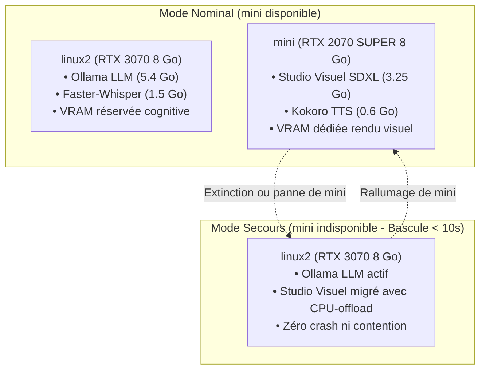

# Cartographie Matérielle & Capabilités CUDA du Cluster Kubernetes Bi-GPU

Ce document dresse l'état des lieux matériel et logiciel consolidé des nœuds du cluster Kubernetes bare-metal (K3s), intégrant l'architecture **Bi-GPU distribuée** validée en octobre 2026.

---

## 1. Synthèse Exécutive & État des Nœuds GPU

| Nœud | Rôle K8s | IP Interne | CPU | RAM | Architecture & Noyau | GPU Détecté | Capacité GPU K8s (`nvidia.com/gpu`) | Rôle Dédié dans Jarvis | Statut |
| :--- | :--- | :--- | :--- | :--- | :--- | :--- | :--- | :--- | :---: |
| **`linux2`** | Control-plane & GPU Master | `192.168.1.160` | 24 vCPU | 31.2 Go | **amd64** (`5.15.0-194-generic`) | **NVIDIA GeForce RTX 3070** (8 Go GDDR6, GA104) | **Allocatable: 1** | Inférence LLM (`jarvis:latest`), Faster-Whisper STT, Qdrant, WebUI, Stockage central `/stockage` (2 To libres) | 🟢 **OPÉRATIONNEL** |
| **`mini`** | Worker GPU Dédié | `192.168.1.99` | 12 vCPU | 15.6 Go | **amd64** (`7.0.0-38-generic`) | **NVIDIA GeForce RTX 2070 SUPER** (8 Go GDDR6, TU104) | **Allocatable: 1** | **Studio Visuel J.A.R.V.I.S.** (SDXL RealVisXL Lightning, Retouche I2I, Upscale 4K), Kokoro TTS, MCP | 🟢 **OPÉRATIONNEL** |
| **`pi1`** | Worker Edge | `192.168.1.24` | 4 vCPU | 0.9 Go | **arm64** (`6.8.0-1064-raspi`) | Broadcom VideoCore (SoC Pi) | 0 | Satellites audio légers / IoT | ⚪ Standby |
| **`piblanc`** | Worker Edge | `192.168.1.50` | 4 vCPU | 0.9 Go | **arm64** (`6.8.0-1064-raspi`) | Broadcom VideoCore (SoC Pi) | 0 | Satellites audio légers / IoT | ⚪ Standby |

---

## 2. Spécifications Comparatives des Deux Cartes Graphiques

| Caractéristique | Nœud `linux2` (Master / Cognitif) | Nœud `mini` (Worker / Studio Graphique) |
| :--- | :--- | :--- |
| **Modèle Commercial** | **NVIDIA GeForce RTX 3070** | **NVIDIA GeForce RTX 2070 SUPER** |
| **Architecture GPU** | Ampere (GA104-300) | Turing (TU104-410) |
| **Finesse de Gravure** | 8 nm Samsung | 12 nm TSMC |
| **Cœurs CUDA** | **5 888 cœurs** | **2 560 cœurs** |
| **Tensor Cores** | 184 (3e génération) | 320 (2e génération) |
| **Compute Capability** | **8.6** | **7.5** |
| **Mémoire VRAM** | **8 192 Mo (8 Go GDDR6)** | **8 192 Mo (8 Go GDDR6)** |
| **Bande Passante Mémoire** | 448 Go/s (bus 256 bits) | 448 Go/s (bus 256 bits) |
| **Version Pilote / CUDA** | Driver `580.178.04` / CUDA `13.0` | Driver `580.178.04` / CUDA `13.0` |
| **Runtime Container K8s** | `nvidia` (NVIDIA Container Toolkit v1.20) | `nvidia` (NVIDIA Container Toolkit v1.20) |

---

## 3. Stratégie d'Ordonnancement & Résilience (Failover Bi-GPU)

Le cluster implémente une stratégie de répartition intelligente pour garantir zéro contention VRAM en mode nominal et une haute disponibilité sans coupure :



1. **Affinité Préférentielle** :
   Le déploiement `jarvis-image-gen` cible prioritairement `mini` (weight 100) et se replie sur `linux2` (weight 50).
2. **Partage VRAM sans Verrou Exclusif** :
   Les variables `NVIDIA_VISIBLE_DEVICES=all` et `NVIDIA_DRIVER_CAPABILITIES=compute,utility` permettent au pod `jarvis-image-gen` de s'exécuter sur `linux2` même si Ollama y est déjà planifié, exploitant le mode `enable_model_cpu_offload()`.
3. **Persistance des Poids via NFS RWX** :
   Le cache des modèles SDXL Lightning (6.5 Go) est monté depuis `/stockage/system-storage/diffusers-cache` en ReadWriteMany. Lors d'une migration entre `mini` et `linux2`, **aucun téléchargement réseau n'est requis**, permettant un redémarrage en **moins de 10 secondes**.

---

## 4. Preuve d'Exécution & Vérification Rapide

```bash
# Vérifier la carte RTX 3070 sur linux2
ssh julien@192.168.1.160 "nvidia-smi"

# Vérifier la carte RTX 2070 SUPER sur mini
ssh julien@192.168.1.160 "sudo kubectl exec -n jarvis-system deploy/jarvis-image-gen -- nvidia-smi"

# Vérifier la distribution des pods GPU
ssh julien@192.168.1.160 "sudo kubectl get pods -n jarvis-system -o wide"
```
