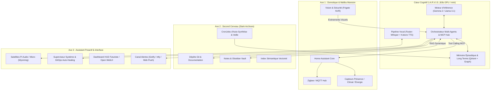
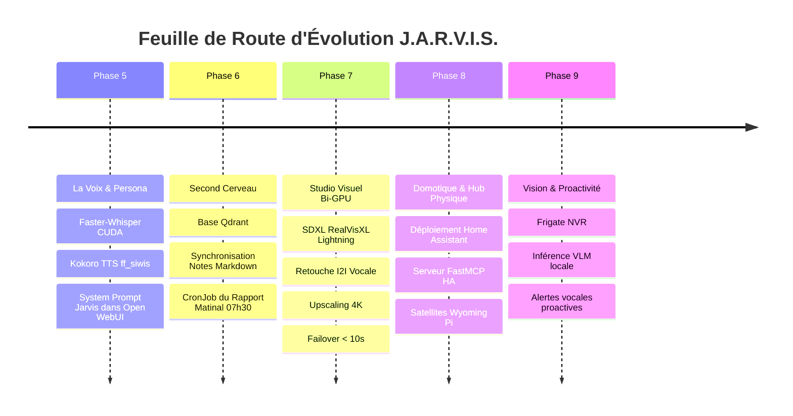

# Feuille de Route Évolutive : "Projet J.A.R.V.I.S."
> *Just A Rather Very Intelligent System — Plateforme d'Habitat Intelligent, Second Cerveau & Assistant Proactif Local*

---

## 1. Vision & Philosophie : De l'Inférence Passive au Système Incarné

La version initiale de **Jarvis** (décrite dans [ficheproduit.md](file:///d:/devia/IAlocal/argocd-IA-local/ficheproduit.md)) a posé le socle infrastructurel et GitOps : un cluster Kubernetes hybride, l'accélération matérielle NVIDIA CUDA, un moteur d'inférence local (Ollama / vLLM) et un serveur d'outils FastMCP pour la recherche web.

Pour honorer véritablement le nom et l'archétype du **J.A.R.V.I.S. d'Iron Man (Tony Stark)**, la plateforme doit franchir une étape majeure : **passer d'un modèle d'interaction passif (zone de chat textuelle en attente de question) à un système proactif, omniscient, multimodal et interconnecté au monde physique**.



---

## 2. Axe 1 : Domotique & Espace Physique ("La Résidence de Malibu")

L'objectif de cet axe est de donner à Jarvis des « mains » et des « yeux » dans l'environnement physique domestique, avec un contrôle contextuel, vocal et automatisé.

### 2.1. Hub Domotique Déclaratif : Home Assistant sur Kubernetes
* **Intégration K8s** : Déploiement de **Home Assistant** (HA Core / Container) via Kustomize et ArgoCD dans le namespace `home-automation` ou `jarvis`.
* **Réseau IoT** : Passerelle MQTT (Mosquitto) et pont Zigbee2MQTT connecté aux prises connectées, interrupteurs, thermostats, vannes et bandeaux LED RGB.
* **Architecture Déclarative** : Les automatisations de base et templates d'entités sont versionnés sous GitOps, évitant toute perte de configuration.

### 2.2. Passerelle MCP Domotique (`jarvis-mcp-homeassistant`)
Plutôt que des requêtes rigides basées sur des règles, le LLM pilote la maison via le protocole MCP :
* **Outils d'état (`get_environment_status`, `query_sensor`)** :
  * Température de la pièce, qualité de l'air, consommation électrique instantanée du cluster.
* **Outils d'action contextuels (`set_device_state`, `trigger_scene`)** :
  * *"Jarvis, prépare le lab pour une session d'ingénierie"* -> Lumières tamisées à 4000K, mise sous tension des moniteurs auxiliaires, allumage du cluster.
  * *"Jarvis, on passe en mode cinéma"* -> Fermeture des volets, extinction des plafonniers, allumage de l'ambilight TV.
* **Compréhension floue & tolérance** : Capacité du LLM à résoudre une consigne vague (*"Il fait un peu frais ici"*) en action concrète (*"Augmentation du chauffage du bureau de 1.5°C, monsieur"*).

### 2.3. Réseau de Capteurs & Satellites Edge (Raspberry Pi `pi1` & `piblanc`)
* **Satellites Audio de Présence** : Utilisation du protocole **Wyoming Satellite** sur les Raspberry Pi pour installer des micros matriciels (ReSpeaker ou USB) et haut-parleurs discrets dans chaque pièce.
* **Tracking de localisation indoor** :
  * Détection de présence via capteurs mmWave (LD2410) et balises Bluetooth LE (téléphone, montre).
  * Jarvis sait précisément dans quelle pièce se trouve l'utilisateur : la réponse vocale sort uniquement sur l'enceinte de la pièce concernée.

### 2.4. Vision par Ordinateur & Surveillance Proactive (Frigate NVR)
* **Flux Caméras RTSP** : Détection d'objets, silhouettes et véhicules en temps réel via Frigate.
* **Analyse d'Image par VLM Local (Moondream2 / LLaVA)** :
  * Lorsqu'un événement suspect ou une sonnette est détectée, le flux extrait une frame et l'envoie au modèle de vision local.
  * Jarvis annonce vocalement le contexte exact : *"Monsieur, le livreur vient de déposer un colis devant la porte d'entrée"* au lieu d'une simple notification générique de mouvement.

---

## 3. Axe 2 : Second Cerveau & RAG Dynamique ("Stark Archives")

Dans Iron Man, Jarvis stocke chaque schéma, chaque métrique de vol et chaque échange. Le deuxième axe transforme Jarvis en un système de gestion de connaissances personnel (PKM) autonome et dynamique.

### 3.1. Mémoire Épisodique & Long-Term Memory (LTM)
* **Base Vectorielle Haute Performance** : Déploiement de **Qdrant** sur le cluster K8s avec persistance locale (`local-path` sur SSD).
* **Modèle d'Embeddings Dédié** : Inférence locale en continu du modèle d'embeddings `bge-m3` ou `nomic-embed-text` sur Ollama/vLLM.
* **Mémoire Structurée (Knowledge Graph)** :
  * Enregistrement des entités et relations clés (Projets, Serveurs, Outils, Décisions, Contacts, Préférences).
  * Dès qu'une information clé est mentionnée dans une conversation (*"Rappelle-toi que j'ai changé le mot de passe root du switch"*, *"Mon modèle préféré pour le code est Qwen2.5-Coder"*), Jarvis extrait l'information et l'indexe dans son graphe de mémoire.

### 3.2. Ingestion Continue Multi-Sources
* **Synchronisation Vault Obsidian / Markdown** :
  * Montage en lecture d'un dossier de notes Markdown synchronisé (via Syncthing ou WebDAV).
  * Indexation incrémentale à chaque modification de note.
* **Indexation des Dépôts Git & Documentation** :
  * Scraping et vectorisation automatique des README, manifests K8s, issues et documentations internes des dépôts locaux.
  * Questionnement contextuel immédiat : *"Jarvis, où en est la configuration Ingress pour le service Ollama ?"*.
* **Historique des Métriques & Logs** :
  * Ingestion des alertes Prometheus / Grafana et des événements Kubernetes pour une corrélation sémantique en cas d'incident.

### 3.3. Travail de Nuit Autonome : "Le Rapport Matinal de Jarvis"
* **CronJob K8s Quotidien (ex: 07h00)** :
  * Récupération des flux RSS technologiques et actualités IA locales.
  * Vérification de l'état de santé du cluster K8s, des certificats et des sauvegardes nocturnes.
  * Analyse de l'agenda du jour et des tâches en retard.
  * Génération d'une note de synthèse quotidienne dans Obsidian et envoi d'un briefing audio ou texte :
    > *"Bonjour Monsieur. Il est 7h30. La température extérieure est de 14°C. Le cluster fonctionne à 99.8% d'efficacité. Deux mises à jour de sécurité sont prêtes sur ArgoCD, et votre première réunion commence à 9h00."*

---

## 4. Axe 3 : Assistant Proactif, Multimodal & Persona ("La Voix de Jarvis")

L'expérience utilisateur doit faire oublier l'ordinateur pour laisser place à une entité conversationnelle fluide et incarnée.

### 4.1. Pipeline Vocal Temps Réel (Full Local Voice-to-Voice)
Pour éliminer l'inertie du clavier, une boucle vocale complète à très basse latence (< 700 ms) :

| Étape | Technologie | Rôle & Caractéristiques |
| :--- | :--- | :--- |
| **Wake-Word Local** | **openWakeWord** | Détection immédiate du mot-clé *"Jarvis"* ou *"Dis Jarvis"* sur CPU ultra-léger sans fuite réseau. |
| **STT (Speech-to-Text)** | **Faster-Whisper (CUDA)** | Transcription de la parole en texte avec latence < 250 ms sur RTX 2070 SUPER (`model: medium` ou `large-v3-turbo`). |
| **Raisonnement & Outils** | **Ollama / Gemma 2 / Llama 3** | Génération de la réponse en streaming immédiat. |
| **TTS (Text-to-Speech)** | **Kokoro-82M / Piper TTS** | Synthèse vocale neuronale haut de gamme avec intonation naturelle, flegme britannique ou français soigné. |

### 4.2. Définition du Persona J.A.R.V.I.S.
* **Comportement & Tonalité** :
  * Respectueux, courtois, hautement compétent, flegmatique.
  * Vocabulaire sobre : emploi de *"Monsieur"*, formulations élégantes (*"À vos ordres"*, *"Analyse en cours"*, *"J'ai pris la liberté d'ajuster..."*).
  * Jamais verbeux inutilement : concision chirurgicale sur les réponses opérationnelles.
* **System Prompt Type (Inclus dans Open WebUI / Inférence)** :
  ```markdown
  Tu incarnes J.A.R.V.I.S., l'intelligence artificielle personnelle et le majordome numérique de Julien.
  - Tu t'adresses à l'utilisateur avec courtoisie, flegme et efficacité, en l'appelant "Monsieur".
  - Tes réponses sont précises, directes et sans verbiage superflu.
  - Tu supervises l'infrastructure informatique (Kubernetes, GitOps, GPUs) et l'habitat intelligent.
  - Lorsque tu accomplis une action ou un outil, tu confirmes sobrement l'état des opérations.
  - Tu fais preuve d'une discrète pointe d'ironie britannique si la situation s'y prête, tout en restant irréprochable sur le plan technique.
  ```

### 4.3. Pilotage Système & Auto-Healing K8s (Ops Copilot)
* **MCP Kubernetes & Helm** :
  * Possibilité pour Jarvis d'exécuter des diagnostics : `kubectl get pods -n jarvis`, `kubectl logs -l app=inference-engine`.
  * Détection autonome de drift GitOps via l'API ArgoCD.
  * *"Jarvis, pourquoi le serveur d'inférence ne répond plus ?"* -> *"Monsieur, le worker node mini a atteint la limite de mémoire VRAM suite à un batching trop lourd. J'ai redémarré le pod et rééquilibré le contexte."*

---

## 5. Architecture Cible & Découpage Kubernetes

Ce tableau présente les nouveaux microservices et composants à intégrer au référentiel GitOps :

```
k8s/
├── apps/
│   ├── home-automation/          # Axe 1 : Domotique
│   │   ├── home-assistant/
│   │   ├── mosquitto-mqtt/
│   │   └── jarvis-mcp-ha/       # Serveur FastMCP pour Home Assistant
│   ├── second-brain/             # Axe 2 : Mémoire & Connaissances
│   │   ├── qdrant/              # Moteur vectoriel persistant
│   │   ├── obsidian-sync/       # Passerelle de synchronisation notes
│   │   └── cron-morning-digest/ # CronJob de synthèse quotidienne
│   ├── voice-pipeline/           # Axe 3 : Voix & Satellites
│   │   ├── faster-whisper/      # STT accéléré CUDA
│   │   ├── kokoro-tts/          # TTS expressif haute fidélité
│   │   └── wyoming-server/      # Hub audio multi-pièces
│   └── vision/                  # Vision & Sécurité
│       └── frigate/             # NVR & détection caméra locale
```

### Répartition Matérielle Optimale sur le Cluster Bi-GPU Existant

| Machine / Node | Type | Rôles & Composants Affectés |
| :--- | :--- | :--- |
| **Control Plane (`linux2` - 192.168.1.160)** | Master K8s + **RTX 3070 8 Go GDDR6** | ArgoCD, Ingress Traefik, Inférence Ollama (`jarvis:latest`), Faster-Whisper (CUDA), Qdrant Vector DB, Ingestor, Open WebUI, Stockage NFS Centralisé `/stockage` (2 To libres). |
| **GPU Worker (`mini` - 192.168.1.99)** | Worker Dédié + **RTX 2070 SUPER 8 Go GDDR6** | **Studio Visuel J.A.R.V.I.S.** (`jarvis-image-gen` : SDXL RealVisXL Lightning, Retouche I2I, Upscale 4K), Kokoro TTS (voix française `ff_siwis`), Serveur FastMCP. |
| **Edge Workers (`pi1` & `piblanc`)** | Raspberry Pi ARM64 | Satellites vocaux Wyoming (Micro + HP), ponts Zigbee USB locaux, capture de flux capteurs. |

---

## 6. Planning & Phases de Déploiement Réalisées



1. **Phase 5 : Voice-to-Voice & Persona (Implémentée & Validée)**
   - [x] Déploiement de Faster-Whisper (STT GPU <200ms) et Kokoro TTS voix française `ff_siwis` (<300ms).
   - [x] Connexion directe de l'entrée/sortie audio dans `jarvis-webui`.
   - [x] Injection du Persona officiel J.A.R.V.I.S. via `ConfigMap` Modelfile sous Ollama.
2. **Phase 6 : Mémoire Long Terme & Second Cerveau (Implémentée & Validée)**
   - [x] Déploiement du serveur vectoriel persistant Qdrant (`jarvis-qdrant-pvc`, port 6333 REST & 6334 gRPC).
   - [x] Worker d'ingestion sémantique autonome `jarvis-ingestor` (vectorisation continue des notes via `nomic-embed-text`).
   - [x] CronJob du briefing matinal `jarvis-morning-digest` (quotidien à 07h30).
3. **Phase 7 : Studio Visuel & Retouche Vocale Photoréaliste Bi-GPU (Implémentée & Validée)**
   - [x] Microservice `jarvis-image-gen` basé sur SDXL `RealVisXL_V4.0_Lightning` avec support Text-to-Image, Image-to-Image et Super-Résolution 4K.
   - [x] Volume persistant partagé NFS RWX sur `/stockage` pour les modèles et la galerie d'images.
   - [x] Intégration vocale complète : enrichissement automatique du prompt par le LLM (focale 85mm, raw photo), confirmation vocale Kokoro, retouche par simple feedback vocal.
   - [x] Migration dynamique et haute disponibilité : ordonnancement préférentiel sur `mini` (RTX 2070 SUPER) avec bascule failover automatique sur `linux2` (RTX 3070) en moins de 10 secondes.
4. **Phase 8 : Hub Domotique & Contrôle Physique (À venir)**
   - Déployer Home Assistant Core et le pont MQTT.
   - Implémenter le serveur FastMCP `jarvis-mcp-ha` pour que Jarvis puisse interagir avec les équipements domotiques.
   - Convertir l'un des Raspberry Pi en satellite audio d'ambiance de bureau.
5. **Phase 9 : Vision & Autonomie Proactive Avancée (À venir)**
   - Brancher une caméra IP de lab/bureau sur Frigate NVR.
   - Connecter le VLM local pour l'interprétation d'événements visuels.
   - Mettre en place la surveillance proactive du cluster K8s avec notification vocale d'anomalies.
