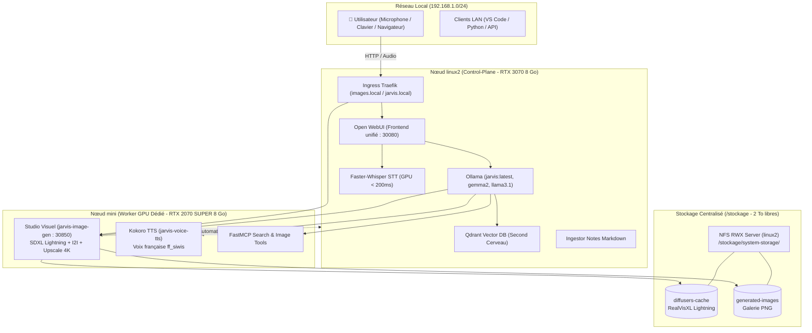

# Fiche Produit : Plateforme IA Locale & Studio Visuel "J.A.R.V.I.S."

| Métadonnée | Valeur |
| :--- | :--- |
| **Nom du Produit** | **J.A.R.V.I.S.** (Local Multi-Modal AI, Voice-to-Voice & Visual Studio Platform) |
| **Version** | **2.0.0 (Production Bi-GPU & Studio Visuel Déployé)** |
| **Statut** | 🟢 **100% Opérationnel & Validé de Bout en Bout** |
| **Dépôt GitOps** | `https://github.com/xelnagas/argocd-IA-local.git` (Branche `main`) |
| **Orchestrateur GitOps** | ArgoCD (Application K8s : `jarvis` dans `k8s/base/`) |
| **Cluster Kubernetes** | Bi-GPU Bare-metal K3s : Master `linux2` (`192.168.1.160`) + Worker `mini` (`192.168.1.99`) |
| **Accélération Matérielle** | **16 Go VRAM GDDR6 cumulée** (NVIDIA RTX 3070 8 Go + NVIDIA RTX 2070 SUPER 8 Go) |
| **Stockage Haute Capacité** | NFS RWX sur `/stockage` (Disque 8 To / 2.0 To libres) |
| **Réseau Local** | `192.168.1.0/24` |

---

## 1. Vision & Objectifs Stratégiques

Le projet **J.A.R.V.I.S.** fournit une plateforme souveraine, auto-hébergée et multimodale d'Intelligence Artificielle générative, de synthèse vocale temps réel, de recherche web en direct et de **génération / retouche photographique photoréaliste** par commande vocale.

### Objectifs Clés Atteints
1. **Souveraineté Totale & Confidentialité Absolue** : 100% des données, voix, photos générées et mémoires vectorielles restent confinées sur le réseau local sans aucune fuite vers le cloud.
2. **Accélération Matérielle Bi-GPU Élastique** :
   - `linux2` (RTX 3070 8 Go) : Dédiée à l'inférence LLM (`jarvis:latest`, ~40 tok/s), transcription Faster-Whisper, embeddings et Qdrant.
   - `mini` (RTX 2070 SUPER 8 Go) : Dédiée au Studio Visuel SDXL Lightning (~7s par rendu), au TTS Kokoro (`ff_siwis`) et aux workers MCP.
3. **Studio Visuel & Retouche Vocale Photoréaliste (Phase 7)** :
   - Génération Text-to-Image photoréaliste SDXL Lightning 1024x1024 en **~7 secondes**.
   - Retouche conversationnelle Image-to-Image (I2I) préservant le sujet en **~7 secondes**.
   - Super-résolution et upscaling 4K Ultra-HD (**4096x4096**) en **3.5 secondes**.
4. **Haute Disponibilité & Migration Dynamique (Failover < 10s)** :
   - En cas d'indisponibilité ou d'extinction de `mini`, Kubernetes migre automatiquement le Studio Visuel sur `linux2` sans perte de service.
5. **Boucle Vocale Voice-to-Voice Instantanée** :
   - Transcription micro Faster-Whisper (< 200 ms) + Synthèse Kokoro TTS voix française `ff_siwis` (< 300 ms).
6. **Exploitation 100% GitOps** :
   - Cycle de vie, manifests Kubernetes et configurations réconciliés en continu par ArgoCD.

---

## 2. Architecture Globale du Système

---

## 3. Matrice des Composants Applicatifs

| Composant | Pod Kubernetes | Image Conteneur | Nœud Préféré | Rôle & Performances |
| :--- | :--- | :--- | :---: | :--- |
| **Interface Unifiée** | `jarvis-webui` | `ghcr.io/open-webui/open-webui:main` | `linux2` | Chat, RAG, intégration audio et studio visuel |
| **Moteur LLM** | `jarvis-inference` | `ollama/ollama:latest` | `linux2` (RTX 3070) | `jarvis:latest`, `gemma2:9b`, `llama3.1:8b` (~40 tok/s) |
| **Studio Visuel** | `jarvis-image-gen` | `192.168.1.160:5000/jarvis-image-gen:latest` | `mini` (RTX 2070S) | RealVisXL Lightning, I2I et upscale 4K (~7s) |
| **Synthèse Vocale** | `jarvis-voice-tts` | `ghcr.io/remsky/kokoro-fastapi:v0.2.1` | `mini` | Kokoro TTS voix française `ff_siwis` (< 300 ms) |
| **Reconnaissance Vocale** | `jarvis-voice-stt` | `fedirz/faster-whisper-server:latest-cuda` | `linux2` (RTX 3070) | Faster-Whisper Medium FP16 (< 200 ms) |
| **Serveur d'Outils** | `jarvis-mcp-search` | Image Custom Python FastMCP | `mini` / `linux2` | Recherche DuckDuckGo + Tool calling images |
| **Second Cerveau** | `jarvis-qdrant` | `qdrant/qdrant:v1.12.1` | `linux2` | Base vectorielle HNSW pour la mémoire persistante |
| **Ingestion Continue** | `jarvis-ingestor` | Image Custom Python Ingestor | `linux2` | Surveillance continue des notes et calcul d'embeddings |

---

## 4. Matrice des Flux Réseau & URLs

| Service | Accès Direct LAN (IP:Port) | Accès Ingress FQDN | Port Interne K8s | Description |
| :--- | :--- | :--- | :---: | :--- |
| **Open WebUI** | **`http://192.168.1.160:30080`** | `http://jarvis.local/` | 8080 | Interface web complète |
| **Studio Visuel API** | **`http://192.168.1.160:30850`** | `http://images.local/` | 8000 | Endpoints OpenAI `/v1/images/*` |
| **Galerie d'Images** | `http://192.168.1.160:30850/images/` | `http://jarvis.local/images/` | 8000 | Consultation directe des PNG |
| **Ollama GPU API** | `http://192.168.1.160:31434` | `http://ollama.local/` | 11434 | API LLM compatible OpenAI |
| **Serveur FastMCP** | `http://192.168.1.160:30800/mcp` | `http://mcp.local/mcp` | 8000 | Protocole MCP pour LLM et clients |
| **Qdrant Vector DB** | `http://192.168.1.160:30333` | `http://qdrant.local/` | 6333 | Base vectorielle |
| **ArgoCD Server** | `https://192.168.1.160/` | - | 443 | Console GitOps |

---

## 5. Spécifications Matérielles & Découpage

| Nœud | Rôle K8s | Matériel | Rôle Applicatif |
| :--- | :--- | :--- | :--- |
| **`linux2`** (`192.168.1.160`) | Control-Plane | Intel Core i7, 32 Go RAM, **RTX 3070 8 Go GDDR6**, Disque `/stockage` 8 To | Inférence Ollama, Whisper STT, Qdrant, NFS Master, WebUI |
| **`mini`** (`192.168.1.99`) | Worker GPU | Intel 12 vCPUs, 16 Go RAM, **RTX 2070 SUPER 8 Go GDDR6** | Studio Visuel SDXL Lightning, TTS Kokoro `ff_siwis`, MCP |

---

## 6. Historique des Jalons & Roadmap Réalisée

- [x] **Phase 0 : Socle Matériel & CUDA** : Pilotes NVIDIA 580+, Container Toolkit et K8s NVIDIA Device Plugin sur tous les nœuds GPU.
- [x] **Phase 1 : Socle GitOps & Stockage** : Kustomize, K3s, Namespace `jarvis-system`, ArgoCD et migration du stockage sur `/stockage`.
- [x] **Phase 2 : Moteur d'Inférence GPU** : Ollama GPU avec modèles `jarvis:latest`, `gemma2:9b`, `llama3.1:8b`.
- [x] **Phase 3 : Interface Utilisateur** : Open WebUI avec Ingress et NodePort 30080.
- [x] **Phase 4 : Recherche Web en Direct** : Serveur FastMCP DuckDuckGo et extraction de pages web.
- [x] **Phase 5 : Pipeline Vocal Voice-to-Voice** : Faster-Whisper GPU (<200ms) et Kokoro TTS français `ff_siwis` (<300ms).
- [x] **Phase 6 : Second Cerveau & Automatisation** : Qdrant Vector DB, Ingestor temps réel et Morning Digest quotidien.
- [x] **Phase 7 : Studio Visuel Photoréaliste & Retouche Vocale** : SDXL RealVisXL Lightning, microservice FastAPI, retouche I2I, upscale 4K, NFS RWX et bascule dynamique inter-nœuds (<10s).

---

*Fiche produit mise à jour le 3 octobre 2026 pour la version 2.0.0 de la plateforme J.A.R.V.I.S.*
