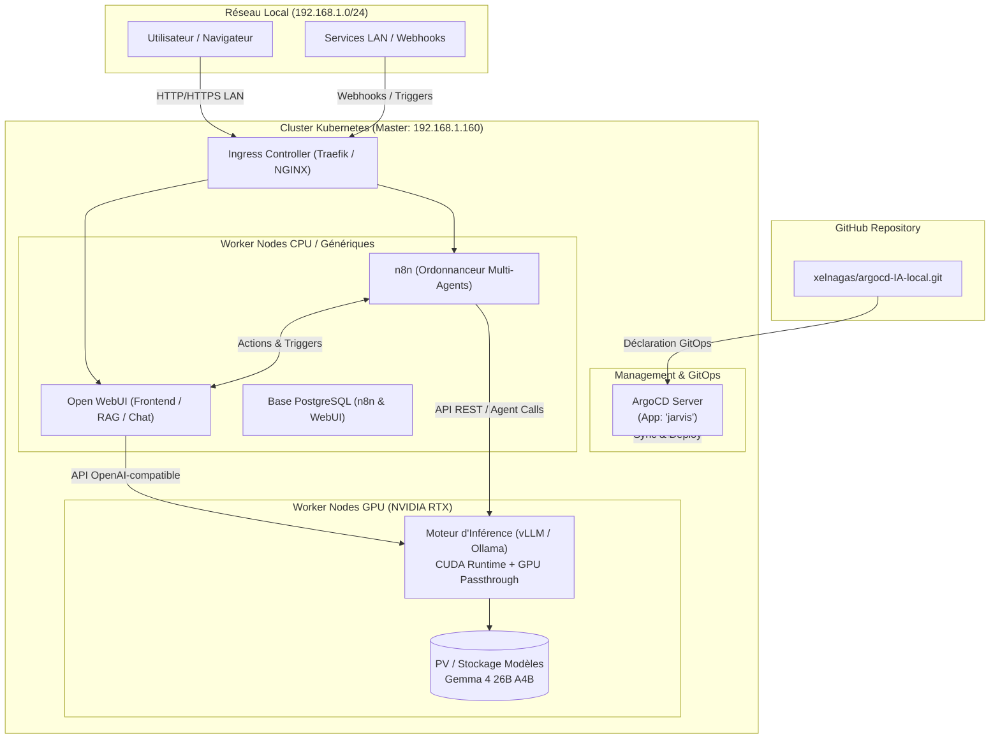

# Fiche Produit : Plateforme IA Locale "Jarvis"

| Métadonnée | Valeur |
| :--- | :--- |
| **Nom du Produit** | **Jarvis** (Local AI & Multi-Agent Platform) |
| **Version** | 1.0.0-draft |
| **Statut** | En conception / Initialisation GitOps |
| **Dépôt GitOps** | `https://github.com/xelnagas/argocd-IA-local.git` |
| **Orchestrateur GitOps** | ArgoCD (Application K8s : `jarvis`) |
| **Cluster Kubernetes** | Master Control-Plane : `192.168.1.160` (Compte administrateur : `julien`) |
| **Réseau Local** | `192.168.1.0/24` |

---

## 1. Vision & Objectifs Stratégiques

Le projet **Jarvis** vise à déployer une infrastructure d'Intelligence Artificielle générative et d'orchestration multi-agents entièrement auto-hébergée (on-premise), souveraine et résiliente, s'exécutant sur un cluster Kubernetes bare-metal domestique/lab.

### Objectifs Clés
1. **Souveraineté Totale des Données** : Aucune dépendance vis-à-vis d'APIs cloud externes (OpenAI, Anthropic, etc.). Données, prompts et fichiers conservés sur le réseau local.
2. **Accélération Matérielle Haute Performance** : Exploitation directe des cartes graphiques NVIDIA RTX (CUDA) présentes sur les worker nodes dédiés.
3. **Moteur d'Inférence Dédié** : Prise en charge de modèles open-weights avancés, notamment la famille **Gemma** (ex: *Gemma 4 26B / A4B* ou équivalents quantifiés 4-bit / AWQ / GGUF) optimisés pour la VRAM disponible.
4. **Accessibilité & Ergonomie** : Interface conversationnelle moderne accessible depuis l'ensemble des postes du réseau local via un Ingress Kubernetes.
5. **Capacités Multi-Agents & Automatisation** : Intégration d'un ordonnanceur de workflows n8n pour orchestrer des agents autonomes et connecter les outils locaux (APIs, bases de données, scripts, domotique).
6. **Exploitation 100% GitOps** : Cycle de vie applicatif piloté exclusivement par ArgoCD depuis le dépôt source Git.

---

## 2. Architecture Globale du Système

---

## 3. Composants Applicatifs de la Stack

### 3.1. Moteur d'Inférence IA (Backend GPU)
* **Technologie retenue** : **vLLM** ou **Ollama** (exécuté en conteneur Kubernetes avec support CUDA).
  * *Option A (vLLM)* : Recommandé pour des performances optimales de débit, batching continu, API 100% compatible OpenAI `/v1/chat/completions`, support natif AWQ/GPTQ/FP8.
  * *Option B (Ollama / llama.cpp)* : Idéal pour une gestion dynamique des modèles GGUF et une empreinte mémoire adaptable.
* **Modèle cible** :
  * Modèle de type **Gemma 4 26B A4B** (ou Gemma 2 27B / quantized AWQ 4-bit / GGUF Q4_K_M).
  * Empreinte mémoire VRAM ciblée : ~16 Go à 24 Go selon la quantification et la taille du contexte (KV Cache).
* **Ressources K8s** :
  * Requête GPU : `nvidia.com/gpu: 1` (ou GPU partagé si plusieurs cartes).
  * Runtime : `nvidia` (NVIDIA Container Toolkit).
  * Stockage partagé (PVC) dédié au cache de modèles HuggingFace / Ollama models (évite le re-téléchargement à chaque redémarrage).

### 3.2. Interface Utilisateur (WebUI)
* **Technologie retenue** : **Open WebUI**.
* **Fonctionnalités** :
  * Interface épurée, responsive, compatible desktop/mobile.
  * Support multi-utilisateurs et gestion des droits/clés API.
  * RAG (Retrieval-Augmented Generation) intégré avec injection de documents (PDF, texte, web).
  * Gestion de prompts personnalisés (System Prompts) et personas d'agents.
  * Connexion directe au backend d'inférence via protocole OpenAI.

### 3.3. Ordonnanceur & Automatisation Multi-Agents
* **Technologie retenue** : **n8n** (Community Edition).
* **Rôle** :
  * Création de pipelines d'automatisation avancés déclenchés par événements (cron, webhooks, flux RSS, emails, IoT).
  * Orchestration de patterns **Multi-Agents** (ex: Agent Chercheur -> Agent Rédacteur -> Agent Critique/Validateur).
  * Noeuds AI natifs de n8n : AI Agent, Memory, Vector Store, Tools & Code execution.
  * Intégration transparente avec le moteur d'inférence local comme LLM Provider via son endpoint OpenAI local (`http://inference-service:8000/v1`).

### 3.4. Réseau & Ingress
* **Ingress Controller** : NGINX Ingress ou Traefik (intégré k3s/rke2).
* **Exposition LAN** :
  * Routage par nom d'hôte DNS local (ex: `jarvis.local`, `n8n.local`) ou via Port-Forwarding / NodePort dédié.
  * Timeout configuré à une valeur élevée (ex: `proxy-read-timeout: 600s`) pour supporter le streaming de réponses longues lors de calculs d'inférence intensifs.

---

## 4. Matériel & Découpage de l'Infrastructure

| Rôle Node | Hôte / IP | Caractéristiques | Rôle dans Jarvis |
| :--- | :--- | :--- | :--- |
| **Control Plane** | `192.168.1.160` (admin: `julien`) | K8s Master, API Server, etcd, ArgoCD Server | Gestion GitOps, supervision, n8n |
| **GPU Worker Node** | `mini` (`192.168.1.99`) | Intel 12 vCPUs, 15 Go RAM, **NVIDIA GeForce RTX 2070 SUPER (8 Go VRAM)** | Inférence Ollama GPU (`accelerator=nvidia-gpu`), Open WebUI |
| **Edge Workers** | `pi1` (`192.168.1.24`), `piblanc` (`192.168.1.50`) | ARM64 Raspberry Pi | Trafic réseau, pods légers |

---

## 5. Exigences Non-Fonctionnelles

### 5.1. Performance & Latence
* Débit d'inférence visé : minimum **15 à 35 tokens/seconde** pour une expérience de lecture fluide en direct (atteint ~30 tokens/s sur `gemma2:9b`).
* Time-to-First-Token (TTFT) < 1.0s sur les requêtes locales.

### 5.2. Persistance & Stockage
* **Modèles LLM** : Volume persistant de **60 Go** (`ollama-models-pvc` sur `local-path` du nœud `mini`).
* **Données n8n & Open WebUI** : Volumes persistants de 10 Go chacun avec rétention locale.

### 5.3. Résilience & Disponibilité
* Tolérance aux pannes : redémarrage automatique des pods (`restartPolicy: Always`).
* Isolement des charges : `nodeSelector: accelerator=nvidia-gpu` garantissant le ciblage exclusif de `mini`.

---

## 6. Matrice des Flux Réseau

| Source | Destination | Port / Protocole | Description |
| :--- | :--- | :--- | :--- |
| Postes LAN (`192.168.1.*`) | Ingress Controller | 80/443 (HTTP/S) | Accès via noms d'hôtes `jarvis.local` et `n8n.local` |
| Postes LAN (`192.168.1.*`) | `jarvis-webui` Service | **30080** (TCP / NodePort) | Accès direct sans configuration DNS (`http://192.168.1.160:30080`) |
| Postes LAN (`192.168.1.*`) | `jarvis-n8n` Service | **30578** (TCP / NodePort) | Accès direct sans configuration DNS (`http://192.168.1.160:30578`) |
| Ingress Controller | `jarvis-webui` Service | 8080 (TCP) | Routage interne du trafic WebUI |
| Ingress Controller | `jarvis-n8n` Service | 5678 (TCP) | Routage interne du trafic n8n |
| `jarvis-webui` Pod | `jarvis-inference` Service | 11434 (TCP) | Envoi des requêtes de chat et streaming |
| `jarvis-n8n` Pod | `jarvis-inference` Service | 11434 (TCP) | Appels LLM des agents autonomes (`/v1`) |
| ArgoCD Controller | K8s API (`192.168.1.160:6443`) | 6443 (HTTPS) | Réconciliation GitOps déclarative |
| ArgoCD Controller | `github.com` | 443 (HTTPS) | Synchronisation du dépôt `argocd-IA-local.git` |

---

## 7. Roadmap & Phases de Déploiement

1. **Phase 1 : Socle GitOps & Pré-requis GPU**
   - Mise en place de l'application ArgoCD `jarvis`.
   - Validation du NVIDIA Container Toolkit et du Kubernetes NVIDIA Device Plugin sur les worker nodes RTX.
   - Configuration des StorageClasses locales.
2. **Phase 2 : Déploiement du Moteur d'Inférence**
   - Déploiement du backend d'inférence (vLLM / Ollama) avec allocation GPU `1`.
   - Téléchargement et chargement en VRAM du modèle Gemma 4 26B A4B.
   - Tests de performance en requêtes directes via curl / script Python.
3. **Phase 3 : Interface Utilisateur & Ingress**
   - Déploiement d'Open WebUI connecté au backend d'inférence.
   - Exposition sur le réseau local via Ingress.
4. **Phase 4 : Orchestration Multi-Agents n8n**
   - Déploiement de n8n avec base de données dédiée.
   - Configuration des credentials LLM vers le service interne.
   - Création des premiers workflows de test multi-agents.
