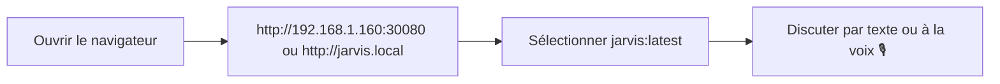
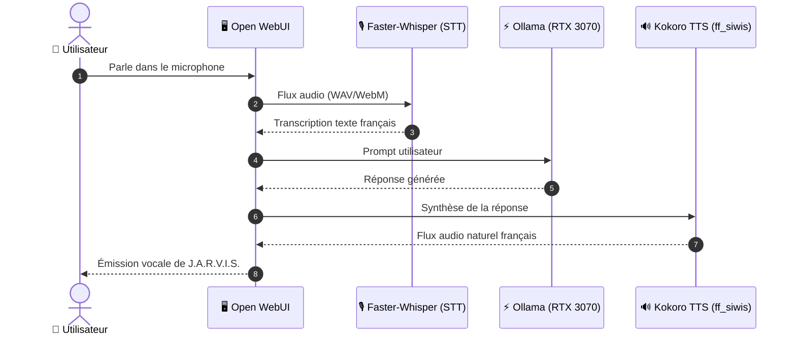

# 🤖 Manuel Utilisateur & Guide d'Exploitation : Plateforme Jarvis

Bienvenue sur le guide officiel de **J.A.R.V.I.S.**, votre infrastructure locale d'Intelligence Artificielle générative, de synthèse vocale et d'orchestration multi-agents, auto-hébergée sur votre cluster Kubernetes et pilotée par GitOps (ArgoCD).

---

## 🧭 Sommaire

* [⚡ 1. Démarrage Express en 30 Secondes](#-1-démarrage-express-en-30-secondes)
* [🌐 2. Points d'Accès & Configuration Réseau (LAN)](#-2-points-daccès--configuration-réseau-lan)
* [💬 3. Guide Pratique : Open WebUI (Interface Chat & RAG)](#-3-guide-pratique--open-webui-interface-chat--rag)
* [🎙️ 4. Mode Vocal Voice-to-Voice (Whisper & Kokoro TTS Français)](#️-4-mode-vocal-voice-to-voice-whisper--kokoro-tts-français)
* [🔍 5. Recherche Web en Direct (Serveur MCP & RAG Temps Réel)](#-5-recherche-web-en-direct-serveur-mcp--rag-temps-réel)
* [🧠 6. Second Cerveau & Base Vectorielle Qdrant (Notes & Briefing)](#-6-second-cerveau--base-vectorielle-qdrant-notes--briefing)
* [🚀 7. Modèles Disponibles & Ajout de Nouveaux Modèles (RTX 3070)](#-7-modèles-disponibles--ajout-de-nouveaux-modèles-rtx-3070)
* [🛠️ 8. Exploitation, Stockage `/stockage` & Maintenance GitOps](#️-8-exploitation-stockage-stockage--maintenance-gitops)
* [❓ 9. Résolution des Problèmes Fréquents (FAQ / Dépannage)](#-9-résolution-des-problèmes-fréquents-faq--dépannage)

---

## ⚡ 1. Démarrage Express en 30 Secondes

Vous voulez commencer à échanger avec Jarvis tout de suite ? C'est très simple :



1. **Ouvrez votre navigateur** sur votre réseau local :
   👉 **[`http://192.168.1.160:30080`](http://192.168.1.160:30080)** (accès direct immédiat sans configuration DNS)  
   👉 ou **[`http://jarvis.local/`](http://jarvis.local/)** (si vous avez configuré le nom d'hôte).
2. **Sélectionnez le modèle** en haut à gauche :
   - **`jarvis:latest`** *(Recommandé)* : L'assistant complet avec style courtois, diagnostic système et compétences étendues.
   - **`llama3.1:8b`** : Idéal pour les recherches web automatiques (Tool Calling).
   - **`gemma2:9b`** : Puissant modèle de Google, rapide et très analytique.
3. **Posez votre première question** ou cliquez sur l'icône **Microphone** pour lui parler !

---

## 🌐 2. Points d'Accès & Configuration Réseau (LAN)

Tous les services de l'écosystème Jarvis sont centralisés sur la machine hôte **`192.168.1.160`** (`linux2`) propulsée par la carte graphique **NVIDIA GeForce RTX 3070 (8 Go VRAM)**.

### 2.1. Tableau des Services & URLs

| Service | Icône / Rôle | Accès Direct LAN (Sans configuration) | Accès via Ingress (Nom convivial) | Statut |
| :--- | :--- | :--- | :--- | :---: |
| **Open WebUI** | 💬 Interface Chat, Documents & Voix | **[`http://192.168.1.160:30080`](http://192.168.1.160:30080)** | **`http://jarvis.local/`** | 🟢 En ligne |
| **Ollama GPU API** | ⚡ Moteur d'Inférence LLM (OpenAI compatible) | **[`http://192.168.1.160:31434`](http://192.168.1.160:31434)** | **`http://ollama.local/`** | 🟢 En ligne |
| **Serveur MCP Search** | 🔍 Recherche Web DuckDuckGo en direct | **[`http://192.168.1.160:30800/mcp`](http://192.168.1.160:30800/mcp)** | **`http://mcp.local/mcp`** | 🟢 En ligne |
| **Qdrant Vector DB** | 🧠 Base Vectorielle (Second Cerveau) | **`http://192.168.1.160:30333`** | **`http://qdrant.local/`** | 🟢 En ligne |
| **ArgoCD GitOps** | 🐙 Console d'orchestration GitOps | **`https://192.168.1.160/`** | - | 🟢 En ligne |

---

### 2.2. Configuration du Fichier `hosts` (Optionnel pour utiliser `jarvis.local`)

Pour taper directement `http://jarvis.local/` au lieu de l'adresse IP et du numéro de port, ajoutez une ligne dans le fichier `hosts` de votre ordinateur :

#### 🪟 Sous Windows :
1. Lancez le **Bloc-notes** en faisant un clic droit > **Exécuter en tant qu'administrateur**.
2. Ouvrez le fichier : `C:\Windows\System32\drivers\etc\hosts`.
3. Ajoutez cette ligne tout en bas du fichier :
   ```text
   192.168.1.160 jarvis.local ollama.local mcp.local qdrant.local
   ```
4. Enregistrez (`Ctrl + S`).

#### 🐧 Sous Linux / 🍏 macOS :
Ouvrez un terminal et exécutez :
```bash
sudo sh -c 'echo "192.168.1.160 jarvis.local ollama.local mcp.local qdrant.local" >> /etc/hosts'
```

> [!TIP]
> **Pour toute la maison en une seule fois :**  
> Si vous utilisez **Pi-hole**, **AdGuard Home** ou le serveur DNS local de votre box/routeur, ajoutez une redirection DNS locale de `*.local` ou `jarvis.local` vers `192.168.1.160`. Tous vos ordinateurs, tablettes et téléphones y auront accès sans aucune manipulation !

---

## 💬 3. Guide Pratique : Open WebUI (Interface Chat & RAG)

Open WebUI est votre portail d'échange principal, riche en fonctionnalités et inspiré des meilleures interfaces d'IA modernes.

### 3.1. Les fonctionnalités clés

* **💬 Discussions Multi-Modèles** : Passez d'un modèle à l'autre en un clic au cours d'une conversation.
* **📎 Analyse de Documents (RAG)** : Glissez-déposez n'importe quel fichier (PDF, Markdown, Word, texte, CSV) dans la zone de chat. Jarvis l'indexe instantanément et répond précisément en citant ses sources.
* **🎨 Personas / Assistants spécialisés** : Créez des profils préconfigurés (ex: *Expert DevOps*, *Réviseur de code*, *Spécialiste Docker*).
* **📚 Historique & Organisation** : Vos échanges sont sauvegardés par dossiers et étiquettes (*Tags*).

---

### 3.2. Conseils pour des Réponses Parfaites

| Objectif | Réglage suggéré | Comment faire ? |
| :--- | :--- | :--- |
| **Code informatique, scripts, maths** | Température basse (**0.1 à 0.2**) | Cliquez sur l'icône de réglages (curseurs) en haut à droite > Réduisez la **Température**. Les réponses seront rigoureuses et déterministes. |
| **Rédaction, idées, synthèse littéraire** | Température moyenne (**0.7 à 0.8**) | Augmentez légèrement la température pour plus d'inventivité. |
| **Questions sur un document long** | Fenêtre de contexte (**8192 tokens**) | Augmentez la valeur de contexte pour permettre à l'IA d'analyser des dizaines de pages d'un seul bloc. |

---

## 🎙️ 4. Mode Vocal Voice-to-Voice (Whisper & Kokoro TTS Français)

Jarvis dispose d'une boucle vocale complète et instantanée :
1. **Écoute (STT)** : Reconnaissance vocale par **Faster-Whisper** (< 200 ms).
2. **Réflexion (LLM)** : Inférence GPU accélérée par la **RTX 3070**.
3. **Voix (TTS)** : Synthèse vocale naturelle par **Kokoro TTS** avec la voix française haute fidélité **`ff_siwis`**.



---

### 4.1. Configuration de la Voix Française en 3 Clics

Pour vous assurer que Jarvis vous répond avec sa voix française naturelle :

1. Dans Open WebUI, cliquez sur votre **Profil** (en bas à gauche) puis sur **Paramètres** (icône roue crantée).
2. Rendez-vous dans l'onglet **Audio** :
   - **Moteur de synthèse vocale (TTS Engine)** : Laissez sur **Par défaut** (*Default*) ou vide.
   - **Voix (Voice)** : Indiquez **`ff_siwis`**.
3. Cliquez sur **Enregistrer**.

> [!WARNING]
> **Ne sélectionnez PAS « Kokoro.js » dans la liste déroulante :**  
> L'option *Kokoro.js* s'exécute localement dans le navigateur et ne supporte que l'anglais.  
> En conservant **Par défaut**, la génération est déléguée au cluster Kubernetes (`jarvis-voice-tts`), qui dispose de la voix française complète **`ff_siwis`**.

---

### 4.2. Autorisation du Microphone dans le Navigateur

Les navigateurs récents bloquent l'accès au microphone sur les adresses en simple `http://`.  
Si un message vous indique **« Accès aux appareils multimédias refusé »**, suivez l'une de ces 2 méthodes :

#### Méthode Rapide (Moins d'une minute sur Chrome ou Edge) :
1. Dans la barre d'adresse de votre navigateur, collez :
   - Pour Google Chrome : `chrome://flags/#unsafely-treat-insecure-origin-as-secure`
   - Pour Microsoft Edge : `edge://flags/#unsafely-treat-insecure-origin-as-secure`
2. Passez l'option sur **Enabled**.
3. Dans la zone de texte, renseignez :
   ```text
   http://192.168.1.160:30080, http://jarvis.local
   ```
4. Cliquez sur le bouton bleu **Relaunch** (Relancer). Le microphone est immédiatement débloqué !

---

## 🔍 5. Recherche Web en Direct (Serveur MCP & RAG Temps Réel)

Jarvis peut explorer Internet en temps réel pour vérifier une information récente, consulter la documentation d'une librairie ou vérifier une actualité.

### 5.1. Comment l'activer dans votre chat ?

Deux méthodes au choix :

#### Option A : Le Bouton Globe 🌐 (Le plus rapide)
- Sous la zone de texte du chat, cliquez sur l'icône **Globe 🌐** (*Web Search*).
- Posez votre question : Open WebUI recherche les informations sur DuckDuckGo et les intègre au prompt de Jarvis. Fonctionne avec **tous les modèles**.

#### Option B : Le Tool Calling MCP (Le plus autonome & intelligent)
- En haut de l'écran, sélectionnez le modèle **`llama3.1:8b`** (optimisé pour appeler des outils).
- À gauche du champ de saisie, cliquez sur le bouton **`+` (Outils / Tools)** et cochez **`MCP Web Search`**.
- L'IA décide de manière autonome quand elle a besoin de chercher sur Internet via les outils :
  - **`search_internet`** : Recherche multi-résultats DuckDuckGo.
  - **`fetch_web_page`** : Lecture et analyse du texte intégral d'une page web sans publicité.

---

## 🧠 6. Second Cerveau & Base Vectorielle Qdrant (Notes & Briefing)

Jarvis intègre un système d'ingestion continue de vos connaissances personnelles et un briefing matinal automatisé :

* **Base Vectorielle Qdrant** : Stocke la mémoire sémantique dans la collection `jarvis_second_brain`.
* **Worker d'Ingestion Continue (`jarvis-ingestor`)** :
  - Surveille en permanence vos notes et documents déposés dans le volume `jarvis-notes-pvc`.
  - Calcule automatiquement les embeddings avec le modèle `nomic-embed-text` et les indexe dans Qdrant.
* **Briefing Matinal (`jarvis-morning-digest`)** :
  - Chaque matin à **07h30**, une tâche planifiée analyse l'état de l'infrastructure, vos notes récentes et génère un compte-rendu quotidien :  
    `Daily-Briefings/Briefing-YYYY-MM-DD.md`.
  - Possibilité de recevoir ce briefing par notification Webhook (Discord, Telegram, ntfy).

---

## 🚀 7. Modèles Disponibles & Ajout de Nouveaux Modèles (RTX 3070)

Grâce à la carte graphique **NVIDIA GeForce RTX 3070 (8 Go VRAM GDDR6, architecture Ampere)** installée sur `192.168.1.160`, l'inférence locale bénéficie d'une accélération matérielle de premier ordre (~35 à 50+ tokens/seconde).

### 7.1. Modèles Déjà Prêts & Installés

| Modèle | Empreinte VRAM | Vitesse mesurée | Points forts & Cas d'usage |
| :--- | :---: | :---: | :--- |
| **`jarvis:latest`** | ~5.4 Go | **~35-40 tok/s** | **Assistant Principal** : Style majordome, synthèse, DevOps et orchestration. |
| **`gemma2:9b`** | ~5.4 Go | **~35 tok/s** | **Raisonnement Google** : Excellent en français, logique et analyse technique. |
| **`llama3.1:8b`** | ~4.9 Go | **~45 tok/s** | **Recherche Web & Outils MCP** : Champion pour le Tool Calling et formats JSON. |
| **`nomic-embed-text`** | ~0.3 Go | **Instantané** | **Embeddings** : Vectorisation haute précision des documents pour le RAG. |
| **`Qwen3.5-35B-A3B`** | ~21 Go | Hybride (RAM+GPU) | **Grand Modèle MoE** : Pour des analyses de fond nécessitant un vaste contexte. |

---

### 7.2. Ajouter un Modèle en 1 Clic (Sans Ligne de Commande)

Vous pouvez enrichir votre bibliothèque de modèles directement depuis l'interface web :

1. Connectez-vous sur **`http://192.168.1.160:30080`**.
2. Cliquez sur votre icône de profil en bas à gauche > **Panneau d'administration (Admin Settings)**.
3. Allez dans l'onglet **Modèles (Models)**.
4. Dans le champ **Pull a model from Ollama.com**, tapez le nom du modèle :
   - Exemples populaires adaptés à la RTX 3070 : `qwen2.5-coder:7b`, `mistral:7b`, `phi3:mini`, `deepseek-r1:8b`.
5. Cliquez sur le bouton de téléchargement (flèche ⬇️).
6. Le modèle est téléchargé avec une barre de progression et sera automatiquement disponible pour tous les utilisateurs dès la fin du téléchargement !

---

### 7.3. Utiliser Jarvis avec Vos Outils Favoris (VS Code, Cursor, Python)

Le moteur d'inférence est directement accessible depuis n'importe quelle machine du réseau local sans restriction :

* **Base URL OpenAI compatible** : `http://192.168.1.160:31434/v1`
* **Base URL Ollama native** : `http://192.168.1.160:31434`
* **Clé API** : `ollama` (ou n'importe quel mot-clé)

#### Exemple pour VS Code (Extension Continue.dev) :
Dans votre fichier `~/.continue/config.json` :
```json
{
  "models": [
    {
      "title": "Jarvis RTX 3070",
      "provider": "ollama",
      "model": "jarvis:latest",
      "apiBase": "http://192.168.1.160:31434"
    }
  ]
}
```

#### Exemple en Python (avec la librairie `openai`) :
```python
from openai import OpenAI

client = OpenAI(
    base_url="http://192.168.1.160:31434/v1",
    api_key="ollama"
)

reponse = client.chat.completions.create(
    model="jarvis:latest",
    messages=[{"role": "user", "content": "Bonjour Jarvis, quel est l'état du système ?"}]
)

print(reponse.choices[0].message.content)
```

---

## 🛠️ 8. Exploitation, Stockage `/stockage` & Maintenance GitOps

### 8.1. Architecture du Stockage (Migration `/stockage`)

Afin d'éviter toute saturation de la partition système racine `/` (SSD NVMe), l'ensemble du stockage Kubernetes, des images Docker et des modèles d'IA a été migré sur le disque haute capacité **`/stockage`** (disque Seagate IronWolf de 8 To) :

```
/stockage/system-storage/
├── rancher/   --> Monté en bind-mount transparent sur /var/lib/rancher (K3s, PVCs, modèles)
├── docker/    --> Monté en bind-mount transparent sur /var/lib/docker (moteur Docker)
└── kubelet/   --> Monté en bind-mount transparent sur /var/lib/kubelet (volumes pods)
```

* **Partition racine `/`** : Libérée à **22% d'utilisation (74 Go libres)**.
* **Partition `/stockage`** : Plus de **2.0 To d'espace libre** pour accueillir vos modèles de LLM volumineux en toute sérénité.
* **Persistance** : Tous les montages sont configurés dans `/etc/fstab` et survivent aux redémarrages de la machine.

---

### 8.2. Commandes Utiles pour l'Exploitation

Depuis votre terminal (ou en SSH sur `julien@192.168.1.160`) :

```bash
# 1. Vérifier l'état de la carte graphique RTX 3070 et la VRAM
ssh julien@192.168.1.160 "nvidia-smi"

# 2. Vérifier que tous les pods Jarvis tournent correctement
ssh julien@192.168.1.160 "kubectl get pods -n jarvis-system -o wide"

# 3. Consulter les logs d'inférence en direct
ssh julien@192.168.1.160 "kubectl logs -f -n jarvis-system deploy/jarvis-inference"

# 4. Redémarrer un service sans perte de données (ex: WebUI)
ssh julien@192.168.1.160 "kubectl rollout restart deploy/jarvis-webui -n jarvis-system"
```

---

### 8.3. La Règle d'Or GitOps (ArgoCD)

Pour toute modification pérenne (variables d'environnement, configuration des modèles, routage) :
1. Modifiez les fichiers YAML dans le dépôt Git local (`k8s/`).
2. Poussez sur la branche principale :
   ```bash
   git commit -am "feat: description du changement"
   git push origin main
   ```
3. ArgoCD synchronise automatiquement votre cluster en quelques secondes !

---

## ❓ 9. Résolution des Problèmes Fréquents (FAQ / Dépannage)

### ❓ « Le site http://jarvis.local ne s'ouvre pas »
* **Solution rapide** : Utilisez l'adresse IP directe : **[`http://192.168.1.160:30080`](http://192.168.1.160:30080)**.
* **Pour réparer le nom d'hôte** : Vérifiez que la ligne `192.168.1.160 jarvis.local` est bien présente dans votre fichier `hosts` (voir [Section 2.2](#-2-points-daccès--configuration-réseau-lan)).

---

### ❓ « Mon micro ne fonctionne pas / Erreur de périphérique multimédia »
* **Cause** : Votre navigateur bloque le micro car le site est en `http://`.
* **Solution** : Activez le flag Chrome ou Edge `unsafely-treat-insecure-origin-as-secure` en ajoutant `http://192.168.1.160:30080` (procédure détaillée dans la [Section 4.2](#️-4-mode-vocal-voice-to-voice-whisper--kokoro-tts-français)).

---

### ❓ « Jarvis répond avec un fort accent anglais ou une mauvaise voix »
* **Cause** : Le réglage Audio a basculé par inadvertance sur le moteur client *Kokoro.js*.
* **Solution** : Allez dans **Paramètres > Audio**, sélectionnez **Par défaut** pour le moteur TTS et saisissez la voix **`ff_siwis`**.

---

### ❓ « Le modèle répond lentement »
* **Cause** : Un modèle trop grand par rapport aux 8 Go de VRAM a été sélectionné, ce qui déverse des couches de calcul sur la mémoire RAM du CPU.
* **Solution** : Privilégiez les modèles quantifiés adaptés aux 8 Go de VRAM comme **`jarvis:latest`**, **`gemma2:9b`** ou **`llama3.1:8b`**, qui tournent à 100% dans la mémoire ultra-rapide de la carte graphique.

---

*Documentation mise à jour le 3 octobre 2026 pour la plateforme Jarvis AI sur nœud `linux2` (RTX 3070 8 Go / `/stockage`).*
