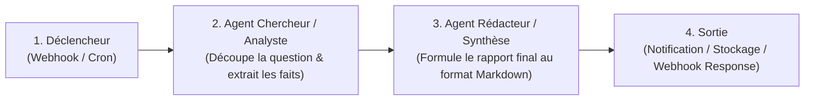

# Manuel Utilisateur & Guide d'Exploitation : Plateforme Jarvis

Bienvenue dans le manuel d'utilisation de **Jarvis**, votre infrastructure locale d'Intelligence Artificielle générative et d'orchestration multi-agents, auto-hébergée sur votre cluster Kubernetes bare-metal et pilotée par GitOps (ArgoCD).

---

## Sommaire

1. [Accès aux Services & Configuration Réseau Local](#1-accès-aux-services--configuration-réseau-local)
2. [Guide Pratique : Open WebUI (Interface Chat & RAG)](#2-guide-pratique--open-webui-interface-chat--rag)
3. [Guide Pratique : Orchestration Multi-Agents avec n8n](#3-guide-pratique--orchestration-multi-agents-avec-n8n)
4. [Gestion & Téléchargement des Modèles LLM (Ollama GPU)](#4-gestion--téléchargement-des-modèles-llm-ollama-gpu)
5. [Recherche d'Informations sur Internet (Web Search & RAG Temps Réel)](#5-recherche-dinformations-sur-internet-web-search--rag-temps-réel)
6. [Exploitation, Supervision & Maintenance GitOps](#6-exploitation-supervision--maintenance-gitops)
7. [Résolution des Incidents Fréquents (Troubleshooting)](#7-résolution-des-incidents-fréquents-troubleshooting)

---

## 1. Accès aux Services & Configuration Réseau Local

### 1.1. Tableau des Points d'Accès

| Service | Rôle | URL Ingress (Nom d'hôte) | Accès Direct LAN (Sans modif DNS/hosts) | Protocole |
| :--- | :--- | :--- | :--- | :--- |
| **Open WebUI** | Interface Chat, RAG & Agents | **`http://jarvis.local/`** | **`http://192.168.1.160:30080`** | HTTP |
| **n8n** | Ordonnanceur Multi-Agents | **`http://n8n.local/`** | **`http://192.168.1.160:30578`** | HTTP |
| **Moteur d'Inférence (Ollama)** | API LLM GPU (Compatible OpenAI & native) | **`http://ollama.local/`** | **`http://192.168.1.160:31434`** | HTTP (REST / Streaming) |
| **ArgoCD** | Console de pilotage GitOps | `https://192.168.1.160/` | - | HTTPS |

### 1.2. Configuration du Fichier `hosts` sur vos Postes Clients (LAN)

L'Ingress Traefik du cluster achemine le trafic en fonction du nom d'hôte HTTP (*Host Header*). Pour accéder facilement à **Jarvis**, **n8n** et **Ollama** depuis n'importe quel ordinateur ou smartphone connecté à votre réseau local (`192.168.1.0/24`) :

#### Sous Windows :
1. Ouvrez le Bloc-notes (ou un éditeur de texte) en tant qu'**Administrateur**.
2. Ouvrez le fichier : `C:\Windows\System32\drivers\etc\hosts`.
3. Ajoutez la ligne suivante à la fin du fichier :
   ```text
   192.168.1.160 jarvis.local n8n.local ollama.local
   ```
4. Enregistrez le fichier.

#### Sous Linux / macOS :
1. Ouvrez un terminal et éditez `/etc/hosts` avec les droits root :
   ```bash
   sudo nano /etc/hosts
   ```
2. Ajoutez la ligne suivante :
   ```text
   192.168.1.160 jarvis.local n8n.local ollama.local
   ```
3. Sauvegardez (`Ctrl+O` puis `Ctrl+X`).

> [!TIP]
> Si vous disposez d'un serveur DNS local (ex: Pi-hole, AdGuard Home, ou DNS de routeur/box), vous pouvez ajouter directement une entrée DNS de type `A` pointant `*.local` ou `jarvis.local` et `n8n.local` vers l'IP `192.168.1.160`. Ainsi, tous les équipements de votre maison y auront accès sans configuration individuelle.

---

## 2. Guide Pratique : Open WebUI (Interface Chat & RAG)

Open WebUI est l'interface utilisateur web pour dialoguer avec les modèles d'IA locaux hébergés sur la carte graphique **NVIDIA GeForce RTX 2070 SUPER**.

### 2.1. Démarrage Rapide
1. Ouvrez votre navigateur sur **`http://jarvis.local`**.
2. L'interface d'accueil s'affiche directement (authentification désactivée par défaut pour un confort d'usage immédiat sur le LAN).
3. En haut à gauche, vérifiez que le modèle sélectionné est bien **`gemma2:9b`**.
4. Tapez votre question dans le champ de saisie en bas et appuyez sur **Entrée**. Le modèle génère sa réponse en streaming temps réel.

### 2.2. Fonctionnalités Avancées

#### A. RAG (Retrieval-Augmented Generation) / Recherche Documentaire
Vous pouvez fournir des documents à Jarvis pour qu'il réponde à partir de vos propres données privées :
1. Cliquez sur l'icône **`+`** (ou trombone) à gauche de la zone de texte.
2. Déposez un fichier (PDF, Markdown, texte brut, CSV, etc.).
3. Posez une question sur le contenu du fichier (ex: *"Résume les 3 points clés de ce rapport"*).
4. Jarvis lit le document, génère les embeddings vectoriels localement et formule sa réponse en citant les sources.

#### B. Personas & Prompts Système Spécialisés
Pour créer des assistants spécialisés (ex: Expert DevOps Kubernetes, Rédacteur Technique, Correcteur orthographique) :
1. Cliquez sur votre icône de profil en bas à gauche > **Modèles** (ou **Workspace** > **Models**).
2. Cliquez sur **Créer un Modèle**.
3. Remplissez le nom (ex: *Jarvis DevOps*), choisissez le modèle de base (`gemma2:9b`), et saisissez le **System Prompt** décrivant son rôle et ses directives.
4. Enregistrez : le modèle personnalisé apparaît désormais dans la liste déroulante des chats.

#### C. Contrôle des Paramètres de Génération
En cliquant sur l'icône de réglages en haut à droite d'une conversation :
* **Température (0.0 à 1.0)** :
  * `0.1 - 0.3` : Réponses déterministes, idéales pour le code, les maths et la logique.
  * `0.7 - 0.8` : Réponses créatives, idéales pour la rédaction et le brainstorming.
* **Context Length (Fenêtre de contexte)** : configuré par défaut à 4096 tokens pour optimiser l'usage des 8 Go de VRAM.

---

## 3. Guide Pratique : Orchestration Multi-Agents avec n8n

**n8n** permet d'automatiser des flux de travail complexes et de connecter le LLM local à des déclencheurs événementiels (cron, webhooks, flux RSS, requêtes HTTP, etc.).

### 3.1. Première Initialisation de n8n
1. Ouvrez votre navigateur sur **`http://n8n.local`**.
2. Lors de la première visite, n8n vous invite à créer le compte d'administration principal (nom, email, mot de passe).
3. Ces identifiants et les données de vos flux sont conservés de manière persistante dans le volume Kubernetes `n8n-data-pvc`.

### 3.2. Connexion de n8n au LLM Local Jarvis (Ollama)
Pour utiliser le modèle Gemma dans vos workflows n8n :
1. Dans le menu de gauche de n8n, cliquez sur **Credentials** (Identifiants) > **Add Credential**.
2. Recherchez **OpenAI** (car Ollama fournit une API 100% compatible OpenAI).
3. Renseignez les paramètres suivants :
   * **API Key** : `ollama` (n'importe quelle chaîne de caractères non vide).
   * **Base URL** (dans les paramètres avancés / Custom Endpoints) :
     ```text
     http://jarvis-inference.jarvis-system.svc.cluster.local:11434/v1
     ```
4. Cliquez sur **Save**.

### 3.3. Création d'un Workflow Multi-Agents Pas-à-Pas

Voici comment construire une chaîne à deux agents autonomes :



1. Dans n8n, créez un nouveau workflow : **New Workflow**.
2. Ajoutez un déclencheur : nœud **Manual Trigger** ou **Webhook**.
3. Ajoutez un nœud **AI Agent** (Agent 1) :
   - Mode : *Tools Agent* ou *Chat Agent*.
   - Connectez-y le nœud **OpenAI Chat Model** :
     - Credential : sélectionnez celui créé à l'étape 3.2.
     - Model : `gemma2:9b`.
   - Prompt système de l'Agent 1 : *"Tu es un analyste expert. Ton rôle est de décomposer la demande de l'utilisateur, d'extraire les éléments clés et d'identifier les contraintes."*
4. Ajoutez un second nœud **AI Agent** (Agent 2) relié à la sortie du premier :
   - Connectez le même modèle LLM.
   - Prompt système de l'Agent 2 : *"Tu es un rédacteur professionnel. Prends les éléments analysés par l'analyste et rédige une synthèse claire, structurée et directement exploitable."*
5. Cliquez sur **Test step** : les deux agents s'exécutent en cascade sur votre GPU local !

---

## 4. Gestion, Ajout & Création de Modèles (Moteur d'Inférence GPU)

Les poids des modèles sont stockés et persistés dans le volume de 60 Go (`ollama-models-pvc`) situé sur le stockage rapide du nœud worker GPU `mini`.

### 4.1. Accès Réseau Local à l'API & Interface d'Inférence

Le moteur d'inférence est directement accessible depuis n'importe quelle machine de votre réseau local (`192.168.1.0/24`) sans restriction :

* **Accès Direct par IP (Recommandé pour scripts & outils)** :
  ```text
  http://192.168.1.160:31434
  ```
* **Accès via Ingress (Nom d'hôte)** :
  ```text
  http://ollama.local/
  ```

Pour tester l'accessibilité depuis un terminal local (PowerShell, Bash) :
```bash
# Vérifier que le moteur d'inférence répond
curl http://192.168.1.160:31434/

# Obtenir la liste des modèles chargés en JSON
curl http://192.168.1.160:31434/api/tags
```

---

### 4.2. Méthode 1 : Ajout en 1 Clic via l'Interface Open WebUI (Le plus simple)

C'est la méthode recommandée pour un usage quotidien sans ligne de commande :

1. Ouvrez **`http://jarvis.local`** (ou `http://192.168.1.160:30080`).
2. Cliquez sur l'icône de profil en bas à gauche > **Admin Settings** (Panneau d'administration).
3. Rendez-vous dans l'onglet **Models** (Modèles).
4. Dans le champ **Pull a model from Ollama.com**, saisissez l'identifiant du modèle souhaité :
   * Exemples : `llama3.1:8b`, `mistral:7b`, `phi3:mini`, `qwen2.5:7b`, `gemma2:2b`, `deepseek-coder-v2:16b`.
5. Cliquez sur le bouton de téléchargement (flèche vers le bas).
6. Le modèle est téléchargé en arrière-plan avec barre de progression. Dès la fin, il apparaît automatiquement dans la liste de vos conversations.

---

### 4.3. Méthode 2 : Téléchargement via l'API REST depuis n'importe quel Poste du LAN

Grâce à l'exposition directe du port `31434`, vous pouvez déclencher le téléchargement d'un nouveau modèle depuis n'importe quel script, terminal ou outil HTTP du réseau local :

#### En Bash / cURL :
```bash
curl http://192.168.1.160:31434/api/pull -d '{
  "name": "llama3.1:8b"
}'
```

#### En PowerShell (Windows) :
```powershell
Invoke-RestMethod -Uri "http://192.168.1.160:31434/api/pull" -Method Post -Body '{"name": "mistral:7b"}'
```

Le téléchargement s'exécute directement sur le cluster et écrit dans le stockage persistant `ollama-models-pvc`.

---

### 4.4. Méthode 3 : En Ligne de Commande Kubernetes (`kubectl exec`)

Pour les administrateurs disposant de l'accès `kubectl` :
```bash
# Télécharger un modèle léger pour tests instantanés (Gemma 2 2B ~1.6 Go)
kubectl exec -it -n jarvis-system deploy/jarvis-inference -- ollama pull gemma2:2b

# Télécharger Llama 3.1 8B (optimisé pour agents et code)
kubectl exec -it -n jarvis-system deploy/jarvis-inference -- ollama pull llama3.1:8b

# Télécharger Qwen 2.5 Coder 7B (excellent pour l'autocomplétion de code)
kubectl exec -it -n jarvis-system deploy/jarvis-inference -- ollama pull qwen2.5-coder:7b
```

---

### 4.5. Méthode 4 : Création d'un Modèle Personnalisé avec un `Modelfile`

Vous pouvez créer vos propres modèles sur-mesure (avec System Prompt figé, température personnalisée, etc.) à partir d'un modèle existant.

1. Créez un fichier nommé `Modelfile` sur votre poste ou dans le pod :
   ```dockerfile
   # Modelfile pour créer Jarvis-DevOps
   FROM gemma2:9b

   # Température basse pour des réponses techniques précises
   PARAMETER temperature 0.2
   PARAMETER num_ctx 8192

   # Prompt système définissant la personnalité de l'agent
   SYSTEM """
   Tu es Jarvis-DevOps, un ingénieur Senior Kubernetes, GitOps, Docker et Linux.
   Tu réponds en français, avec concision, en fournissant systématiquement des commandes
   ou des manifests YAML prêts pour la production.
   """
   ```

2. Exécutez la création du modèle :
   ```bash
   # Créer le modèle personnalisé
   kubectl exec -i -n jarvis-system deploy/jarvis-inference -- ollama create jarvis-devops -f - < Modelfile
   ```

3. Le modèle `jarvis-devops` est instantanément disponible dans Open WebUI et dans n8n !

---

### 4.6. Méthode 5 : Importer des Modèles GGUF Externes (Hugging Face)

Si vous souhaitez utiliser un modèle spécifique ou une quantification fine téléchargée depuis Hugging Face (fichier `.gguf`) :

1. Déposez votre fichier `.gguf` dans le répertoire des modèles d'Ollama sur le nœud `mini` (ou via `kubectl cp`) :
   ```bash
   kubectl cp mon-modele-custom.Q4_K_M.gguf jarvis-system/<nom-du-pod>:/root/.ollama/mon-modele.gguf
   ```
2. Créez un `Modelfile` pointant vers ce fichier :
   ```dockerfile
   FROM /root/.ollama/mon-modele.gguf
   PARAMETER temperature 0.7
   ```
3. Compilez-le dans Ollama :
   ```bash
   kubectl exec -it -n jarvis-system deploy/jarvis-inference -- ollama create mon-modele-custom -f /root/.ollama/Modelfile
   ```

---

### 4.7. Méthode 6 : Connexion d'Outils Tiers sur le Réseau Local

L'exposition réseau sur le port `31434` permet à vos applications préférées d'exploiter la carte **RTX 2070 SUPER** du cluster :

#### A. Connexion depuis LM Studio / Chatbox / Jan :
Dans votre application cliente sur PC :
* **Type de fournisseur** : Ollama (ou OpenAI Compatible)
* **Base URL** : `http://192.168.1.160:31434` (ou `http://192.168.1.160:31434/v1` en mode OpenAI)
* **API Key** : `ollama` (ou n'importe quel texte)

#### B. Connexion depuis VS Code (Extensions Continue.dev ou Cline) :
Dans la configuration `~/.continue/config.json` :
```json
{
  "models": [
    {
      "title": "Jarvis Gemma 2 9B (Local GPU)",
      "provider": "ollama",
      "model": "gemma2:9b",
      "apiBase": "http://192.168.1.160:31434"
    }
  ]
}
```

#### C. Exemple en Python (avec le SDK OpenAI) :
```python
from openai import OpenAI

client = OpenAI(
    base_url="http://192.168.1.160:31434/v1",
    api_key="ollama"
)

response = client.chat.completions.create(
    model="gemma2:9b",
    messages=[{"role": "user", "content": "Quelle est la météo sur Mars ?"}]
)

print(response.choices[0].message.content)
```

---

### 4.8. Inventaire & Suppression de Modèles

```bash
# Lister tous les modèles présents sur le GPU
kubectl exec -n jarvis-system deploy/jarvis-inference -- ollama list

# Ou via curl depuis votre PC :
curl -s http://192.168.1.160:31434/api/tags | jq .

# Supprimer un modèle pour libérer de l'espace disque
kubectl exec -it -n jarvis-system deploy/jarvis-inference -- ollama rm <nom-modele>

# Ou via curl :
curl -X DELETE http://192.168.1.160:31434/api/delete -d '{"name": "modele-a-supprimer"}'
```

---

### 4.9. Tableau Comparatif & Dimensionnement VRAM (RTX 2070 SUPER 8 Go)

| Modèle | Empreinte VRAM | Débit Mesuré | Cas d'usage idéal |
| :--- | :--- | :--- | :--- |
| **`gemma2:9b`** *(Installé)* | ~5.4 Go | **~30 tokens/s** | **Polyvalent par excellence** : Chat, raisonnement, code, français impeccable. |
| **`nomic-embed-text`** *(Installé)* | ~0.3 Go | **Instantané** | **Embeddings & RAG** : Indexation sémantique ultra-rapide de documents. |
| **`llama3.1:8b`** | ~4.9 Go | **~35 tokens/s** | Workflows multi-agents n8n, génération d'outils JSON structurés. |
| **`qwen2.5-coder:7b`** | ~4.7 Go | **~35 tokens/s** | Développement informatique, écriture de scripts Python/Bash/YAML. |
| **`gemma2:2b`** | ~1.6 Go | **~65 tokens/s** | Traitements de masse en temps réel, micro-agents, classification. |
| **`gemma:26b`** | ~15 Go (Hybride) | **~8-12 tokens/s** | Analyses documentaires complexes nécessitant une grande profondeur. |

---

## 5. Recherche d'Informations sur Internet (Web Search & RAG Temps Réel)

Par défaut, les modèles LLM comme `gemma2:9b` possèdent des connaissances limitées à leur date d'entraînement et n'ont pas de connexion réseau directe. La plateforme **Jarvis** intègre un système complet de **Recherche Web augmentée par génération (Web Search RAG)**, combinant la puissance de recherche en ligne avec la confidentialité et la puissance d'inférence de votre GPU local.

```
                    ┌────────────────────────────────────────────────────────┐
                    │                      OPEN WEBUI                        │
                    │                                                        │
┌──────────────┐    │ 1. Question Utilisateur                                │    ┌────────────────────┐
│              │───>│    (avec Web Search activé 🌐)                         │    │                    │
│  Utilisateur │    │                                                        │    │     DuckDuckGo     │
│    (Web)     │    │ 2. Requête Web ───────────────────────────────────────┼───>│  (Moteur de        │
│              │    │ 3. Récupération des URL & Extraits ◀──────────────────┼────│   Recherche Libre) │
│              │    │                                                        │    │                    │
│              │    │ 4. Vectorisation RAG des pages web via                 │    └────────────────────┘
│              │    │    `nomic-embed-text` (GPU mini)                       │
│              │    │                                                        │    ┌────────────────────┐
│              │    │ 5. Envoi du contexte web extrait + prompt ────────────┼───>│       OLLAMA       │
│  Réponse     │<───│ 6. Réponse enrichie avec citations & liens web cliquables  │   │     (gemma2:9b     │
│  Temps Réel  │    │                                                        │    │    sur RTX 2070)   │
└──────────────┘    └────────────────────────────────────────────────────────┘    └────────────────────┘
```

---

### 5.1. Comment Fonctionne la Recherche Web ?

1. **Interrogation du Web** : Lorsqu'une recherche est requise, Open WebUI consulte le moteur de recherche configuré (**DuckDuckGo** par défaut, direct, anonyme et ne nécessitant aucune clé d'API).
2. **Extraction & Nettoyage** : Les pages web les plus pertinentes (Top 3 à 5) sont téléchargées et débarrassées de leur mise en page publicitaire ou superflue.
3. **Indexation Sémantique Locale** : Les extraits sont découpés et vectorisés en mémoire vive grâce au modèle GPU d'embeddings local **`nomic-embed-text:latest`** tournant sur la RTX 2070 SUPER.
4. **Génération & Citation** : Le modèle `gemma2:9b` reçoit la question et les extraits web les plus pertinents, synthétise l'information en temps réel, et fournit des **liens sources cliquables** pour chaque information apportée.

---

### 5.2. Utilisation dans l'Interface Open WebUI

#### Méthode 1 : Activer la Recherche au Cas par Cas (Recommandé)
1. Rendez-vous sur `http://jarvis.local/` (ou `http://192.168.1.160:30080`).
2. Dans la boîte de dialogue en bas de l'écran, cliquez sur l'icône **🌐 (Web Search)** pour l'activer.
   * L'icône passe en surbrillance pour indiquer que la recherche en direct est activée.
3. Posez votre question nécessitant des données fraîches, par exemple :
   * *"Quelles sont les dernières fonctionnalités publiées dans Kubernetes 1.32 ?"*
   * *"Quelle est la météo aujourd'hui à Bordeaux ?"*
   * *"Résume-moi l'actualité spatiale de cette semaine."*
4. Pendant la réponse, Open WebUI affiche un statut dynamique `Searching the web...` puis `Web search completed`, avec la liste des sites consultés et des références [1], [2] menant directement aux articles d'origine.

#### Méthode 2 : Activer la Recherche Web par Défaut pour Tous les Chats
Si vous souhaitez que chaque question cherche systématiquement sur le web :
1. Cliquez sur votre **Profil** (en bas à gauche) > **Paramètres** (*Settings*).
2. Ouvrez l'onglet **Général** ou **Interface**.
3. Activez l'option **Web Search by default**.

---

### 5.3. Configuration & Moteurs de Recherche Disponibles

La configuration est déclarée de manière immuable dans GitOps (`k8s/base/open-webui/deployment.yaml`) :
```yaml
- name: ENABLE_WEB_SEARCH
  value: "True"
- name: WEB_SEARCH_ENGINE
  value: "duckduckgo"
- name: WEB_SEARCH_RESULT_COUNT
  value: "3"
- name: WEB_SEARCH_CONCURRENT_REQUESTS
  value: "10"
- name: RAG_EMBEDDING_ENGINE
  value: "ollama"
- name: RAG_EMBEDDING_MODEL
  value: "nomic-embed-text:latest"
- name: RAG_OLLAMA_BASE_URL
  value: "http://jarvis-inference.jarvis-system.svc.cluster.local:11434"
```

#### Moteurs de Recherche Compatibles :
Depuis le panneau d'administration Open WebUI (**Panneau d'administration > Paramètres > Recherche Web**) ou via variables d'environnement, vous pouvez basculer sur :
* **DuckDuckGo** *(Par défaut)* : Gratuit, instantané, sans clé d'API.
* **SearXNG** : Métamoteur open-source auto-hébergeable sur votre cluster k3s.
* **Brave Search** : Moteur indépendant avec API officielle (nécessite une clé API Brave).
* **Tavily / Perplexity / Serper** : Moteurs optimisés pour les agents IA et LLM (nécessitent une clé API).
* **Google Programmable Search Engine (PSE)** : Recherche Google officielle (nécessite ID moteur + clé API Google).

---

### 5.4. Utiliser la Recherche Web dans les Workflows Multi-Agents n8n

Dans **n8n** (`http://n8n.local` ou `http://192.168.1.160:30578`), vous pouvez doter vos agents autonomes d'une capacité de recherche internet :

1. Créez un nouveau workflow dans n8n.
2. Ajoutez un nœud **AI Agent** (Outil d'agent autonome).
3. Connectez comme modèle de langage le nœud **Ollama Chat Model** :
   * **Base URL** : `http://jarvis-inference.jarvis-system.svc.cluster.local:11434`
   * **Model** : `gemma2:9b`
4. Connectez comme outil (**Tool**) à l'agent :
   * **Outil standard** : Le nœud **HTTP Request** ou un nœud **Custom Search / SerpAPI / Tavily**.
   * Pour DuckDuckGo sans clé : Utilisez une requête HTTP vers une API de recherche ou un script Python/Bash exécutant `ddgs`.
5. Dans le prompt système de l'agent n8n :
   ```text
   Tu es un assistant d'analyse stratégique. Si une question nécessite des informations récentes ou externes, utilise ton outil de recherche web pour collecter des sources vérifiables avant de formuler ta synthèse finale.
   ```
6. Lorsque le workflow s'exécute, l'agent décide intelligemment s'il doit interroger internet, extrait les résultats, et produit un rapport enrichi et daté.

---

## 6. Exploitation, Supervision & Maintenance GitOps

### 6.1. Vérification de l'État de l'Application ArgoCD
Pour vérifier que l'infrastructure est conforme et sans dérive :
```bash
kubectl get app jarvis -n argocd
# Résultat attendu : SYNC STATUS = Synced / HEALTH STATUS = Healthy
```

### 6.2. Surveiller l'Utilisation GPU et la VRAM en Direct
Pour observer la consommation énergétique, la température et la mémoire occupée de la RTX 2070 SUPER lors d'une génération :
```bash
kubectl exec -n jarvis-system deploy/jarvis-inference -- nvidia-smi
```

Pour une surveillance en continu toutes les 2 secondes :
```bash
kubectl exec -it -n jarvis-system deploy/jarvis-inference -- watch -n 2 nvidia-smi
```

### 6.3. Consulter les Logs des Services
En cas de comportement inattendu :
```bash
# Logs du moteur d'inférence (requêtes LLM, temps de calcul)
kubectl logs -f -n jarvis-system deploy/jarvis-inference

# Logs de l'interface Open WebUI
kubectl logs -f -n jarvis-system deploy/jarvis-webui

# Logs de n8n
kubectl logs -f -n jarvis-system deploy/jarvis-n8n
```

### 6.4. Procédure de Redémarrage d'un Service
Grâce aux PVC persistants, redémarrer un composant ne supprime aucune donnée ni aucun modèle :
```bash
# Redémarrer Open WebUI
kubectl rollout restart deployment/jarvis-webui -n jarvis-system

# Redémarrer n8n
kubectl rollout restart deployment/jarvis-n8n -n jarvis-system

# Redémarrer le moteur d'inférence
kubectl rollout restart deployment/jarvis-inference -n jarvis-system
```

### 6.5. Modifier la Configuration via GitOps (La Règle d'Or)
Pour modifier une variable, une limite de mémoire ou une route :
1. Modifiez les fichiers YAML correspondants dans `k8s/base/` ou `k8s/overlays/production/`.
2. Validez la syntaxe localement :
   ```bash
   kubectl kustomize k8s/overlays/production
   ```
3. Committez et poussez sur GitHub :
   ```bash
   git commit -am "chore(config): ajuster la mémoire de WebUI"
   git push origin main
   ```
4. ArgoCD détecte automatiquement le commit et applique la modification sur le cluster sans aucune coupure de service.

---

## 7. Résolution des Incidents Fréquents (Troubleshooting)

### Q1. La page `http://jarvis.local` ne s'ouvre pas ("Site inaccessible").
* **Cause 1** : L'entrée DNS n'est pas présente dans votre fichier `hosts`.
  * *Solution* : Vérifiez que `192.168.1.160 jarvis.local` est bien enregistré dans votre fichier `hosts` (voir [Section 1.2](#12-configuration-du-fichier-hosts-sur-vos-postes-clients-lan)).
* **Cause 2** : Testez directement la réponse de l'Ingress depuis un terminal :
  ```bash
  curl.exe -I -H "Host: jarvis.local" http://192.168.1.160/
  ```
  Si vous obtenez `HTTP/1.1 200 OK`, le cluster fonctionne parfaitement : le souci vient de la résolution locale du navigateur (vider le cache DNS ou tester en navigation privée).

---

### Q2. La réponse du chat s'arrête brusquement ou affiche une erreur de délai dépassé (Timeout).
* **Cause** : Le prompt est très volumineux et dépasse le timeout standard du reverse proxy.
* *Solution* : Vérifiez dans `k8s/base/ingress/ingress.yaml` que les annotations de streaming Traefik sont bien actives :
  ```yaml
  traefik.ingress.kubernetes.io/router.entrypoints: web,websecure
  ```

---

### Q3. L'inférence est anormalement lente (quelques tokens par minute).
* **Cause** : Le modèle s'exécute sur le CPU au lieu du GPU.
* *Solution* :
  1. Vérifiez que la RTX 2070 SUPER est bien détectée :
     ```bash
     kubectl exec -n jarvis-system deploy/jarvis-inference -- nvidia-smi
     ```
  2. Si le modèle dépasse 8 Go de VRAM (ex: modèle 26B/70B non quantifié), les couches sont déversées en RAM système, ce qui ralentit l'inférence. Basculez sur `gemma2:9b` qui s'exécute à 100% en VRAM.

---

### Q4. Un pod affiche le statut `Pending`.
* **Cause** : Les contraintes de ressources (GPU ou StorageClass) ne peuvent pas être satisfaites.
* *Solution* :
  ```bash
  kubectl describe pod <nom-du-pod> -n jarvis-system
  ```
  Vérifiez la section `Events:` en bas de la commande pour identifier si le problème provient du stockage ou du GPU.
