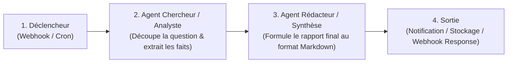

# Manuel Utilisateur & Guide d'Exploitation : Plateforme Jarvis

Bienvenue dans le manuel d'utilisation de **Jarvis**, votre infrastructure locale d'Intelligence Artificielle générative et d'orchestration multi-agents, auto-hébergée sur votre cluster Kubernetes bare-metal et pilotée par GitOps (ArgoCD).

---

## Sommaire

1. [Accès aux Services & Configuration Réseau Local](#1-accès-aux-services--configuration-réseau-local)
2. [Guide Pratique : Open WebUI (Interface Chat & RAG)](#2-guide-pratique--open-webui-interface-chat--rag)
3. [Guide Pratique : Orchestration Multi-Agents avec n8n](#3-guide-pratique--orchestration-multi-agents-avec-n8n)
4. [Gestion & Téléchargement des Modèles LLM (Ollama GPU)](#4-gestion--téléchargement-des-modèles-llm-ollama-gpu)
5. [Exploitation, Supervision & Maintenance GitOps](#5-exploitation-supervision--maintenance-gitops)
6. [Résolution des Incidents Fréquents (Troubleshooting)](#6-résolution-des-incidents-fréquents-troubleshooting)

---

## 1. Accès aux Services & Configuration Réseau Local

### 1.1. Tableau des Points d'Accès

| Service | Rôle | URL / Point d'accès | Protocole |
| :--- | :--- | :--- | :--- |
| **Open WebUI** | Interface de discussion IA, RAG & Agents | **`http://jarvis.local/`** | HTTP (Port 80 Ingress) |
| **n8n** | Ordonnanceur & Workflows Multi-Agents | **`http://n8n.local/`** | HTTP (Port 80 Ingress) |
| **Backend Inférence** | API LLM interne (Ollama OpenAI-compatible) | `http://jarvis-inference.jarvis-system.svc.cluster.local:11434` | Interne K8s |
| **ArgoCD** | Console de pilotage GitOps | `https://192.168.1.160:80` (namespace `argocd`) | HTTPS |

### 1.2. Configuration du Fichier `hosts` sur vos Postes Clients (LAN)

L'Ingress Traefik du cluster achemine le trafic en fonction du nom d'hôte HTTP (*Host Header*). Pour accéder facilement à **Jarvis** et **n8n** depuis n'importe quel ordinateur ou smartphone connecté à votre réseau local (`192.168.1.0/24`) :

#### Sous Windows :
1. Ouvrez le Bloc-notes (ou un éditeur de texte) en tant qu'**Administrateur**.
2. Ouvrez le fichier : `C:\Windows\System32\drivers\etc\hosts`.
3. Ajoutez la ligne suivante à la fin du fichier :
   ```text
   192.168.1.160 jarvis.local n8n.local
   ```
4. Enregistrez le fichier.

#### Sous Linux / macOS :
1. Ouvrez un terminal et éditez `/etc/hosts` avec les droits root :
   ```bash
   sudo nano /etc/hosts
   ```
2. Ajoutez la ligne suivante :
   ```text
   192.168.1.160 jarvis.local n8n.local
   ```
3. Sauvegardez (`Ctrl+O` puis `Ctrl+X`).

> [!TIP]
> Si vous disposez d'un serveur DNS local (ex: Pi-hole, AdGuard Home, ou DNS de routeur/box), vous pouvez ajouter directement une entrée DNS de type `A` pointant `*.local` ou `jarvis.local` et `n8n.local` vers l'IP `192.168.1.160`. Ainsi, tous les équipements de votre maison y auront accès sans configuration individuelle.

---

## 2. Guide Pratique : Open WebUI (Interface Chat & RAG)

Open WebUI est l'interface utilisateur web pour dialoguer avec les modèles d'IA locaux hébergés sur la carte graphique **NVIDIA GeForce RTX 2070 SUPER**.

### 2.1. Démarrage Rapide
1. Ouvrez votre navigateur sur **`http://jarvis.local`**.
2. L'interface d'accueil s'affiche directement (authentification désactivée par défaut pour un confort d'usage immédiat sur le LAN).
3. En haut à gauche, vérifiez que le modèle sélectionné est bien **`gemma2:9b`**.
4. Tapez votre question dans le champ de saisie en bas et appuyez sur **Entrée**. Le modèle génère sa réponse en streaming temps réel.

### 2.2. Fonctionnalités Avancées

#### A. RAG (Retrieval-Augmented Generation) / Recherche Documentaire
Vous pouvez fournir des documents à Jarvis pour qu'il réponde à partir de vos propres données privées :
1. Cliquez sur l'icône **`+`** (ou trombone) à gauche de la zone de texte.
2. Déposez un fichier (PDF, Markdown, texte brut, CSV, etc.).
3. Posez une question sur le contenu du fichier (ex: *"Résume les 3 points clés de ce rapport"*).
4. Jarvis lit le document, génère les embeddings vectoriels localement et formule sa réponse en citant les sources.

#### B. Personas & Prompts Système Spécialisés
Pour créer des assistants spécialisés (ex: Expert DevOps Kubernetes, Rédacteur Technique, Correcteur orthographique) :
1. Cliquez sur votre icône de profil en bas à gauche > **Modèles** (ou **Workspace** > **Models**).
2. Cliquez sur **Créer un Modèle**.
3. Remplissez le nom (ex: *Jarvis DevOps*), choisissez le modèle de base (`gemma2:9b`), et saisissez le **System Prompt** décrivant son rôle et ses directives.
4. Enregistrez : le modèle personnalisé apparaît désormais dans la liste déroulante des chats.

#### C. Contrôle des Paramètres de Génération
En cliquant sur l'icône de réglages en haut à droite d'une conversation :
* **Température (0.0 à 1.0)** :
  * `0.1 - 0.3` : Réponses déterministes, idéales pour le code, les maths et la logique.
  * `0.7 - 0.8` : Réponses créatives, idéales pour la rédaction et le brainstorming.
* **Context Length (Fenêtre de contexte)** : configuré par défaut à 4096 tokens pour optimiser l'usage des 8 Go de VRAM.

---

## 3. Guide Pratique : Orchestration Multi-Agents avec n8n

**n8n** permet d'automatiser des flux de travail complexes et de connecter le LLM local à des déclencheurs événementiels (cron, webhooks, flux RSS, requêtes HTTP, etc.).

### 3.1. Première Initialisation de n8n
1. Ouvrez votre navigateur sur **`http://n8n.local`**.
2. Lors de la première visite, n8n vous invite à créer le compte d'administration principal (nom, email, mot de passe).
3. Ces identifiants et les données de vos flux sont conservés de manière persistante dans le volume Kubernetes `n8n-data-pvc`.

### 3.2. Connexion de n8n au LLM Local Jarvis (Ollama)
Pour utiliser le modèle Gemma dans vos workflows n8n :
1. Dans le menu de gauche de n8n, cliquez sur **Credentials** (Identifiants) > **Add Credential**.
2. Recherchez **OpenAI** (car Ollama fournit une API 100% compatible OpenAI).
3. Renseignez les paramètres suivants :
   * **API Key** : `ollama` (n'importe quelle chaîne de caractères non vide).
   * **Base URL** (dans les paramètres avancés / Custom Endpoints) :
     ```text
     http://jarvis-inference.jarvis-system.svc.cluster.local:11434/v1
     ```
4. Cliquez sur **Save**.

### 3.3. Création d'un Workflow Multi-Agents Pas-à-Pas

Voici comment construire une chaîne à deux agents autonomes :



1. Dans n8n, créez un nouveau workflow : **New Workflow**.
2. Ajoutez un déclencheur : nœud **Manual Trigger** ou **Webhook**.
3. Ajoutez un nœud **AI Agent** (Agent 1) :
   - Mode : *Tools Agent* ou *Chat Agent*.
   - Connectez-y le nœud **OpenAI Chat Model** :
     - Credential : sélectionnez celui créé à l'étape 3.2.
     - Model : `gemma2:9b`.
   - Prompt système de l'Agent 1 : *"Tu es un analyste expert. Ton rôle est de décomposer la demande de l'utilisateur, d'extraire les éléments clés et d'identifier les contraintes."*
4. Ajoutez un second nœud **AI Agent** (Agent 2) relié à la sortie du premier :
   - Connectez le même modèle LLM.
   - Prompt système de l'Agent 2 : *"Tu es un rédacteur professionnel. Prends les éléments analysés par l'analyste et rédige une synthèse claire, structurée et directement exploitable."*
5. Cliquez sur **Test step** : les deux agents s'exécutent en cascade sur votre GPU local !

---

## 4. Gestion & Téléchargement des Modèles LLM (Ollama GPU)

Les poids des modèles sont stockés dans le volume persistant de 60 Go (`ollama-models-pvc`) rattaché au nœud physique `mini`.

### 4.1. Télécharger un Nouveau Modèle

#### Méthode 1 : Directement depuis Open WebUI (Le plus simple)
1. Ouvrez `http://jarvis.local` > **Paramètres** (icône roue crantée) > **Admin Settings** > **Models**.
2. Dans le champ **Pull a model from Ollama.com**, tapez le nom du modèle (ex: `llama3.1:8b`, `mistral:7b`, `phi3:mini`).
3. Cliquez sur le bouton de téléchargement. La barre de progression s'affiche en direct.

#### Méthode 2 : En Ligne de Commande Kubernetes
Depuis votre terminal administrateur :
```bash
# Télécharger un modèle léger très rapide (ex: Gemma 2 2B)
kubectl exec -it -n jarvis-system deploy/jarvis-inference -- ollama pull gemma2:2b

# Télécharger Llama 3.1 8B (compatible 100% VRAM sur la RTX 2070 SUPER)
kubectl exec -it -n jarvis-system deploy/jarvis-inference -- ollama pull llama3.1:8b

# Télécharger le modèle Gemma 26B (mode hybride CPU/GPU)
kubectl exec -it -n jarvis-system deploy/jarvis-inference -- ollama pull gemma:26b
```

### 4.2. Lister les Modèles Installés
```bash
kubectl exec -n jarvis-system deploy/jarvis-inference -- ollama list
```

### 4.3. Supprimer un Modèle pour Libérer de l'Espace Disque
```bash
kubectl exec -it -n jarvis-system deploy/jarvis-inference -- ollama rm <nom-du-modele>
```

### 4.4. Guide des Modèles Recommandés pour la RTX 2070 SUPER (8 Go VRAM)

| Modèle | Empreinte VRAM | Débit Observé | Cas d'usage idéal |
| :--- | :--- | :--- | :--- |
| **`gemma2:9b`** *(Installé par défaut)* | ~5.4 Go | **~30 tokens/s** | **Polyvalent par excellence** : Chat, raisonnement, code, français impeccable. |
| **`llama3.1:8b`** | ~4.9 Go | **~35 tokens/s** | Workflows d'agents n8n, structuration JSON, outils. |
| **`gemma2:2b`** | ~1.6 Go | **~65 tokens/s** | Classification ultra-rapide, micro-tâches, agents temps réel. |
| **`gemma:26b`** | ~15 Go (Hybride) | **~8-12 tokens/s** | Analyses documentaires complexes nécessitant une grande profondeur. |

---

## 5. Exploitation, Supervision & Maintenance GitOps

### 5.1. Vérification de l'État de l'Application ArgoCD
Pour vérifier que l'infrastructure est conforme et sans dérive :
```bash
kubectl get app jarvis -n argocd
# Résultat attendu : SYNC STATUS = Synced / HEALTH STATUS = Healthy
```

### 5.2. Surveiller l'Utilisation GPU et la VRAM en Direct
Pour observer la consommation énergétique, la température et la mémoire occupée de la RTX 2070 SUPER lors d'une génération :
```bash
kubectl exec -n jarvis-system deploy/jarvis-inference -- nvidia-smi
```

Pour une surveillance en continu toutes les 2 secondes :
```bash
kubectl exec -it -n jarvis-system deploy/jarvis-inference -- watch -n 2 nvidia-smi
```

### 5.3. Consulter les Logs des Services
En cas de comportement inattendu :
```bash
# Logs du moteur d'inférence (requêtes LLM, temps de calcul)
kubectl logs -f -n jarvis-system deploy/jarvis-inference

# Logs de l'interface Open WebUI
kubectl logs -f -n jarvis-system deploy/jarvis-webui

# Logs de n8n
kubectl logs -f -n jarvis-system deploy/jarvis-n8n
```

### 5.4. Procédure de Redémarrage d'un Service
Grâce aux PVC persistants, redémarrer un composant ne supprime aucune donnée ni aucun modèle :
```bash
# Redémarrer Open WebUI
kubectl rollout restart deployment/jarvis-webui -n jarvis-system

# Redémarrer n8n
kubectl rollout restart deployment/jarvis-n8n -n jarvis-system

# Redémarrer le moteur d'inférence
kubectl rollout restart deployment/jarvis-inference -n jarvis-system
```

### 5.5. Modifier la Configuration via GitOps (La Règle d'Or)
Pour modifier une variable, une limite de mémoire ou une route :
1. Modifiez les fichiers YAML correspondants dans `k8s/base/` ou `k8s/overlays/production/`.
2. Validez la syntaxe localement :
   ```bash
   kubectl kustomize k8s/overlays/production
   ```
3. Committez et poussez sur GitHub :
   ```bash
   git commit -am "chore(config): ajuster la mémoire de WebUI"
   git push origin main
   ```
4. ArgoCD détecte automatiquement le commit et applique la modification sur le cluster sans aucune coupure de service.

---

## 6. Résolution des Incidents Fréquents (Troubleshooting)

### Q1. La page `http://jarvis.local` ne s'ouvre pas ("Site inaccessible").
* **Cause 1** : L'entrée DNS n'est pas présente dans votre fichier `hosts`.
  * *Solution* : Vérifiez que `192.168.1.160 jarvis.local` est bien enregistré dans votre fichier `hosts` (voir [Section 1.2](#12-configuration-du-fichier-hosts-sur-vos-postes-clients-lan)).
* **Cause 2** : Testez directement la réponse de l'Ingress depuis un terminal :
  ```bash
  curl.exe -I -H "Host: jarvis.local" http://192.168.1.160/
  ```
  Si vous obtenez `HTTP/1.1 200 OK`, le cluster fonctionne parfaitement : le souci vient de la résolution locale du navigateur (vider le cache DNS ou tester en navigation privée).

---

### Q2. La réponse du chat s'arrête brusquement ou affiche une erreur de délai dépassé (Timeout).
* **Cause** : Le prompt est très volumineux et dépasse le timeout standard du reverse proxy.
* *Solution* : Vérifiez dans `k8s/base/ingress/ingress.yaml` que les annotations de streaming Traefik sont bien actives :
  ```yaml
  traefik.ingress.kubernetes.io/router.entrypoints: web,websecure
  ```

---

### Q3. L'inférence est anormalement lente (quelques tokens par minute).
* **Cause** : Le modèle s'exécute sur le CPU au lieu du GPU.
* *Solution* :
  1. Vérifiez que la RTX 2070 SUPER est bien détectée :
     ```bash
     kubectl exec -n jarvis-system deploy/jarvis-inference -- nvidia-smi
     ```
  2. Si le modèle dépasse 8 Go de VRAM (ex: modèle 26B/70B non quantifié), les couches sont déversées en RAM système, ce qui ralentit l'inférence. Basculez sur `gemma2:9b` qui s'exécute à 100% en VRAM.

---

### Q4. Un pod affiche le statut `Pending`.
* **Cause** : Les contraintes de ressources (GPU ou StorageClass) ne peuvent pas être satisfaites.
* *Solution* :
  ```bash
  kubectl describe pod <nom-du-pod> -n jarvis-system
  ```
  Vérifiez la section `Events:` en bas de la commande pour identifier si le problème provient du stockage ou du GPU.
