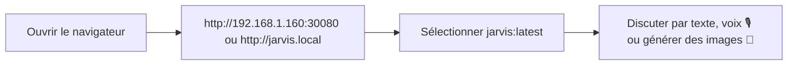
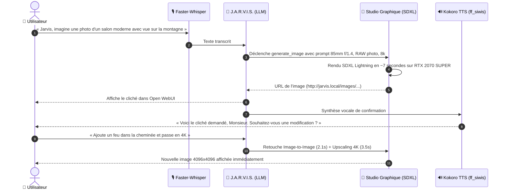

# 🤖 Manuel Utilisateur & Guide d'Exploitation : Plateforme Jarvis

Bienvenue sur le guide officiel de **J.A.R.V.I.S.**, votre infrastructure locale d'Intelligence Artificielle générative, de synthèse vocale, de **Studio Visuel photoréaliste** et d'orchestration multi-agents, auto-hébergée sur votre cluster Kubernetes bi-GPU et pilotée par GitOps (ArgoCD).

---

## 🧭 Sommaire

* [⚡ 1. Démarrage Express en 30 Secondes](#-1-démarrage-express-en-30-secondes)
* [🌐 2. Points d'Accès & Configuration Réseau (LAN)](#-2-points-daccès--configuration-réseau-lan)
* [💬 3. Guide Pratique : Open WebUI (Interface Chat & RAG)](#-3-guide-pratique--open-webui-interface-chat--rag)
* [🎙️ 4. Mode Vocal Voice-to-Voice (Whisper & Kokoro TTS Français)](#️-4-mode-vocal-voice-to-voice-whisper--kokoro-tts-français)
* [🎨 5. Studio Visuel J.A.R.V.I.S. : Génération & Retouche Vocale d'Images](#-5-studio-visuel-jarvis--génération--retouche-vocale-dimages)
* [🔍 6. Recherche Web en Direct (Serveur MCP & RAG Temps Réel)](#-6-recherche-web-en-direct-serveur-mcp--rag-temps-réel)
* [🧠 7. Second Cerveau & Base Vectorielle Qdrant (Notes & Briefing)](#-7-second-cerveau--base-vectorielle-qdrant-notes--briefing)
* [🚀 8. Modèles Disponibles & Architecture Bi-GPU (RTX 3070 + RTX 2070 SUPER)](#-8-modèles-disponibles--architecture-bi-gpu-rtx-3070--rtx-2070-super)
* [🛠️ 9. Exploitation, Stockage `/stockage` & Maintenance GitOps](#️-9-exploitation-stockage-stockage--maintenance-gitops)
* [❓ 10. Résolution des Problèmes Fréquents (FAQ / Dépannage)](#-10-résolution-des-problèmes-fréquents-faq--dépannage)

---

## ⚡ 1. Démarrage Express en 30 Secondes

Vous voulez commencer à échanger avec Jarvis tout de suite ? C'est très simple :



1. **Ouvrez votre navigateur** sur votre réseau local :
   👉 **[`http://192.168.1.160:30080`](http://192.168.1.160:30080)** (accès direct immédiat sans configuration DNS)  
   👉 ou **[`http://jarvis.local/`](http://jarvis.local/)** (si vous avez configuré le nom d'hôte).
2. **Sélectionnez le modèle** en haut à gauche :
   - **`jarvis:latest`** *(Recommandé)* : L'assistant complet avec style courtois, diagnostic système, compétences vocales et **Studio Visuel intégré**.
   - **`llama3.1:8b`** : Idéal pour les recherches web automatiques (Tool Calling).
   - **`gemma2:9b`** : Puissant modèle de Google, rapide et très analytique.
3. **Posez votre première question**, cliquez sur l'icône **Microphone** pour lui parler ou dites simplement :  
   *« Jarvis, génère une photo d'un café parisien sous la pluie au crépuscule. »*

---

## 🌐 2. Points d'Accès & Configuration Réseau (LAN)

L'écosystème Jarvis est propulsé par deux nœuds GPU en cluster Kubernetes :
- **`linux2` (`192.168.1.160`)** : **NVIDIA GeForce RTX 3070 (8 Go VRAM)** + Stockage centralisé `/stockage` (2 To libres).
- **`mini` (`192.168.1.99`)** : **NVIDIA GeForce RTX 2070 SUPER (8 Go VRAM)** (Studio Visuel SDXL dédié & TTS Kokoro).

### 2.1. Tableau des Services & URLs

| Service | Icône / Rôle | Accès Direct LAN (Sans configuration) | Accès Ingress (Nom convivial) | Nœud Préféré | Statut |
| :--- | :--- | :--- | :--- | :---: | :---: |
| **Open WebUI** | 💬 Interface Chat, Documents, Voix & Studio | **[`http://192.168.1.160:30080`](http://192.168.1.160:30080)** | **`http://jarvis.local/`** | `linux2` | 🟢 En ligne |
| **Studio Visuel API** | 🎨 Moteur SDXL Lightning & Retouche I2I | **[`http://192.168.1.160:30850`](http://192.168.1.160:30850)** | **`http://images.local/`** | `mini` *(Failover `linux2`)* | 🟢 En ligne |
| **Galerie Images** | 🖼️ Accès direct aux PNG générés | **`http://192.168.1.160:30850/images/`** | **`http://jarvis.local/images/`** | `/stockage` (NFS RWX) | 🟢 En ligne |
| **Ollama GPU API** | ⚡ Moteur d'Inférence LLM (OpenAI compatible) | **[`http://192.168.1.160:31434`](http://192.168.1.160:31434)** | **`http://ollama.local/`** | `linux2` | 🟢 En ligne |
| **Serveur FastMCP** | 🔍 Recherche Web DuckDuckGo & Tools Images | **[`http://192.168.1.160:30800/mcp`](http://192.168.1.160:30800/mcp)** | **`http://mcp.local/mcp`** | `mini` | 🟢 En ligne |
| **Qdrant Vector DB** | 🧠 Base Vectorielle (Second Cerveau) | **`http://192.168.1.160:30333`** | **`http://qdrant.local/`** | `linux2` | 🟢 En ligne |
| **ArgoCD GitOps** | 🐙 Console d'orchestration GitOps | **`https://192.168.1.160/`** | - | `linux2` | 🟢 En ligne |

---

### 2.2. Configuration du Fichier `hosts` (Optionnel pour utiliser `jarvis.local` et `images.local`)

Pour taper directement les noms de domaine au lieu de l'adresse IP et des ports, ajoutez une ligne dans votre fichier `hosts` :

#### 🪟 Sous Windows :
1. Lancez le **Bloc-notes** en faisant un clic droit > **Exécuter en tant qu'administrateur**.
2. Ouvrez le fichier : `C:\Windows\System32\drivers\etc\hosts`.
3. Ajoutez cette ligne tout en bas du fichier :
   ```text
   192.168.1.160 jarvis.local images.local ollama.local mcp.local qdrant.local
   ```
4. Enregistrez (`Ctrl + S`).

#### 🐧 Sous Linux / 🍏 macOS :
Ouvrez un terminal et exécutez :
```bash
sudo sh -c 'echo "192.168.1.160 jarvis.local images.local ollama.local mcp.local qdrant.local" >> /etc/hosts'
```

---

## 💬 3. Guide Pratique : Open WebUI (Interface Chat & RAG)

Open WebUI est votre portail d'échange unifié, intégrant dialogue textuel, documents, génération vocale et visuelle.

### 3.1. Les fonctionnalités clés

* **💬 Discussions Multi-Modèles** : Passez de `jarvis:latest` à `llama3.1:8b` en un clic au cours d'une conversation.
* **📎 Analyse de Documents (RAG)** : Glissez-déposez n'importe quel fichier (PDF, Markdown, Word, texte, CSV) dans la zone de chat. Jarvis l'indexe instantanément et répond précisément en citant ses sources.
* **🎨 Personas / Assistants spécialisés** : Créez des profils préconfigurés (ex: *Expert DevOps*, *Réviseur de code*, *Spécialiste Docker*).
* **📚 Historique & Organisation** : Vos échanges sont sauvegardés par dossiers et étiquettes (*Tags*).

---

## 🎙️ 4. Mode Vocal Voice-to-Voice (Whisper & Kokoro TTS Français)

Jarvis dispose d'une boucle vocale bidirectionnelle ultra-réactive :
- **Entrée Vocale** : `jarvis-voice-stt` propulsé par **Faster-Whisper** sur GPU (< 200 ms de latence).
- **Sortie Vocale** : `jarvis-voice-tts` propulsé par **Kokoro TTS** avec la voix française naturelle **`ff_siwis`**.

### 4.1. Comment parler à Jarvis ?
1. Cliquez sur l'icône **Microphone** dans la barre de saisie d'Open WebUI.
2. Énoncez votre requête à voix haute.
3. Dès que vous vous arrêtez de parler, Jarvis transcrit votre voix, formule sa réponse et vous la lit avec sa voix française de majordome.

### 4.2. Autorisation du Microphone dans le Navigateur

Si un message vous indique **« Accès aux appareils multimédias refusé »** sur `http://` :
1. Dans la barre d'adresse de votre navigateur, collez :
   - Pour Google Chrome : `chrome://flags/#unsafely-treat-insecure-origin-as-secure`
   - Pour Microsoft Edge : `edge://flags/#unsafely-treat-insecure-origin-as-secure`
2. Passez l'option sur **Enabled**.
3. Dans la zone de texte, renseignez : `http://192.168.1.160:30080, http://jarvis.local`
4. Cliquez sur le bouton bleu **Relaunch**.

---

## 🎨 5. Studio Visuel J.A.R.V.I.S. : Génération & Retouche Vocale d'Images

Le **Studio Visuel** permet de concevoir, retoucher et agrandir des clichés photoréalistes en haute définition par simple consigne vocale ou textuelle.



### 5.1. Exemples de Commandes Vocales Immédiates

| Type de Demande | Exemple de Phrase Vocale | Comportement de Jarvis |
| :--- | :--- | :--- |
| **Génération Initiale** | *« Jarvis, génère une photo d'un astronaute en armure cybernétique sur Mars au crépuscule. »* | Crée une image 1024x1024 photoréaliste en **~7 secondes** avec éclairage volumétrique et profondeur de champ. |
| **Retouche Conversationnelle** | *« Ajoute des lunettes holographiques et une lueur bleutée à l'astronaute. »* | Réutilise l'image précédente, conserve les traits du visage et intègre les éléments demandés en **~7 secondes**. |
| **Modification d'Ambiance** | *« Change l'éclairage pour une atmosphère nocturne pluvieuse avec reflets néon. »* | Réajuste les teintes et la météo sans altérer le sujet principal. |
| **Super-Résolution 4K** | *« Agrandis cette image en 4K Ultra-HD. »* | Applique l'upscaling Lanczos x4 et renforce les micro-textures (**4096x4096**, ~9.5 Mo) en **3.5 secondes**. |

### 5.2. Où sont stockées vos images ?

Toutes vos créations sont stockées de manière permanente et sécurisée sur le disque haute capacité **`/stockage`** (2 To libres) :
* **Chemin physique sur le serveur `linux2`** :  
  `/stockage/system-storage/generated-images/`
* **Accès web direct dans votre navigateur** :  
  `http://192.168.1.160:30850/images/<nom_du_fichier>.png` ou `http://jarvis.local/images/<nom_du_fichier>.png`.
* **Aucun risque de saturation** de la partition racine `/`.

### 5.3. Résilience & Bascule Automatique (Failover Bi-GPU)

Le Studio Visuel est hautement disponible :
* **Mode Nominal** : Exécuté sur le worker **`mini`** (RTX 2070 SUPER), laissant 100% des ressources de **`linux2`** (RTX 3070) disponibles pour les LLM et le chat.
* **Mode Secours Automatique (Failover < 10s)** : Si la machine `mini` est éteinte ou indisponible, Kubernetes migre instantanément le pod `jarvis-image-gen` sur `linux2`. Grâce à l'offloading CPU dynamique, le service continue de fonctionner sans saturer la carte graphique.
* **Retour Nominal** : Dès que `mini` est rallumée, la charge graphique réintègre automatiquement le worker dédié.

---

## 🔍 6. Recherche Web en Direct (Serveur MCP & RAG Temps Réel)

Jarvis peut explorer Internet en direct pour vérifier une information récente ou consulter la documentation d'un projet.

### Comment l'activer ?
- **Option A (Bouton Globe 🌐)** : Cliquez sur le globe sous la zone de texte pour injecter une recherche DuckDuckGo.
- **Option B (Tool Calling MCP)** : Avec le modèle `llama3.1:8b`, activez l'outil `MCP Web Search`. L'IA déclenche les recherches en totale autonomie.

---

## 🧠 7. Second Cerveau & Base Vectorielle Qdrant (Notes & Briefing)

* **Base Vectorielle Qdrant** : Stocke votre mémoire documentaire dans la collection `jarvis_second_brain`.
* **Ingestor Continu (`jarvis-ingestor`)** : Surveille vos notes déposées dans le volume `jarvis-notes-pvc` et les indexe avec `nomic-embed-text`.
* **Briefing Matinal (`jarvis-morning-digest`)** : Chaque matin à **07h30**, une synthèse de vos notes et de l'état du cluster est compilée.

---

## 🚀 8. Modèles Disponibles & Architecture Bi-GPU (RTX 3070 + RTX 2070 SUPER)

Le cluster tire parti de **16 Go de VRAM GDDR6 cumulée** :
- **`linux2` (RTX 3070 8 Go)** : Dédiée à l'inférence textuelle, aux embeddings et à l'analyse rapide (~40-50 tok/s).
- **`mini` (RTX 2070 SUPER 8 Go)** : Dédiée au rendu d'images SDXL Lightning, au TTS et aux workers d'arrière-plan.

| Modèle / Moteur | Nœud Hôte | VRAM allouée | Temps de Réponse | Cas d'Usage |
| :--- | :---: | :---: | :---: | :--- |
| **`jarvis:latest`** | `linux2` | ~5.4 Go | ~35-40 tok/s | Assistant principal, prompt engineering & coordination. |
| **`RealVisXL Lightning`** | `mini` | ~3.25 Go | **~7 secondes** | Studio Visuel : T2I, I2I et super-résolution 4K. |
| **`Kokoro TTS (ff_siwis)`**| `mini` | ~0.6 Go | < 300 ms | Synthèse vocale française de haute qualité. |
| **`Faster-Whisper Medium`**| `linux2` | ~1.5 Go | < 200 ms | Transcription vocale temps réel. |
| **`llama3.1:8b`** | `linux2` | ~4.9 Go | ~45 tok/s | Outils MCP & raisonnement structuré. |
| **`nomic-embed-text`** | `linux2` | ~0.3 Go | Instantané | Indexation vectorielle RAG. |

---

## 🛠️ 9. Exploitation, Stockage `/stockage` & Maintenance GitOps

### 9.1. Architecture du Stockage `/stockage` (2 To libres)

L'ensemble des données volumineuses réside sur la partition de 8 To `/stockage` :
```
/stockage/system-storage/
├── rancher/            --> K3s, données des pods et PVCs
├── docker/             --> Moteur Docker
├── kubelet/            --> Runtime de conteneurs
├── diffusers-cache/    --> Modèle SDXL Lightning (NFS RWX partagé)
└── generated-images/   --> Galerie permanente de vos créations (NFS RWX)
```

### 9.2. Commandes Utiles pour l'Exploitation

Depuis votre terminal (ou en SSH sur `julien@192.168.1.160`) :

```bash
# 1. Surveiller les GPU sur les deux nœuds
ssh julien@192.168.1.160 "nvidia-smi"
ssh julien@192.168.1.160 "ssh mini nvidia-smi"

# 2. Vérifier l'état de tous les pods Jarvis
ssh julien@192.168.1.160 "sudo kubectl get pods -n jarvis-system -o wide"

# 3. Tester l'état de santé du Studio Visuel
ssh julien@192.168.1.160 "curl -s http://localhost:30850/health"

# 4. Consulter les logs du Studio Visuel
ssh julien@192.168.1.160 "sudo kubectl logs -f -n jarvis-system deploy/jarvis-image-gen"
```

---

## ❓ 10. Résolution des Problèmes Fréquents (FAQ / Dépannage)

### ❓ « L'image met plus de temps à se générer lors du tout premier appel »
* **Explication** : Lors du tout premier appel après un redémarrage, PyTorch compile et optimise les noyaux CUDA (cuDNN) pour votre carte graphique (~40-60s). Dès le deuxième appel, l'inférence se fait à vitesse nominale (**~7 secondes**).

### ❓ « Le site http://jarvis.local ou http://images.local ne s'ouvre pas »
* **Solution** : Utilisez les adresses directes avec numéro de port :  
  - Open WebUI : **[`http://192.168.1.160:30080`](http://192.168.1.160:30080)**.
  - Studio Visuel : **[`http://192.168.1.160:30850`](http://192.168.1.160:30850)**.

### ❓ « Mon micro ne fonctionne pas dans le navigateur »
* **Solution** : Activez l'option Chrome/Edge `unsafely-treat-insecure-origin-as-secure` en y inscrivant `http://192.168.1.160:30080` (procédure détaillée en [Section 4.2](#️-4-mode-vocal-voice-to-voice-whisper--kokoro-tts-français)).

---

*Manuel mis à jour le 3 octobre 2026 pour la plateforme Jarvis AI Bi-GPU (RTX 3070 8 Go + RTX 2070 SUPER 8 Go / `/stockage`).*
