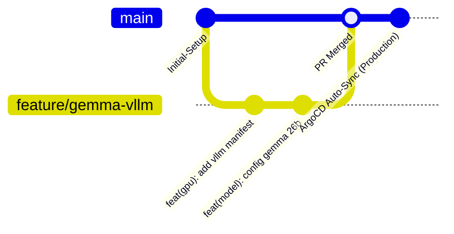

# Norme GitOps ArgoCD : Projet "Jarvis"

| Métadonnée | Valeur |
| :--- | :--- |
| **Nom de l'Application ArgoCD** | `jarvis` |
| **Dépôt Git Source** | `https://github.com/xelnagas/argocd-IA-local.git` |
| **Branche Principale (Source of Truth)** | `main` |
| **Cluster Cible** | Cluster Kubernetes local (Master : `192.168.1.160`) |
| **Namespace ArgoCD** | `argocd` |
| **Namespace Applicatif Jarvis** | `jarvis-system` (ou `jarvis`) |
| **Outil de Templating** | Kustomize (ou manifests bruts standardisés) |

---

## 1. Principes Directeurs du GitOps

1. **Git comme Source Unique de Vérité (SSOT)** : L'ensemble de l'état désiré du cluster (configurations, pods, services, ingress, secrets chiffrés) réside dans ce dépôt Git.
2. **Opérations Déclaratives Strictes** : Tout changement en production doit provenir d'un commit Git. Les commandes impératives directes (`kubectl apply`, `kubectl edit`) sont formellement proscrites en fonctionnement nominal.
3. **Réconciliation Automatisée & Self-Healing** : ArgoCD détecte toute dérive de configuration (*drift*) entre le cluster et le dépôt Git et la corrige automatiquement.
4. **Immutabilité des Déploiements** : Les images de conteneurs doivent privilégier des tags sémantiques ou des SHA256 immuables plutôt que le tag `:latest`.

---

## 2. Définition de l'Application ArgoCD Principale (`jarvis`)

Le fichier bootstrap d'enregistrement de l'application dans ArgoCD est le suivant :

```yaml
# bootstrap/application-jarvis.yaml
apiVersion: argoproj.io/v1alpha1
kind: Application
metadata:
  name: jarvis
  namespace: argocd
  finalizers:
    - resources-finalizer.argocd.argoproj.io
  labels:
    app.kubernetes.io/name: jarvis
    app.kubernetes.io/part-of: ai-platform
spec:
  project: default
  source:
    repoURL: https://github.com/xelnagas/argocd-IA-local.git
    targetRevision: main
    path: k8s/overlays/production
  destination:
    server: https://kubernetes.default.svc
    namespace: jarvis-system
  syncPolicy:
    automated:
      prune: true
      selfHeal: true
      allowEmpty: false
    syncOptions:
      - CreateNamespace=true
      - ApplyOutOfSyncOnly=true
      - ServerSideApply=true
    retry:
      limit: 5
      backoff:
        duration: 10s
        factor: 2
        maxDuration: 3m
```

---

## 3. Structure Recommandée du Référentiel Git

Le dépôt respecte une architecture modulaire basée sur **Kustomize**, facilitant la séparation entre infrastructure de base et configurations spécifiques aux nœuds locaux :

```text
argocd-IA-local/
├── .gitignore
├── README.md
├── ficheproduit.md                     # Fiche produit & architecture fonctionnelle
├── normegitops.md                      # Le présent document de normes GitOps
│
├── bootstrap/                          # Manifests initiaux pour ArgoCD
│   └── application-jarvis.yaml         # Définition de l'application racine ArgoCD
│
└── k8s/
    ├── infrastructure/                 # Plugins système & GPU K8s
    │   └── nvidia-device-plugin.yaml   # DaemonSet d'exposition du GPU RTX
    │
    ├── base/                           # Manifests génériques réutilisables
    │   ├── namespace.yaml
    │   ├── inference-engine/           # Backend GPU (vLLM / Ollama)
    │   │   ├── deployment.yaml
    │   │   ├── service.yaml
    │   │   └── pvc-models.yaml
    │   ├── open-webui/                 # Frontend WebUI
    │   │   ├── deployment.yaml
    │   │   ├── service.yaml
    │   │   ├── ingress.yaml
    │   │   └── pvc-data.yaml
    │   └── n8n/                        # Ordonnanceur multi-agents
    │       ├── deployment.yaml
    │       ├── service.yaml
    │       ├── ingress.yaml
    │       ├── pvc-n8n.yaml
    │       └── configmap.yaml
    │
    └── overlays/
        └── production/                 # Configuration spécifique au cluster local
            ├── kustomization.yaml      # Agrégateur Kustomize principal
            ├── patches/
            │   ├── gpu-resources.yaml  # Patchs de contraintes GPU CUDA (limits, nodeSelector)
            │   ├── ingress-hosts.yaml  # Définition des noms DNS/IP du LAN (192.168.1.0/24)
            │   └── storage-class.yaml  # Mapping des StorageClasses locales
            └── secrets/
                └── sealed-secrets.yaml # Secrets chiffrés pour n8n et WebUI
```

---

## 4. Normes de Nommage & Labels Standardisés

Tous les manifests déployés au sein de la stack **Jarvis** doivent respecter la convention de labellisation standard Kubernetes (recommandations officielles) :

```yaml
metadata:
  labels:
    app.kubernetes.io/name: <nom-composant>       # ex: vllm, open-webui, n8n
    app.kubernetes.io/instance: jarvis
    app.kubernetes.io/version: "<semver>"         # ex: "0.5.4", "v0.3.10"
    app.kubernetes.io/component: <role>           # ex: inference-backend, frontend, workflow-engine
    app.kubernetes.io/part-of: jarvis
    app.kubernetes.io/managed-by: argocd
```

### Règles de Naming
* Noms de ressources K8s en `kebab-case` : `jarvis-inference`, `jarvis-webui`, `jarvis-n8n`.
* Noms des services internes : DNS interne clair, par exemple `http://jarvis-inference.jarvis-system.svc.cluster.local:8000`.

---

## 5. Normes d'Ordonnancement & Assignation GPU (NVIDIA RTX / CUDA)

Le cluster étant hétérogène (certains nodes avec GPU RTX, d'autres sans), le ciblage strict des workloads d'inférence est **obligatoire**.

### 5.1. Étiquetage des Nœuds GPU
Chaque nœud équipé d'une carte NVIDIA RTX doit comporter le label suivant au niveau du cluster :
```bash
kubectl label nodes <nom-du-worker-gpu> accelerator=nvidia-gpu gpu-model=rtx
```

### 5.2. Spécification dans les Pods d'Inférence
Les manifests des pods d'inférence (vLLM / Ollama) doivent obligatoirement déclarer :

```yaml
spec:
  # 1. Sélection stricte du nœud matériel
  nodeSelector:
    accelerator: nvidia-gpu

  # 2. Tolérance aux taints éventuelles dédiées aux GPU
  tolerations:
    - key: "nvidia.com/gpu"
      operator: "Exists"
      effect: "NoSchedule"

  # 3. Déclaration du Runtime Container CUDA (si configuré)
  runtimeClassName: nvidia

  containers:
    - name: inference-engine
      image: vllm/vllm-openai:latest
      resources:
        limits:
          nvidia.com/gpu: "1"    # Réservation stricte d'un GPU CUDA
          memory: 32Gi
          cpu: "8"
        requests:
          nvidia.com/gpu: "1"
          memory: 16Gi
          cpu: "4"
      volumeMounts:
        - name: model-cache
          mountPath: /root/.cache/huggingface
```

---

## 6. Normes de Gestion des Secrets (Sécurité GitOps)

Aucun secret (mot de passe, clé API, jeton JWT, clé d'encryptage n8n) ne doit être déposé en clair dans le dépôt Git.

### 6.1. Outil Standard : Bitnami Sealed Secrets (ou SOPS)
* Les secrets sont chiffrés asymétriquement côté poste administrateur (`julien`) avec la clé publique du contrôleur `SealedSecrets` déployé sur le master `192.168.1.160`.
* Seul le manifest `SealedSecret` (chiffré) est versionné dans Git :
  ```bash
  kubectl create secret generic n8n-credentials \
    --from-literal=N8N_ENCRYPTION_KEY="mon-secret-tres-sur" \
    --dry-run=client -o yaml | \
    kubeseal --controller-namespace kube-system \
             --format yaml > k8s/overlays/production/secrets/sealed-n8n.yaml
  ```
* À la synchronisation, le contrôleur restaure le `Secret` Kubernetes standard dans le namespace `jarvis-system`.

---

## 7. Gestion du Stockage & Poids des Modèles

Le modèle **Gemma 4 26B A4B** et ses variantes quantifiées représentent entre 15 Go et 30 Go de données de poids tensoriels.

### Règles de Gestion des PVC :
1. **Politique de Rétention (`reclaimPolicy`)** : Définie sur `Retain` pour le PVC des modèles (`pvc-models.yaml`), afin d'éviter la suppression accidentelle des poids du modèle lors d'un cycle de suppression d'application ArgoCD.
2. **Points de Montage Dédiés** :
   - Moteur d'inférence : `/models` ou `/root/.cache/huggingface`.
   - Open WebUI : `/app/backend/data` (historique des chats, embeddings RAG).
   - n8n : `/home/node/.n8n` (workflows, exécutions, logs).

---

## 8. Stratégie de Branches & Workflow Développeur



### 8.1. Conventions de Commits (Conventional Commits)
* `feat(inference)` : Ajout ou mise à jour du moteur d'inférence ou modèle.
* `feat(n8n)` : Ajout d'extensions ou paramètres de workflows multi-agents.
* `feat(webui)` : Configuration ou mise à jour de l'interface Open WebUI.
* `fix(gpu)` : Ajustement des allocations de VRAM ou des paramètres CUDA.
* `chore(gitops)` : Ajustement des règles de synchronisation ArgoCD.

### 8.2. Procédure de Rollback
En cas d'instabilité après un déploiement (ex: VRAM Out-Of-Memory avec un nouveau modèle) :
1. Identifier le commit stable précédent : `git log --oneline`.
2. Exécuter un revert Git : `git revert HEAD && git push origin main`.
3. ArgoCD détecte le push et applique le rollback automatiquement sans intervention manuelle sur le cluster.

---

## 9. Personnalisation des Health Checks ArgoCD

Certains modèles LLM de 26 milliards de paramètres peuvent nécessiter 60 à 180 secondes pour se charger en VRAM depuis le stockage persistant.

Pour éviter qu'ArgoCD ne déclare prématurément le pod en échec (*Degraded*) :
1. **Startup Probes Kubernetes** : Configurer une `startupProbe` avec un `failureThreshold` élevé (ex: `failureThreshold: 30`, `periodSeconds: 10` = 300s de tolérance au démarrage).
2. **Readiness Probe** : Tester l'endpoint standard de disponibilité de l'API (ex: `GET /health` ou `GET /v1/models`).
3. ArgoCD maintiendra le statut applicatif à `Progressing` jusqu'à la fin complète du chargement du modèle en VRAM.
