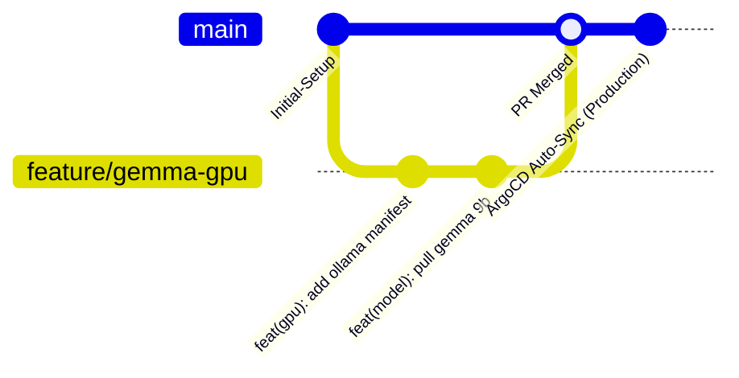

# Norme GitOps ArgoCD : Projet "Jarvis"

| Métadonnée | Valeur |
| :--- | :--- |
| **Nom de l'Application ArgoCD** | `jarvis` |
| **Dépôt Git Source** | `https://github.com/xelnagas/argocd-IA-local.git` |
| **Branche Principale (Source of Truth)** | `main` |
| **Cluster Cible** | Cluster Kubernetes local (Master : `192.168.1.160`) |
| **Namespace ArgoCD** | `argocd` |
| **Namespace Applicatif Jarvis** | `jarvis-system` (ou `jarvis`) |
| **Outil de Templating** | Kustomize (ou manifests bruts standardisés) |

---

## 1. Principes Directeurs du GitOps

1. **Git comme Source Unique de Vérité (SSOT)** : L'ensemble de l'état désiré du cluster (configurations, pods, services, ingress, secrets chiffrés) réside dans ce dépôt Git.
2. **Opérations Déclaratives Strictes** : Tout changement en production doit provenir d'un commit Git. Les commandes impératives directes (`kubectl apply`, `kubectl edit`) sont formellement proscrites en fonctionnement nominal.
3. **Réconciliation Automatisée & Self-Healing** : ArgoCD détecte toute dérive de configuration (*drift*) entre le cluster et le dépôt Git et la corrige automatiquement.
4. **Immutabilité des Déploiements** : Les images de conteneurs doivent privilégier des tags sémantiques ou des SHA256 immuables plutôt que le tag `:latest`.

---

## 2. Définition de l'Application ArgoCD Principale (`jarvis`)

Le fichier bootstrap d'enregistrement de l'application dans ArgoCD est le suivant :

```yaml
# bootstrap/application-jarvis.yaml
apiVersion: argoproj.io/v1alpha1
kind: Application
metadata:
  name: jarvis
  namespace: argocd
  finalizers:
    - resources-finalizer.argocd.argoproj.io
  labels:
    app.kubernetes.io/name: jarvis
    app.kubernetes.io/part-of: ai-platform
spec:
  project: default
  source:
    repoURL: https://github.com/xelnagas/argocd-IA-local.git
    targetRevision: main
    path: k8s/overlays/production
  destination:
    server: https://kubernetes.default.svc
    namespace: jarvis-system
  syncPolicy:
    automated:
      prune: true
      selfHeal: true
      allowEmpty: false
    syncOptions:
      - CreateNamespace=true
      - ApplyOutOfSyncOnly=true
      - ServerSideApply=true
    retry:
      limit: 5
      backoff:
        duration: 10s
        factor: 2
        maxDuration: 3m
```

---

## 3. Structure Recommandée du Référentiel Git

Le dépôt respecte une architecture modulaire basée sur **Kustomize**, facilitant la séparation entre infrastructure de base et configurations spécifiques aux nœuds locaux :

```text
argocd-IA-local/
├── .gitignore
├── README.md
├── ficheproduit.md                     # Fiche produit & architecture fonctionnelle
├── normegitops.md                      # Le présent document de normes GitOps
│
├── bootstrap/                          # Manifests initiaux pour ArgoCD
│   └── application-jarvis.yaml         # Définition de l'application racine ArgoCD
│
└── k8s/
    ├── infrastructure/                 # Plugins système & GPU K8s
    │   └── nvidia-device-plugin.yaml   # DaemonSet d'exposition du GPU RTX
    │
    ├── base/                           # Manifests génériques réutilisables
    │   ├── namespace.yaml
    │   ├── inference-engine/           # Backend GPU (vLLM / Ollama)
    │   │   ├── deployment.yaml
    │   │   ├── service.yaml
    │   │   └── pvc-models.yaml
    │   ├── open-webui/                 # Frontend WebUI
    │   │   ├── deployment.yaml
    │   │   ├── service.yaml
    │   │   └── pvc.yaml
    │   └── mcp-search/                 # Serveur d'outils MCP (Recherche Web & Fetch)
    │       ├── deployment.yaml
    │       ├── service.yaml
    │       ├── configmap.yaml
    │       └── kustomization.yaml
    │
    └── overlays/
        └── production/                 # Configuration spécifique au cluster local
            ├── kustomization.yaml      # Agrégateur Kustomize principal
            ├── patches/
            │   ├── gpu-resources.yaml  # Patchs de contraintes GPU CUDA (limits, nodeSelector)
            │   ├── ingress-hosts.yaml  # Définition des noms DNS/IP du LAN (192.168.1.0/24)
            │   └── storage-class.yaml  # Mapping des StorageClasses locales
            └── secrets/
                └── sealed-secrets.yaml # Secrets chiffrés pour WebUI
```

---

## 4. Normes de Nommage & Labels Standardisés

Tous les manifests déployés au sein de la stack **Jarvis** doivent respecter la convention de labellisation standard Kubernetes (recommandations officielles) :

```yaml
metadata:
  labels:
    app.kubernetes.io/name: <nom-composant>       # ex: ollama, open-webui, mcp-search
    app.kubernetes.io/instance: jarvis
    app.kubernetes.io/version: "<semver>"         # ex: "0.5.4", "v0.3.10"
    app.kubernetes.io/component: <role>           # ex: inference-engine, frontend, mcp-server
    app.kubernetes.io/part-of: jarvis
    app.kubernetes.io/managed-by: argocd
```

### Règles de Naming
* Noms de ressources K8s en `kebab-case` : `jarvis-inference`, `jarvis-webui`, `jarvis-mcp-search`.
* Noms des services internes : DNS interne clair, par exemple `http://jarvis-inference.jarvis-system.svc.cluster.local:8000`.

---

## 5. Normes d'Ordonnancement & Assignation Bi-GPU (NVIDIA RTX / CUDA)

Le cluster disposant de deux cartes graphiques NVIDIA (`linux2` RTX 3070 8 Go et `mini` RTX 2070 SUPER 8 Go), la répartition et la résilience inter-nœuds obéissent aux règles suivantes :

### 5.1. Étiquetage des Nœuds GPU
```bash
kubectl label nodes linux2 accelerator=nvidia-gpu gpu-model=rtx3070
kubectl label nodes mini accelerator=nvidia-gpu gpu-model=rtx2070super
```

### 5.2. Spécification pour les Workloads Haute Disponibilité (Studio Visuel)
Pour permettre au pod `jarvis-image-gen` de s'exécuter prioritairement sur `mini` tout en assurant un repli automatique sur `linux2` (failover sans verrouillage exclusif d'un entier GPU) :

```yaml
spec:
  runtimeClassName: nvidia
  affinity:
    nodeAffinity:
      preferredDuringSchedulingIgnoredDuringExecution:
        - weight: 100
          preference:
            matchExpressions:
              - key: kubernetes.io/hostname
                operator: In
                values: ["mini"]
        - weight: 50
          preference:
            matchExpressions:
              - key: kubernetes.io/hostname
                operator: In
                values: ["linux2"]
  tolerations:
    - key: "node.kubernetes.io/not-ready"
      operator: "Exists"
      effect: "NoExecute"
      tolerationSeconds: 30
    - key: "node.kubernetes.io/unreachable"
      operator: "Exists"
      effect: "NoExecute"
      tolerationSeconds: 30
  containers:
    - name: image-generator
      env:
        - name: NVIDIA_VISIBLE_DEVICES
          value: "all"
        - name: NVIDIA_DRIVER_CAPABILITIES
          value: "compute,utility"
        - name: ENABLE_CPU_OFFLOAD
          value: "true"
```

---

## 6. Normes de Gestion des Secrets (Sécurité GitOps)

Aucun secret (mot de passe, clé API, jeton JWT) ne doit être déposé en clair dans le dépôt Git.
Les variables sensibles sont gérées via ConfigMaps / Secrets K8s locaux ou SealedSecrets Bitnami.

---

## 7. Gestion du Stockage Haute Capacité `/stockage` & NFS RWX

Afin de préserver la partition système `/` et permettre le partage multi-nœuds sans duplication :

### Règles de Gestion du Stockage :
1. **Stockage Centralisé sur `/stockage` (2 To libres)** :
   - `/stockage/system-storage/diffusers-cache/` : Poids SDXL RealVisXL Lightning (partagé en NFS RWX).
   - `/stockage/system-storage/generated-images/` : Galerie permanente des PNG générés (partagé en NFS RWX).
   - `/stockage/system-storage/rancher/` : Données K3s et PVCs locaux.
2. **Volumes ReadWriteMany (RWX)** :
   - Tout volume partagé entre `linux2` et `mini` doit être déclaré en PersistentVolume NFS (`accessModes: [ReadWriteMany]`) afin que le worker `mini` accède aux données à la même vitesse que l'hôte local.

---

## 8. Stratégie de Branches & Workflow Développeur



### 8.1. Conventions de Commits (Conventional Commits)
* `feat(inference)` : Ajout ou mise à jour du moteur d'inférence ou modèle.
* `feat(mcp)` : Ajout d'outils ou paramètres du serveur MCP.
* `feat(webui)` : Configuration ou mise à jour de l'interface Open WebUI.
* `fix(gpu)` : Ajustement des allocations de VRAM ou des paramètres CUDA.
* `chore(gitops)` : Ajustement des règles de synchronisation ArgoCD.

### 8.2. Procédure de Rollback
En cas d'instabilité après un déploiement (ex: VRAM Out-Of-Memory avec un nouveau modèle) :
1. Identifier le commit stable précédent : `git log --oneline`.
2. Exécuter un revert Git : `git revert HEAD && git push origin main`.
3. ArgoCD détecte le push et applique le rollback automatiquement sans intervention manuelle sur le cluster.

---

## 9. Personnalisation des Health Checks ArgoCD

Certains modèles LLM de 26 milliards de paramètres peuvent nécessiter 60 à 180 secondes pour se charger en VRAM depuis le stockage persistant.

Pour éviter qu'ArgoCD ne déclare prématurément le pod en échec (*Degraded*) :
1. **Startup Probes Kubernetes** : Configurer une `startupProbe` avec un `failureThreshold` élevé (ex: `failureThreshold: 30`, `periodSeconds: 10` = 300s de tolérance au démarrage).
2. **Readiness Probe** : Tester l'endpoint standard de disponibilité de l'API (ex: `GET /health` ou `GET /v1/models`).
3. ArgoCD maintiendra le statut applicatif à `Progressing` jusqu'à la fin complète du chargement du modèle en VRAM.
