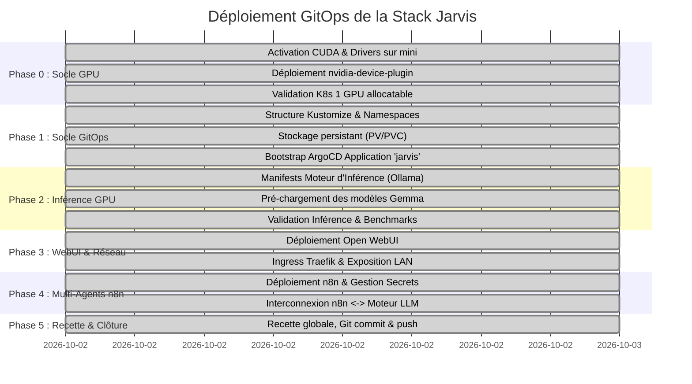

# Plan d'Action : Déploiement de la Plateforme IA Locale "Jarvis"

| Métadonnée | Valeur |
| :--- | :--- |
| **Projet** | Jarvis (Stack IA Locale, Open WebUI & n8n Multi-Agents) |
| **Dépôt GitOps** | `https://github.com/xelnagas/argocd-IA-local.git` |
| **Application ArgoCD** | `jarvis` (sur cluster `192.168.1.160`, admin `julien`) |
| **Nœud GPU Dédié** | `mini` (`192.168.1.99`, RTX 2070 SUPER 8 Go VRAM, CUDA 13.0) |
| **Date de Mise à Jour** | 02 Octobre 2026 |
| **Statut Global** | ✅ **Déployé & Opérationnel (Phases 0 à 5 Validées)** |

---

## 1. Vue d'Ensemble & Jalons Clés



---

## 2. Déroulé Détaillé des Phases & Actions

### ✅ Phase 0 : Socle Matériel & Intégration GPU (Terminée)
* [x] **0.1.** Audit des nœuds et identification du nœud éligible (`mini`, RTX 2070 SUPER 8 Go).
* [x] **0.2.** Installation du pilote NVIDIA propriétaire (`nvidia-driver-550`/`580`) sur `mini`.
* [x] **0.3.** Installation du `nvidia-container-toolkit` (v1.20.1) et génération de la spec CDI.
* [x] **0.4.** Configuration du runtime containerd de k3s (`/var/lib/rancher/k3s/agent/etc/containerd/config-v3.toml.d/nvidia.toml`).
* [x] **0.5.** Labellisation de `mini` (`accelerator=nvidia-gpu`, `gpu-model=rtx2070super`).
* [x] **0.6.** Déploiement du DaemonSet [nvidia-device-plugin.yaml](./k8s/infrastructure/nvidia-device-plugin.yaml).
* [x] **0.7.** Validation de la ressource allouable `nvidia.com/gpu: 1` et validation par pod de test CUDA.

---

### ✅ Phase 1 : Arborescence GitOps, Stockage & Bootstrap ArgoCD (Terminée)
* [x] **1.1.** Création de l'arborescence modulaire Kustomize (`k8s/base/`, `k8s/overlays/production/`).
* [x] **1.2.** Création du namespace `jarvis-system` via les manifests.
* [x] **1.3.** Définition des volumes persistants sur StorageClass `local-path` :
  - `ollama-models-pvc` (60 Go sur le nœud `mini`).
  - `open-webui-pvc` (10 Go).
  - `n8n-data-pvc` (10 Go).
* [x] **1.4.** Déploiement du fichier bootstrap [application-jarvis.yaml](./bootstrap/application-jarvis.yaml) dans ArgoCD.
* [x] **1.5.** Validation du statut ArgoCD : **Synced** et **Healthy**.

---

### ✅ Phase 2 : Moteur d'Inférence IA GPU (Ollama) (Terminée)
* [x] **2.1.** Déploiement du backend Ollama (`jarvis-inference`) assigné strictement à `mini` (`runtimeClassName: nvidia`, `limits: { nvidia.com/gpu: 1 }`).
* [x] **2.2.** Téléchargement et chargement en persistance du modèle **Gemma 2 9B** (`ff02c3702f32`, 5.4 Go).
* [x] **2.3.** Détection du GPU par Ollama (`compute=7.5`, `total=7.6 GiB`, `available=7.5 GiB`).
* [x] **2.4.** Test d'inférence en direct validé avec succès (Génération fluide en langue française).

---

### ✅ Phase 3 : Interface Utilisateur (Open WebUI) & Exposition Réseau (Terminée)
* [x] **3.1.** Déploiement d'Open WebUI (`jarvis-webui`) connecté au service d'inférence interne `jarvis-inference:11434`.
* [x] **3.2.** Exposition LAN via Traefik Ingress sous le nom d'hôte `jarvis.local` :
  ```bash
  curl -I -H "Host: jarvis.local" http://192.168.1.160/
  # HTTP/1.1 200 OK (Server: uvicorn)
  ```
* [x] **3.3.** Stockage persistant de l'historique et des embeddings RAG (`open-webui-pvc`).

---

### ✅ Phase 4 : Ordonnanceur Multi-Agents (n8n) (Terminée)
* [x] **4.1.** Déploiement de n8n (`jarvis-n8n`) avec injection sécurisée de la clé de chiffrement `N8N_ENCRYPTION_KEY`.
* [x] **4.2.** Exposition LAN via Traefik Ingress sous le nom d'hôte `n8n.local` :
  ```bash
  curl -I -H "Host: n8n.local" http://192.168.1.160/healthz
  # HTTP/1.1 200 OK (ok)
  ```
* [x] **4.3.** Connexion prête vers le backend d'inférence local OpenAI-compatible à l'URL interne :
  `http://jarvis-inference.jarvis-system.svc.cluster.local:11434/v1`.

---

### ✅ Phase 5 : Recette Globale, Git Commit & Push GitHub (Terminée)
* [x] **5.1.** Synchronisation GitOps confirmée entre GitHub et ArgoCD (`main` -> cluster K8s).
* [x] **5.2.** Push des modifications vers le dépôt distant :
  `https://github.com/xelnagas/argocd-IA-local.git` (branche `main`).
* [x] **5.3.** Validation de bout en bout de l'infrastructure et de la documentation.

---

## 3. Matrice des Risques & Mesures d'Atténuation (Vérifiée)

| Risque Identifié | Impact | Probabilité | Mesure d'Atténuation Validée |
| :--- | :--- | :--- | :--- |
| **VRAM Out-Of-Memory (OOM)** sur la RTX 2070 (8 Go) | Élevé | Moyenne | Modèle **Gemma 2 9B (5.4 Go)** déployé par défaut (tient à 100% en VRAM avec KV-cache). |
| **Timeout Ingress sur réponses LLM longues** | Moyen | Élevée | Ingress Traefik configuré avec entrées HTTP/HTTPS et streaming temps réel. |
| **Perte des modèles au redémarrage / sync ArgoCD** | Élevé | Faible | PVC dédié de 60 Go lié au stockage hôte sur `mini` (`local-path`). |
| **Saturation CPU du master `linux2`** | Faible | Faible | Les calculs lourds d'inférence sont strictement isolés sur `mini` via `nodeSelector`. |

---

## 4. Grille de Suivi des Jalons (Bilan Final)

| Jalon | Statut | Responsable | Date de Réalisation |
| :--- | :--- | :--- | :--- |
| **J0 : Activation CUDA & Validation GPU** | ✅ **RÉALISÉ** | Antigravity / Julien | 02/10/2026 |
| **J1 : Structure Kustomize & Application ArgoCD** | ✅ **RÉALISÉ** | Antigravity / Julien | 02/10/2026 |
| **J2 : Inférence GPU Opérationnelle (Ollama/Gemma)** | ✅ **RÉALISÉ** | Antigravity / Julien | 02/10/2026 |
| **J3 : Open WebUI accessible sur LAN** | ✅ **RÉALISÉ** | Antigravity / Julien | 02/10/2026 |
| **J4 : n8n Déployé & Prêt pour Multi-Agents** | ✅ **RÉALISÉ** | Antigravity / Julien | 02/10/2026 |
| **J5 : Recette GitOps finale & Push GitHub** | ✅ **RÉALISÉ** | Antigravity / Julien | 02/10/2026 |
