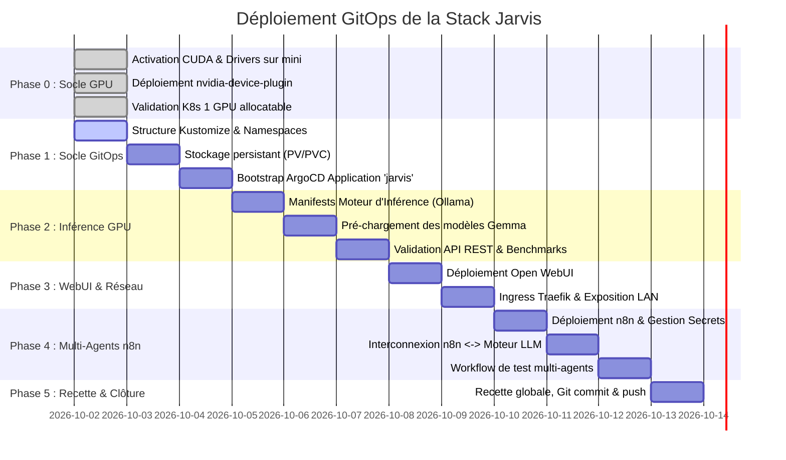

# Plan d'Action : Déploiement de la Plateforme IA Locale "Jarvis"

| Métadonnée | Valeur |
| :--- | :--- |
| **Projet** | Jarvis (Stack IA Locale, Open WebUI & n8n Multi-Agents) |
| **Dépôt GitOps** | `https://github.com/xelnagas/argocd-IA-local.git` |
| **Application ArgoCD** | `jarvis` (sur cluster `192.168.1.160`, admin `julien`) |
| **Nœud GPU Dédié** | `mini` (`192.168.1.99`, RTX 2070 SUPER 8 Go VRAM, CUDA 13.0) |
| **Date de Création** | 02 Octobre 2026 |
| **Statut Global** | En cours (Phase 0 achevée, Phase 1 prête au démarrage) |

---

## 1. Vue d'Ensemble & Jalons Clés



---

## 2. Déroulé Détaillé des Phases & Actions

### ✅ Phase 0 : Socle Matériel & Intégration GPU (Terminée)
* [x] **0.1.** Audit des nœuds et identification du nœud éligible (`mini`, RTX 2070 SUPER 8 Go).
* [x] **0.2.** Installation du pilote NVIDIA propriétaire (`nvidia-driver-550`/`580`) sur `mini`.
* [x] **0.3.** Installation du `nvidia-container-toolkit` (v1.20.1) et génération de la spec CDI.
* [x] **0.4.** Configuration du runtime containerd de k3s (`/var/lib/rancher/k3s/agent/etc/containerd/config-v3.toml.d/nvidia.toml`).
* [x] **0.5.** Labellisation de `mini` (`accelerator=nvidia-gpu`, `gpu-model=rtx2070super`).
* [x] **0.6.** Déploiement du DaemonSet [nvidia-device-plugin.yaml](./k8s/infrastructure/nvidia-device-plugin.yaml).
* [x] **0.7.** Validation de la ressource allouable `nvidia.com/gpu: 1` et validation par pod de test CUDA.

---

### ⏳ Phase 1 : Arborescence GitOps, Stockage & Bootstrap ArgoCD

**Objectif** : Structurer le dépôt Git et configurer ArgoCD pour qu'il pilote l'état désiré du cluster.

#### Actions :
1. **Initialiser l'arborescence Kustomize** :
   - Créer `k8s/base/namespace.yaml` pour le namespace dédié `jarvis-system`.
   - Créer la structure `k8s/base/` pour les trois services : `inference-engine/`, `open-webui/`, `n8n/`.
   - Créer `k8s/overlays/production/kustomization.yaml`.
2. **Définir les Volumes Persistants (PVC)** :
   - `pvc-models` : Stockage des poids de modèles (50 à 100 Go sur `local-path`).
   - `pvc-webui` : Stockage des historiques de conversations et documents RAG (10 Go).
   - `pvc-n8n` : Stockage des workflows et de la base n8n (10 Go).
   - *Règle* : Déclarer `persistentVolumeReclaimPolicy: Retain` pour les modèles.
3. **Créer le fichier bootstrap ArgoCD** :
   - Rédiger `bootstrap/application-jarvis.yaml` ciblant le dépôt `https://github.com/xelnagas/argocd-IA-local.git` sur le chemin `k8s/overlays/production`.
   - Activer la synchronisation automatique (`prune: true`, `selfHeal: true`).
4. **Enregistrer l'application dans ArgoCD** :
   ```bash
   kubectl apply -f bootstrap/application-jarvis.yaml
   ```

**Livrables de Phase 1** : Arborescence Git prête, PVC provisionnés, Application ArgoCD `jarvis` créée et synchronisée.

---

### ⏳ Phase 2 : Moteur d'Inférence IA GPU (Ollama / vLLM)

**Objectif** : Déployer le backend de calcul d'IA sur le nœud `mini` et charger les modèles Gemma.

#### Actions :
1. **Élaborer les manifests K8s du moteur d'inférence** :
   - `deployment.yaml` :
     - Image : `ollama/ollama:latest`.
     - Assignation stricte : `nodeSelector: { accelerator: nvidia-gpu }`.
     - Runtime : `runtimeClassName: nvidia`.
     - Allocation GPU : `resources.limits: { nvidia.com/gpu: "1" }`.
     - Variables d'environnement : `OLLAMA_MODELS=/root/.ollama/models`, `OLLAMA_HOST=0.0.0.0:11434`, `NVIDIA_VISIBLE_DEVICES=all`.
     - Montage du volume persistant `pvc-models`.
   - `service.yaml` :
     - Service ClusterIP `jarvis-inference` sur le port `11434`.
2. **Configurer les Sondes de Santé (Health Checks)** :
   - `startupProbe` : HTTP GET `/api/tags` avec `failureThreshold: 30`, `periodSeconds: 10` (tolérance de 5 minutes au démarrage).
   - `readinessProbe` : HTTP GET `/api/tags` toutes les 15s.
3. **Chargement des Modèles d'Inférence** :
   - Modèle 1 (Haute Vitesse / 100% VRAM) : **Gemma 2 9B Q4_K_M** (`ollama pull gemma2:9b`).
   - Modèle 2 (Raisonnement / Hybride) : **Gemma 26B / A4B** (`ollama pull gemma:26b` ou équivalent quantifié).
4. **Validation Technique** :
   - Tester l'endpoint API via curl depuis un pod interne :
     ```bash
     curl http://jarvis-inference.jarvis-system.svc:11434/api/generate -d '{"model": "gemma2:9b", "prompt": "Bonjour", "stream": false}'
     ```
   - Mesurer la latence et vérifier la charge VRAM avec `nvidia-smi` sur `mini`.

**Livrables de Phase 2** : Service `jarvis-inference` opérationnel sur GPU avec les modèles Gemma accessibles.

---

### ⏳ Phase 3 : Interface Utilisateur (Open WebUI) & Exposition Réseau

**Objectif** : Déployer l'interface web conversationnelle et la rendre accessible sur le réseau local `192.168.1.0/24`.

#### Actions :
1. **Créer les manifests Open WebUI** :
   - `deployment.yaml` :
     - Image : `ghcr.io/open-webui/open-webui:main`.
     - Variables :
       - `OLLAMA_BASE_URL=http://jarvis-inference.jarvis-system.svc.cluster.local:11434`.
       - `WEBUI_AUTH=true` (ou `false` selon préférence mono-utilisateur).
     - Montage de `pvc-webui` sur `/app/backend/data`.
   - `service.yaml` :
     - ClusterIP exposant le port `8080`.
2. **Configurer l'Ingress Traefik pour le Réseau Local** :
   - `ingress.yaml` :
     - IngressClassName : `traefik`.
     - Hôte DNS : `jarvis.local` (ou accès par IP de service / NodePort).
     - Annotations Traefik pour streaming long :
       - `traefik.ingress.kubernetes.io/router.entrypoints: web`
       - `traefik.ingress.kubernetes.io/buffering.max-request-body-bytes: "104857600"`
3. **Validation Fonctionnelle** :
   - Accès depuis un navigateur du réseau local (`http://192.168.1.160` ou `http://jarvis.local`).
   - Test de chat complet avec streaming de réponse en temps réel.
   - Test d'injection de document pour le RAG.

**Livrables de Phase 3** : Interface Open WebUI accessible sur le LAN, connectée au moteur d'inférence GPU.

---

### ⏳ Phase 4 : Ordonnanceur Multi-Agents (n8n)

**Objectif** : Déployer n8n pour orchestrer des workflows multi-agents autonomes exploitant le LLM local.

#### Actions :
1. **Gestion Sécurisée des Secrets n8n** :
   - Générer une clé de chiffrement `N8N_ENCRYPTION_KEY`.
   - Chiffrer le secret via Bitnami Sealed Secrets ou Secret Kubernetes dans `jarvis-system`.
2. **Créer les manifests n8n** :
   - `deployment.yaml` :
     - Image : `docker.n8n.io/n8nio/n8n:latest`.
     - Variables :
       - `N8N_PORT=5678`.
       - `WEBHOOK_URL=http://n8n.local/`.
       - `N8N_ENCRYPTION_KEY` injectée depuis le secret.
     - Montage de `pvc-n8n` sur `/home/node/.n8n`.
   - `service.yaml` :
     - ClusterIP sur le port `5678`.
   - `ingress.yaml` :
     - Exposition LAN sous l'URL `http://n8n.local` (ou port dédié).
3. **Interconnexion LLM & Workflows Multi-Agents** :
   - Dans n8n, configurer un credential de type **OpenAI API** :
     - Base URL : `http://jarvis-inference.jarvis-system.svc.cluster.local:11434/v1`
     - API Key : Valeur factice (ex: `ollama`)
   - Créer un workflow multi-agents de démonstration :
     - *Agent 1 (Coordinateur/Chercheur)* : Reçoit la consigne et structure les tâches.
     - *Agent 2 (Rédacteur/Synthèse)* : Rédige le résultat final via le LLM local.

**Livrables de Phase 4** : n8n déployé, connecté au LLM local, avec un workflow multi-agents fonctionnel.

---

### ⏳ Phase 5 : Recette Globale, GitOps Validation & Clôture

**Objectif** : Valider la résilience GitOps, mesurer les performances et finaliser les dépôts.

#### Actions :
1. **Validation GitOps ArgoCD** :
   - Vérifier que l'application `jarvis` dans ArgoCD passe au statut **Synced** et **Healthy**.
   - Tester l'auto-healing en modifiant manuellement un label ou un replica pour constater la réconciliation automatique.
2. **Mesure des Performances & Métrologie** :
   - Vérifier la consommation mémoire GPU sous charge (`nvidia-smi` pendant l'inférence).
   - Valider le débit de génération de tokens (> 25 tokens/s sur le modèle 9B).
3. **Commit & Push sur GitHub** :
   - Revue de l'ensemble des fichiers (`ficheproduit.md`, `normegitops.md`, `cudanode.md`, `planaction.md`, manifests `k8s/`).
   - Exécution des commits Git standardisés (`feat:`, `chore:`).
   - Push sur `https://github.com/xelnagas/argocd-IA-local.git` (branche `main`).

---

## 3. Matrice des Risques & Mesures d'Atténuation

| Risque Identifié | Impact | Probabilité | Mesure d'Atténuation Prévue |
| :--- | :--- | :--- | :--- |
| **VRAM Out-Of-Memory (OOM)** sur la RTX 2070 (8 Go) | Élevé | Moyenne | Privilégier le modèle 9B Q4_K_M (5.5 Go VRAM) en production nominale. Pour le 26B, configurer l'offload hybride GPU/RAM CPU. |
| **Timeout Ingress sur réponses LLM longues** | Moyen | Élevée | Configurer les annotations Traefik `proxy-read-timeout: 600s` et désactiver le buffering de réponse. |
| **Perte des modèles au redémarrage / sync ArgoCD** | Élevé | Faible | Utiliser une `PersistentVolumeClaim` dédiée avec `ReclaimPolicy: Retain` pour les répertoires de modèles. |
| **Saturation CPU du master `linux2`** | Faible | Faible | Toutes les charges d'inférence sont strictement isolées sur le worker `mini` via `nodeSelector`. |

---

## 4. Grille de Suivi d'Avancement

| Jalon | Statut | Responsable | Date Cible |
| :--- | :--- | :--- | :--- |
| **J0 : Activation CUDA & Validation GPU** | ✅ **FAIT** | Antigravity / Julien | 02/10/2026 |
| **J1 : Structure Kustomize & Application ArgoCD** | ⏳ À démarrer | Antigravity / Julien | 02/10/2026 |
| **J2 : Inférence GPU Opérationnelle (Ollama/Gemma)** | ⏳ En attente | Antigravity / Julien | 03/10/2026 |
| **J3 : Open WebUI accessible sur LAN** | ⏳ En attente | Antigravity / Julien | 03/10/2026 |
| **J4 : n8n & Premier Workflow Multi-Agents** | ⏳ En attente | Antigravity / Julien | 04/10/2026 |
| **J5 : Recette GitOps finale & Push GitHub** | ⏳ En attente | Antigravity / Julien | 04/10/2026 |
