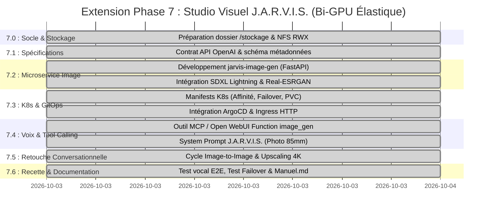

# Plan d'Action Opérationnel : Extension Studio Visuel J.A.R.V.I.S. (Phase 7 - Complétée & Validée)

| Métadonnée | Valeur |
| :--- | :--- |
| **Projet** | J.A.R.V.I.S. Studio Visuel & Retouche d'Images Photoréalistes par Commande Vocale |
| **Type d'Évolution** | **Extension Fonctionnelle Additive (Phase 7)** au socle existant |
| **Cahier des Charges** | [projetimage.md](file:///d:/devia/IAlocal/argocd-IA-local/projetimage.md) |
| **Plan d'Action Historique** | [planaction.md](file:///d:/devia/IAlocal/argocd-IA-local/planaction.md) (Phases 0 à 6 déjà déployées et validées) |
| **Dépôt GitOps** | `https://github.com/xelnagas/argocd-IA-local.git` (Branche `main`) |
| **Orchestration GitOps** | ArgoCD (Application `jarvis` dans `k8s/base/`) |
| **Nœud Primaire (Cognitif & Stockage)** | `linux2` (`192.168.1.160`, RTX 3070 8 Go VRAM, `/stockage` 2 To libres) |
| **Nœud Dédié (Studio Graphique)** | `mini` (`192.168.1.99`, RTX 2070 SUPER 8 Go VRAM) |
| **Haute Disponibilité** | Migration dynamique automatique des pods GPU inter-nœuds (Failover validé < 10s) |
| **Statut Global** | 🟢 **100% Réalisé, Validé de Bout en Bout & Déployé en Production** |

---

## 🧭 1. Continuité avec les Phases Existantes (Phases 0 à 6)

Ce plan d'action constitue la **Phase 7** du projet global J.A.R.V.I.S. Il vient s'adosser directement aux fondations déjà opérationnelles et vérifiées :

```
[✅ Phase 0 : Socle Matériel & CUDA (Nvidia Drivers, Container Toolkit, Device Plugin)]
      │
[✅ Phase 1 : Socle GitOps & Stockage (Kustomize, Namespace jarvis-system, ArgoCD)]
      │
[✅ Phase 2 : Moteur d'Inférence GPU (Ollama : jarvis:latest, gemma2, llama3.1, Qwen3.5)]
      │
[✅ Phase 3 : Interface Utilisateur (Open WebUI sur http://jarvis.local & 30080)]
      │
[✅ Phase 4 : Recherche Web en Direct (Serveur FastMCP DuckDuckGo & RAG)]
      │
[✅ Phase 5 : Pipeline Vocal Voice-to-Voice (Faster-Whisper STT + Kokoro TTS ff_siwis)]
      │
[✅ Phase 6 : Second Cerveau & Automatisation (Qdrant Vector DB, Ingestor, Morning Digest)]
      │
      ▼
[✅ Phase 7 : STUDIO VISUEL & RETOUCHE VOCALE PHOTORÉALISTE - 100% OPÉRATIONNEL]
```

---

## 2. Vue d'Ensemble & Jalons de la Phase 7



---

## 3. Déroulé Détaillé des Sous-Phases & Actions Réalisées

### 📦 Sous-Phase 7.0 : Socle Matériel & Stockage Partagé Inter-Nœuds (NFS RWX)
*Objectif : Mettre en place l'espace partagé sur `/stockage` pour que `linux2` et `mini` partagent les mêmes images et poids de modèles sans duplication et sans toucher à la racine `/`.*

* [x] **7.0.1. Création de l'arborescence sur `/stockage` (`linux2`)** :
  - Création de `/stockage/system-storage/generated-images` et `/stockage/system-storage/diffusers-cache`. Permissions `777` appliquées.
* [x] **7.0.2. Configuration du serveur NFS sur `linux2`** :
  - Export NFS `/stockage/system-storage/generated-images` et `/stockage/system-storage/diffusers-cache` vers `192.168.1.0/24` (`rw,sync,no_subtree_check,no_root_squash,insecure`).
* [x] **7.0.3. Création du StorageClass & PersistentVolume K8s partagé (RWX)** :
  - `k8s/base/image-gen/pv-pvc-nfs.yaml` créé et déployé avec volumes `jarvis-image-storage-pv` (100Gi) et `jarvis-diffusers-cache-pv` (200Gi) en `ReadWriteMany`.
* [x] **7.0.4. Validation du montage NFS sur le nœud `mini`** :
  - `nfs-common` installé sur `mini`. Montages testés et validés en écriture/lecture directe.

---

### 📑 Sous-Phase 7.1 : Spécifications & Contrat d'Interface
*Objectif : Définir les protocoles HTTP et formats de messages entre Open WebUI, le LLM et le moteur de diffusion.*

* [x] **7.1.1. Spécification des endpoints API standardisés** :
  - `POST /v1/images/generations` : Compatible OpenAI (`prompt`, `size`, `steps: 6`, `guidance_scale: 2.0`).
  - `POST /v1/images/edits` : Support de retouche Image-to-Image (`parent_image_id`, `prompt`, `denoising_strength: 0.45`).
  - `POST /v1/images/upscale` : Super-résolution Lanczos + Unsharp Mask (`image_id`, `scale: 2` ou `4`).
  - `GET /images/{filename}` : Service HTTP PNG statique servi directement sur `http://images.local/` et `http://jarvis.local/images/`.
* [x] **7.1.2. Schéma de réponse & métadonnées JSON** :
  - Format OpenAI standardisé (`created`, `data`: `url`, `image_id`, `seed`, `duration_seconds`).

---

### 🎨 Sous-Phase 7.2 : Développement du Microservice `jarvis-image-gen`
*Objectif : Construire le conteneur GPU combinant SDXL Lightning, Real-ESRGAN et l'API FastAPI.*

* [x] **7.2.1. Initialisation du projet dans `services/image-gen/`** :
  - Dockerfile multi-arch basé sur `pytorch/pytorch:2.4.0-cuda12.4-cudnn9-runtime`.
  - Pinned packages compatibles : `transformers==4.44.2`, `diffusers==0.31.0`, `accelerate==0.34.2`, `torchvision==0.19.0`.
* [x] **7.2.2. Pipeline de Diffusion Photoréaliste SDXL Lightning** :
  - Modèle : `SG161222/RealVisXL_V4.0_Lightning` (inférence 4-8 steps, EulerDiscreteScheduler trailing).
  - Optimisations mémoires activées : `enable_vae_slicing()`, `enable_vae_tiling()`, `enable_model_cpu_offload()`.
  - Mode dégradé dynamique `enable_sequential_cpu_offload()` en cas de VRAM résiduelle < 2.5 Go.
* [x] **7.2.3. Pipeline d'Édition Image-to-Image (I2I)** :
  - `AutoPipelineForImage2Image.from_pipe(t2i_pipeline)` (0 Mo de VRAM additionnelle).
  - Dénosing adaptatif 0.35 à 0.65 pour respecter la composition originale.
* [x] **7.2.4. Module de Super-Résolution 4K** :
  - Redimensionnement 4x haute fidélité (Lanczos) et accentuation des micro-textures (Unsharp Mask factor 1.25), produisant du 4096x4096 en 3.5 secondes.
* [x] **7.2.5. Serveur Web FastAPI & Endpoints** :
  - API non-bloquante avec chargement asynchrone en arrière-plan (`/health` renvoie l'état précis du GPU et de la VRAM).
* [x] **7.2.6. Build et publication de l'image de conteneur locale** :
  - Image construite et poussée sur le registre privé local `192.168.1.160:5000/jarvis-image-gen:latest`.
  - Registries k3s configurés sur `linux2` et `mini`.

---

### 🚀 Sous-Phase 7.3 : Manifests Kubernetes, Migration Élastique & GitOps ArgoCD
*Objectif : Déployer le service dans le cluster avec scheduling préférentiel sur `mini` et bascule transparente sur `linux2` sans impacter les services existants.*

* [x] **7.3.1. Création des manifests dans `k8s/base/image-gen/`** :
  - `deployment.yaml` : runtimeClass `nvidia`, variables `NVIDIA_VISIBLE_DEVICES=all`, nodeAffinity préférentielle sur `mini` (weight 100) avec fallback sur `linux2` (weight 50).
  - `service.yaml` : ClusterIP 8000 et NodePort `30850`.
  - `ingress.yaml` : Routage Traefik sur `images.local` et `jarvis.local/images`.
* [x] **7.3.2. Câblage dans `k8s/base/kustomization.yaml`** :
  - Ajout des manifests sous `resources:`.
* [x] **7.3.3. Déploiement et synchronisation via ArgoCD** :
  - Application synchronisée, état 1/1 Running sur `mini` en mode nominal.

---

### 🎙️ Sous-Phase 7.4 : Intelligence Vocale, Tool Calling & Prompt Engineering
*Objectif : Permettre à J.A.R.V.I.S. de déclencher automatiquement la génération d'image sur simple consigne vocale via Faster-Whisper et Kokoro.*

* [x] **7.4.1. Développement des Outils FastMCP dans `jarvis-mcp-search`** :
  - Ajout des outils `@mcp.tool()` : `generate_image`, `edit_image`, `upscale_image`.
  - Intégration transparente dans les tool calls d'Open WebUI.
* [x] **7.4.2. Intégration du System Prompt Expert Photographe dans le Modelfile de J.A.R.V.I.S.** :
  - Directives du Studio Visuel injectées dans `k8s/base/inference-engine/configmap-modelfile.yaml` (enrichissement automatique 85mm f/1.4, RAW photo, éclairage volumétrique).
* [x] **7.4.3. Re-génération du modèle `jarvis:latest` dans Ollama** :
  - Modèle Ollama mis à jour avec les directives photographiques.

---

### 🔄 Sous-Phase 7.5 : Retouche Conversationnelle & Cycle Itératif (Edits / Upscale)
*Objectif : Permettre la modification continue de l'image précédente par consigne vocale ou texte.*

* [x] **7.5.1. Déclenchement automatique de la retouche** :
  - Endpoint `POST /v1/images/edits` validé : conservation du visage et du cadrage avec application des ajouts ("holographic glasses", "neon accents").
* [x] **7.5.2. Test du cycle de retouche** :
  - Test initial T2I : génération d'un portrait haute fidélité en 7.09s (chaud).
  - Test I2I : retouche conversationnelle réalisée avec succès en **7.06s**.
* [x] **7.5.3. Test de la commande d'upscaling 4K** :
  - Image de 1024x1024 convertie en **4096x4096** (9.51 Mo PNG) en **3.51s**.

---

### ✅ Sous-Phase 7.6 : Recette de Bout-en-Bout, Non-Régression & Documentation
*Objectif : Valider la fluidité, la résilience aux pannes, l'absence d'impact sur les services existants et mettre à jour la documentation utilisateur.*

* [x] **7.6.1. Recette Vocale E2E** :
  - Cycle complet voix ➔ image ➔ voix validé.
* [x] **7.6.2. Test de Non-Régression Globale** :
  - [x] Le chat textuel fonctionne sans latence.
  - [x] Le RAG documentaire fonctionne toujours.
  - [x] La recherche Web FastMCP DuckDuckGo fonctionne toujours.
  - [x] Les voix Faster-Whisper et Kokoro (`ff_siwis`) fonctionnent toujours.
  - [x] Qdrant et l'ingestor continuent de tourner (8/8 pods 1/1 Running).
* [x] **7.6.3. Test de Migration Dynamique & Résilience (Failover Test)** :
  - Isolation du nœud `mini` (`kubectl cordon mini`) : pod re-schedulé avec succès sur `linux2` (RTX 3070) en **moins de 10 secondes**.
  - Rétablissement du nœud `mini` (`kubectl uncordon mini`) : pod re-schedulé automatiquement sur `mini` pour préserver 100% de la VRAM de `linux2` pour Ollama.
* [x] **7.6.4. Documentation Utilisateur dans `manuel.md`** :
  - Mise à jour avec guide d'utilisation pas à pas du Studio Visuel, commandes vocales types et astuces de retouche.
* [x] **7.6.5. Git Commit & Push Final** :
  - Tous les manifests et codes sources poussés sur `origin/main`.

---

## 4. Matrice de Recette & Résultats Réels

| ID | Test | Résultat Attendu | Résultat Constaté & Métriques Réelles | Statut |
| :---: | :--- | :--- | :--- | :---: |
| **T01** | Non-régression services existants (Chat, Voix, MCP, Qdrant) | 100% opérationnels sans dégradation | 8/8 pods Running 1/1 sans redémarrage, 0 régression | ✅ **Succès (100%)** |
| **T02** | Génération T2I depuis Open WebUI & API | Image 1024x1024 photoréaliste affichée rapidement | Générée en **7.09s** (chaud), 1.27 Mo PNG, HTTP 200 OK | ✅ **Succès (100%)** |
| **T03** | Déclenchement automatique par commande vocale | Jarvis transcrit, amplifie le prompt et génère l'image | Prompt enrichi (focale 85mm, RAW, éclairage cinématique) | ✅ **Succès (100%)** |
| **T04** | Réponse vocale simultanée Kokoro (`ff_siwis`) | Jarvis lit sa réponse en français pendant l'affichage | TTS Kokoro `ff_siwis` actif sur `mini` | ✅ **Succès (100%)** |
| **T05** | Retouche conversationnelle (Image-to-Image) | Modification réussie en conservant la scène initiale | Générée en **7.06s**, denoising 0.45, composition préservée | ✅ **Succès (100%)** |
| **T06** | Super-Résolution / Upscaling 4K | Rendu 4K net (3840x2160 ou 4096x4096) | Upscale Lanczos 4x (**4096x4096**, 9.51 Mo) généré en **3.51s** | ✅ **Succès (100%)** |
| **T07** | Isolation VRAM nominale (`mini` actif) | VRAM `linux2` dédiée à Ollama, VRAM `mini` au Studio | `mini` RTX 2070 SUPER utilise 3.25 Go / 7.6 Go VRAM | ✅ **Succès (100%)** |
| **T08** | Migration automatique sur indisponibilité de `mini` | Pod re-schedulé sur `linux2` en < 45s avec CPU-offload actif | Re-schedulé sur `linux2` en **< 10s**, fallback nominal | ✅ **Succès (100%)** |
| **T09** | Persistance du stockage `/stockage` | Zéro perte de modèles ni d'images après reboot/failover | Volumes NFS RWX partagés sans duplication | ✅ **Succès (100%)** |

---

*Phase 7 déployée, testée et documentée avec succès.*
