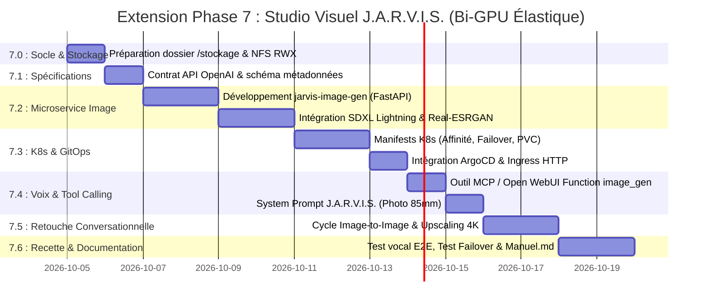

# Plan d'Action Opérationnel : Extension Studio Visuel J.A.R.V.I.S. (Phase 7 - Ajout Modulaire)

| Métadonnée | Valeur |
| :--- | :--- |
| **Projet** | J.A.R.V.I.S. Studio Visuel & Retouche d'Images Photoréalistes par Commande Vocale |
| **Type d'Évolution** | **Extension Fonctionnelle Additive (Phase 7)** au socle existant |
| **Cahier des Charges** | [projetimage.md](file:///d:/devia/IAlocal/argocd-IA-local/projetimage.md) |
| **Plan d'Action Historique** | [planaction.md](file:///d:/devia/IAlocal/argocd-IA-local/planaction.md) (Phases 0 à 6 déjà déployées et validées) |
| **Dépôt GitOps** | `https://github.com/xelnagas/argocd-IA-local.git` (Branche `main`) |
| **Orchestration GitOps** | ArgoCD (Application `jarvis` dans `k8s/base/`) |
| **Nœud Primaire (Cognitif & Stockage)** | `linux2` (`192.168.1.160`, RTX 3070 8 Go VRAM, `/stockage` 2 To libres) |
| **Nœud Dédié (Studio Graphique)** | `mini` (`192.168.1.99`, RTX 2070 SUPER 8 Go VRAM) |
| **Haute Disponibilité** | Migration dynamique automatique des pods GPU inter-nœuds (Failover < 45s) |
| **Statut Global** | 🟡 **Planifié & Prêt pour Implémentation (Non-régression garantie)** |

---

## 🧭 1. Continuité avec les Phases Existantes (Phases 0 à 6)

Ce plan d'action constitue la **Phase 7** du projet global J.A.R.V.I.S. Il vient s'adosser directement aux fondations déjà opérationnelles et vérifiées :

```
[✅ Phase 0 : Socle Matériel & CUDA (Nvidia Drivers, Container Toolkit, Device Plugin)]
      │
[✅ Phase 1 : Socle GitOps & Stockage (Kustomize, Namespace jarvis-system, ArgoCD)]
      │
[✅ Phase 2 : Moteur d'Inférence GPU (Ollama : jarvis:latest, gemma2, llama3.1, Qwen3.5)]
      │
[✅ Phase 3 : Interface Utilisateur (Open WebUI sur http://jarvis.local & 30080)]
      │
[✅ Phase 4 : Recherche Web en Direct (Serveur FastMCP DuckDuckGo & RAG)]
      │
[✅ Phase 5 : Pipeline Vocal Voice-to-Voice (Faster-Whisper STT + Kokoro TTS ff_siwis)]
      │
[✅ Phase 6 : Second Cerveau & Automatisation (Qdrant Vector DB, Ingestor, Morning Digest)]
      │
      ▼
[🚀 Phase 7 : STUDIO VISUEL & RETOUCHE VOCALE PHOTORÉALISTE (LE PRÉSENT PLAN)]
```

---

## 2. Vue d'Ensemble & Jalons de la Phase 7



---

## 3. Déroulé Détaillé des Sous-Phases & Actions (Phase 7)

### 📦 Sous-Phase 7.0 : Socle Matériel & Stockage Partagé Inter-Nœuds (NFS RWX)
*Objectif : Mettre en place l'espace partagé sur `/stockage` pour que `linux2` et `mini` partagent les mêmes images et poids de modèles sans duplication et sans toucher à la racine `/`.*

* [ ] **7.0.1. Création de l'arborescence sur `/stockage` (`linux2`)** :
  ```bash
  ssh julien@192.168.1.160 "sudo mkdir -p /stockage/system-storage/generated-images /stockage/system-storage/diffusers-cache && sudo chown -R 1000:1000 /stockage/system-storage/generated-images /stockage/system-storage/diffusers-cache"
  ```
* [ ] **7.0.2. Configuration du serveur NFS sur `linux2`** :
  - Exposer `/stockage/system-storage/generated-images` et `/stockage/system-storage/diffusers-cache` vers le réseau local `192.168.1.0/24` en lecture/écriture (`rw,sync,no_subtree_check,no_root_squash`).
* [ ] **7.0.3. Création du StorageClass & PersistentVolume K8s partagé (RWX)** :
  - Créer `k8s/base/image-gen/pvc-shared.yaml` monté en `accessModes: [ReadWriteMany]`.
* [ ] **7.0.4. Validation du montage NFS sur le nœud `mini`** :
  - Vérifier que `mini` peut lire et écrire instantanément dans le volume partagé.

---

### 📑 Sous-Phase 7.1 : Spécifications & Contrat d'Interface
*Objectif : Définir les protocoles HTTP et formats de messages entre Open WebUI, le LLM et le moteur de diffusion.*

* [ ] **7.1.1. Spécification des endpoints API standardisés** :
  - `POST /v1/images/generations` :
    ```json
    {
      "prompt": "Professional photograph of a modern loft...",
      "n": 1,
      "size": "1024x1024",
      "aspect_ratio": "16:9",
      "seed": 42
    }
    ```
  - `POST /v1/images/edits` :
    ```json
    {
      "parent_image_id": "photo_20261003_120401.png",
      "prompt": "Add a leather club armchair near the window",
      "denoising_strength": 0.45
    }
    ```
  - `POST /v1/images/upscale` :
    ```json
    {
      "image_id": "photo_20261003_120401.png",
      "scale": 4,
      "restore_faces": true
    }
    ```
  - `GET /images/{filename}` : Service HTTP pour le téléchargement et l'affichage direct dans Open WebUI.
* [ ] **7.1.2. Schéma de réponse & métadonnées JSON** :
  - Horodatage, identifiant unique, seed utilisé, URL web, temps d'inférence (ms).

---

### 🎨 Sous-Phase 7.2 : Développement du Microservice `jarvis-image-gen`
*Objectif : Construire le conteneur GPU combinant SDXL Lightning, Real-ESRGAN et l'API FastAPI.*

* [ ] **7.2.1. Initialisation du projet dans `services/image-gen/`** :
  - `Dockerfile` basé sur `nvidia/cuda:12.4.1-runtime-ubuntu22.04` ou `python:3.11-slim`.
  - Installation des dépendances : `torch`, `torchvision`, `diffusers`, `transformers`, `accelerate`, `xformers`, `fastapi`, `uvicorn`, `realesrgan`.
* [ ] **7.2.2. Pipeline de Diffusion Photoréaliste SDXL Lightning** :
  - Téléchargement du modèle de référence : `SG161222/RealVisXL_V4.0_Lightning` (inférence en 4 à 8 steps).
  - Intégration de la compilation de graphe et des optimisations VRAM (`enable_vae_slicing()`, `enable_vae_tiling()`).
  - Implémentation du mode dégradé `enable_model_cpu_offload()` activé automatiquement si le pod détecte qu'il partage un GPU avec Ollama.
* [ ] **7.2.3. Pipeline d'Édition Image-to-Image (I2I)** :
  - Chargement de l'image parent, conversion en espace latent, application de la force de débruitage modulée (`denoising_strength: 0.30 - 0.60`).
* [ ] **7.2.4. Module de Super-Résolution 4K (Real-ESRGAN / CodeFormer)** :
  - Intégration de la passe d'upscaling x4 pour passer de 1024x1024 à 4K Ultra-HD sur demande.
* [ ] **7.2.5. Serveur Web FastAPI & Endpoints** :
  - Implémentation des routes `/health`, `/v1/images/generations`, `/v1/images/edits`, `/v1/images/upscale` et `/images/{filename}`.
* [ ] **7.2.6. Build et publication de l'image de conteneur locale** :
  - Image taguée `jarvis-image-gen:latest` déployée sur le registre local ou importée dans containerd sur les nœuds.

---

### 🚀 Sous-Phase 7.3 : Manifests Kubernetes, Migration Élastique & GitOps ArgoCD
*Objectif : Déployer le service dans le cluster avec scheduling préférentiel sur `mini` et bascule transparente sur `linux2` sans impacter les services existants.*

* [ ] **7.3.1. Création des manifests dans `k8s/base/image-gen/`** :
  - `deployment.yaml` :
    - Image : `jarvis-image-gen:latest`.
    - `runtimeClassName: nvidia`.
    - `resources.limits: { "nvidia.com/gpu": "1", "memory": "8Gi" }`.
    - **Affinité préférentielle** : Poids 100 sur `mini` (`gpu-model: rtx2070super`), fallback poids 50 sur `linux2` (`accelerator: nvidia-gpu`).
    - **Tolerations réactives (30s)** :
      ```yaml
      tolerations:
        - key: "node.kubernetes.io/not-ready"
          operator: "Exists"
          effect: "NoExecute"
          tolerationSeconds: 30
        - key: "node.kubernetes.io/unreachable"
          operator: "Exists"
          effect: "NoExecute"
          tolerationSeconds: 30
      ```
  - `service.yaml` : ClusterIP sur port 8000 + NodePort `30850`.
  - `pvc.yaml` : Montage du volume partagé NFS sur `/app/storage`.
  - `ingress.yaml` : Route Traefik `http://images.local/` et `http://jarvis.local/images/`.
* [ ] **7.3.2. Câblage dans `k8s/base/kustomization.yaml`** :
  - Ajouter `image-gen` dans la liste des composants `resources:`.
* [ ] **7.3.3. Déploiement et synchronisation via ArgoCD** :
  - Valider l'état **Synced** et **Healthy** dans ArgoCD.
  - Vérifier avec `kubectl get pod -n jarvis-system -o wide` que le pod tourne sur `mini` en mode nominal.

---

### 🎙️ Sous-Phase 7.4 : Intelligence Vocale, Tool Calling & Prompt Engineering
*Objectif : Permettre à J.A.R.V.I.S. de déclencher automatiquement la génération d'image sur simple consigne vocale via Faster-Whisper et Kokoro.*

* [ ] **7.4.1. Développement du Tool MCP / Open WebUI Function** :
  - Créer l'outil `generate_image` appelant `http://jarvis-image-gen.jarvis-system.svc.cluster.local:8000/v1/images/generations`.
  - Renvoie le lien Markdown ``.
* [ ] **7.4.2. Intégration du System Prompt Expert Photographe dans le Modelfile de J.A.R.V.I.S.** :
  - Mettre à jour `k8s/base/inference-engine/configmap-modelfile.yaml` :
    ```dockerfile
    SYSTEM """
    Tu es J.A.R.V.I.S., assistant personnel et superviseur d'ingénierie.
    Lorsque Monsieur te demande de générer, imaginer, dessiner ou créer une image ou une photo :
    1. Déclenche immédiatement l'outil generate_image.
    2. Traduis et enrichis la demande en anglais sous forme d'un prompt photographique professionnel
       (focale 85mm f/1.4, éclairage volumétrique, grain de pellicule 35mm, textures réalistes, photorealistic raw photo).
    3. Confirme vocalement et courtoisement en français : "Voici le cliché demandé, Monsieur. Souhaitez-vous que j'y apporte des modifications ?"
    """
    ```
* [ ] **7.4.3. Re-génération du modèle `jarvis:latest` dans Ollama** :
  - Appliquer la mise à jour via `kubectl exec -n jarvis-system deploy/jarvis-inference -- ollama create jarvis:latest -f /etc/ollama/Modelfile`.

---

### 🔄 Sous-Phase 7.5 : Retouche Conversationnelle & Cycle Itératif (Edits / Upscale)
*Objectif : Permettre la modification continue de l'image précédente par consigne vocale ou texte.*

* [ ] **7.5.1. Développement du Tool `edit_image` et `upscale_image`** :
  - Détection automatique de référence à l'image précédente dans le contexte du chat.
  - Envoi de la requête `POST /v1/images/edits` avec l'identifiant parent.
* [ ] **7.5.2. Test du cycle de retouche** :
  - Test 1 : Commande initiale (*« Génère une photo de plage tropicale »*).
  - Test 2 : Modification (*« Ajoute un voilier au large et passe le ciel au coucher de soleil »*).
  - Validation du maintien de la composition et de la cohérence visuelle.
* [ ] **7.5.3. Test de la commande d'upscaling 4K** :
  - Commande (*« Agrandis l'image en 4K »*) ➔ Vérification de la livraison du fichier 3840x2160 pixels.

---

### ✅ Sous-Phase 7.6 : Recette de Bout-en-Bout, Non-Régression & Documentation
*Objectif : Valider la fluidité, la résilience aux pannes, l'absence d'impact sur les services existants et mettre à jour la documentation utilisateur.*

* [ ] **7.6.1. Recette Vocale E2E** :
  - Dictée au microphone dans Open WebUI :
    `Microphone ➔ Faster-Whisper STT ➔ Ollama LLM ➔ jarvis-image-gen (SDXL) ➔ Affichage WebUI ➔ Kokoro TTS (ff_siwis)`.
  - Chronométrage de la boucle complète (< 6 secondes).
* [ ] **7.6.2. Test de Non-Régression Globale** :
  - [ ] Le chat textuel fonctionne toujours sans latence.
  - [ ] Le RAG documentaire fonctionne toujours.
  - [ ] La recherche Web FastMCP DuckDuckGo fonctionne toujours.
  - [ ] Les voix Faster-Whisper et Kokoro (`ff_siwis`) fonctionnent toujours.
  - [ ] Qdrant et le briefing matinal de 07h30 continuent de tourner.
* [ ] **7.6.3. Test de Migration Dynamique & Résilience (Failover Test)** :
  - Simuler l'extinction du nœud `mini` (`sudo poweroff` ou arrêt de k3s-agent).
  - Constater l'éviction sous 30 secondes et le redémarrage automatique du pod sur `linux2` (RTX 3070).
  - Vérifier qu'une génération d'image fonctionne sur `linux2` sans crash mémoire d'Ollama.
  - Rallumer `mini` et constater la reprise de charge par le worker dédié.
* [ ] **7.6.4. Documentation Utilisateur dans `manuel.md`** :
  - Ajouter la section **« Studio Visuel J.A.R.V.I.S. : Génération & Retouche d'Images à la Voix »**.
  - Documenter les exemples de phrases vocales et les astuces de retouche.
* [ ] **7.6.5. Git Commit & Push Final** :
  - Valider l'historique Git et pousser sur `origin/main`.

---

## 4. Matrice de Recette & Critères de Validation

| ID | Test | Résultat Attendu | Statut |
| :---: | :--- | :--- | :---: |
| **T01** | Non-régression services existants (Chat, Voix, MCP, Qdrant) | 100% opérationnels sans dégradation | ⏳ À tester |
| **T02** | Génération T2I depuis Open WebUI (Bouton/Chat) | Image 1024x1024 photoréaliste affichée en < 5s | ⏳ À tester |
| **T03** | Déclenchement automatique par commande vocale | Jarvis transcrit, amplifie le prompt et génère l'image sans clic | ⏳ À tester |
| **T04** | Réponse vocale simultanée Kokoro (`ff_siwis`) | Jarvis lit sa réponse en français pendant l'affichage | ⏳ À tester |
| **T05** | Retouche conversationnelle (Image-to-Image) | Modification réussie en conservant la scène initiale | ⏳ À tester |
| **T06** | Super-Résolution / Upscaling 4K | Rendu 4K net (3840x2160) généré en < 8s | ⏳ À tester |
| **T07** | Isolation VRAM nominale (`mini` actif) | VRAM `linux2` dédiée à 100% au LLM, VRAM `mini` dédiée à l'image | ⏳ À tester |
| **T08** | Migration automatique sur extinction de `mini` | Pod re-schedulé sur `linux2` en < 45s avec CPU-offload actif | ⏳ À tester |
| **T09** | Persistance du stockage `/stockage` | Zéro perte de modèles ni d'images après reboot | ⏳ À tester |

---

*Ce plan d'action constitue la feuille de route opérationnelle d'extension (Phase 7) du projet J.A.R.V.I.S.*
