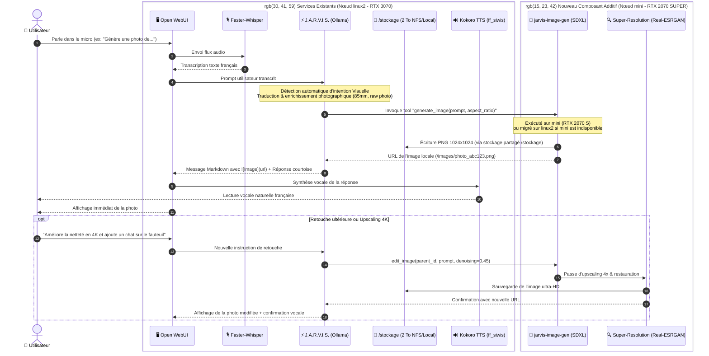
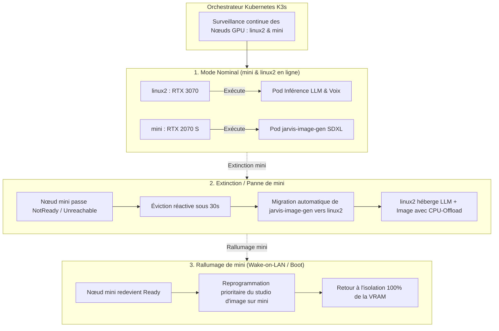

# 🎨 Projet J.A.R.V.I.S. Studio Visuel : Génération & Retouche d'Images Photoréalistes par Commande Vocale

> **Document de Cadrage & Plan d'Action Technique (Extension Modulaire Additive)**  
> *Auteur : Antigravity (Google DeepMind) & Julien*  
> *Date de création : 3 octobre 2026 (Mise à jour Additive & Élasticité Bi-GPU)*  
> *Cible d'infrastructure : Cluster Kubernetes Bare-metal Multi-Nœuds avec Migration Dynamique :*
> - **Nœud 1 (`linux2` - 192.168.1.160)** : GPU NVIDIA GeForce RTX 3070 8 Go, Stockage centralisé `/stockage` (2 To libres), Control-Plane & Cœur Cognitif (LLM, Voice STT/TTS, Open WebUI, Qdrant).
> - **Nœud 2 (`mini` - 192.168.1.99)** : Worker GPU NVIDIA GeForce RTX 2070 SUPER 8 Go (Studio Graphique, Moteur de Diffusion SDXL, Retouche & Upscaling 4K).
> - **Nature de l'Évolution** : **Ajout fonctionnel (Extension Phase 7)** s'intégrant au socle existant 100% opérationnel (Inférence GPU, Open WebUI, Voice-to-Voice Whisper/Kokoro, Serveur MCP Web Search, Second Cerveau Qdrant).
> - **Orchestration GitOps** : ArgoCD & Kustomize.

---

> [!NOTE]
> **Extension Additive sans Régression :**  
> Ce projet enrichit la plateforme **J.A.R.V.I.S.** d'une nouvelle modalité d'expression visuelle. Il **ne remplace et ne modifie négativement aucun service existant**.  
> Les fonctionnalités actuelles (dialogue textuel, synthèse vocale française Kokoro `ff_siwis`, reconnaissance vocale Faster-Whisper, recherche Internet en direct via DuckDuckGo MCP, ingestion de notes Markdown et briefing matinal) continuent de fonctionner à 100% et s'articulent en synergie avec ce nouveau Studio Visuel.

---

## 🧭 1. Vision & Synergie avec les Fonctionnalités Existantes

### 1.1. L'Expérience Utilisateur Cible (UX Iron Man)
L'utilisateur s'adresse à **J.A.R.V.I.S.** à la voix via le microphone d'Open WebUI (ou un satellite audio) :

1. **Commande Vocale Naturelle** *(Utilise le service existant `jarvis-voice-stt`)* :  
   *« Jarvis, imagine et génère une photo d'un salon moderne avec une grande baie vitrée donnant sur une forêt de pins enneigée au crépuscule. »*
2. **Interprétation & Amplification Agentique** *(Utilise le persona existant `jarvis:latest` sur `linux2` - RTX 3070)* :  
   - Whisper STT transcrit la voix instantanément en français (< 200 ms).
   - Le persona **J.A.R.V.I.S.** détecte automatiquement l'intention de génération visuelle.
   - Il amplifie et traduit le prompt en anglais cinématographique pour le moteur de diffusion (cadrage, focale 85mm f/1.4, éclairage volumétrique, textures 8k photoréalistes).
3. **Délégation & Rendu Graphique Ultra-Rapide** *(Nouveau composant `jarvis-image-gen` sur `mini` - RTX 2070 SUPER)* :  
   - Le microservice local de diffusion calcule l'image en **~3 à 5 secondes** sur la **RTX 2070 SUPER** sans impacter la mémoire du LLM sur `linux2`.
   - Si `mini` est éteint, le pod est automatiquement hébergé sur `linux2` (RTX 3070) sans coupure.
4. **Restitution Multimodale Immédiate** *(Intégration native dans l'interface existante Open WebUI & Kokoro TTS)* :  
   - L'image haute définition apparaît directement dans le fil de discussion Open WebUI.
   - J.A.R.V.I.S. confirme vocalement via le pod existant `jarvis-voice-tts` (`ff_siwis`) :  
     *« Voici votre cliché, Monsieur. Souhaitez-vous que j'ajuste l'ambiance lumineuse ou que j'y intègre d'autres éléments ? »*
5. **Retouche Itérative & Upscaling par Prompt (Image-to-Image / Inpainting)** :  
   - L'utilisateur peut réagir à la voix ou au clavier :  
     *« Ajoute un fauteuil club en cuir marron près de la baie vitrée et agrandis l'image en haute résolution. »*
   - J.A.R.V.I.S. conserve l'état contextuel, transmet l'image de référence au studio graphique pour modification (*Image-to-Image / Edits*) et upscaling 4K, puis affiche la nouvelle variante.

---

### 1.2. Matrice d'Intégration & Non-Régression avec l'Existant

| Composant de la Plateforme | Rôle Initial (Phases 1 à 6) | Apport de l'Extension Studio Visuel (Phase 7) | Impact / Risque |
| :--- | :--- | :--- | :---: |
| **Open WebUI (`jarvis-webui`)** | Chat, gestion RAG, historiques et personas | Affiche les photos générées en Markdown dans le chat et permet la retouche | 🟢 Zéro régression (Ajout transparent) |
| **Pipeline Vocal STT (`jarvis-voice-stt`)** | Transcription Faster-Whisper du micro en texte | Sert de point d'entrée vocal naturel pour dicter les scènes à générer | 🟢 Inchangé (Réutilisation directe) |
| **Pipeline Vocal TTS (`jarvis-voice-tts`)** | Synthèse vocale Kokoro (voix française `ff_siwis`) | Énonce le retour courtois de Jarvis lors de la mise à disposition de l'image | 🟢 Inchangé (Réutilisation directe) |
| **Moteur LLM (`jarvis-inference`)** | Inférence Ollama (`jarvis:latest`, `gemma2:9b`, `llama3.1`) | Le persona est instruit pour amplifier les prompts en directives photo et appeler le tool | 🟢 Inchangé (Modelfile étendu) |
| **Serveur MCP Search (`jarvis-mcp-search`)** | Recherche Web DuckDuckGo & extraction de pages | Fonctionne en parallèle ; Jarvis peut chercher sur le web ET générer des images | 🟢 Inchangé (Coexistence totale) |
| **Second Cerveau (`jarvis-qdrant` / `ingestor`)** | Mémoire vectorielle, notes Obsidian et briefing 07h30 | Continue d'indexer les documents sans interférence | 🟢 Inchangé (Isolé sur son namespace) |
| **Disque Partagé `/stockage` (8 To / 2 To libres)** | Héberge K3s, Docker, PVCs modèles Ollama et multimédia | Héberge le cache des poids SDXL (`diffusers-cache`) et les PNG créés (`generated-images`) | 🟢 Confort total (2 To disponibles) |

---

## 🏗️ 2. Architecture Bi-GPU & Flux de Données Multi-Nœuds

L'architecture s'appuie sur la complémentarité des deux cartes graphiques du cluster avec flexibilité de placement :



---

## ⚡ 3. Répartition des Rôles & Stratégie Bi-GPU Élastique

```
┌────────────────────────────────────────────────────────┐   ┌────────────────────────────────────────────────────────┐
│             NŒUD 1 : linux2 (192.168.1.160)            │   │               NŒUD 2 : mini (192.168.1.99)             │
│        GPU : NVIDIA GeForce RTX 3070 (8 Go VRAM)       │   │     GPU : NVIDIA GeForce RTX 2070 SUPER (8 Go VRAM)    │
├────────────────────────────────────────────────────────┤   ├────────────────────────────────────────────────────────┤
│  ⚡ CŒUR COGNITIF & REPLI DE SECOURS                   │   │  🎨 STUDIO GRAPHIQUE DÉDIÉ (Cible Préférentielle)      │
│                                                        │   │                                                        │
│  • Ollama LLM (jarvis:latest, gemma2:9b, llama3.1)    │   │  • Microservice jarvis-image-gen (SDXL Lightning)      │
│    -> 100% VRAM réservée au raisonnement (~5.4 Go)    │   │    -> 100% VRAM dédiée à la génération (~5.2 Go)       │
│  • Faster-Whisper (STT vocal < 200 ms)                 │   │  • Moteur de retouche Image-to-Image / Inpainting     │
│  • Kokoro TTS (Synthèse vocale française ff_siwis)     │   │  • Super-Résolution & Upscaling 4K (Real-ESRGAN)       │
│  • Interface Open WebUI & Qdrant Second Cerveau        │   │  • Génération de 4 variantes en parallèle (Batch)      │
│  • Stockage persistant NFS centralisé (/stockage 2 To) │   │                                                        │
│  ----------------------------------------------------  │   │  ----------------------------------------------------  │
│  🔄 HÔTE DE SECOURS (Si mini est éteint/NotReady) :    │   │  🔄 HÔTE DE REPLI (Si linux2 en maintenance K8s) :    │
│  • Héberge temporairement jarvis-image-gen avec        │   │  • Capable d'exécuter l'inférence LLM Ollama          │
│    optimisation CPU-Offload dynamique.                 │   │    grâce aux volumes partagés sur /stockage.           │
└────────────────────────────────────────────────────────┘   └────────────────────────────────────────────────────────┘
```

### 3.1. Les Actions Concrètes Déléguées au Nœud `mini` (RTX 2070 SUPER)

1. **Action 1 : Rendu Text-to-Image (T2I) Haute Fidélité** :
   - Exécution du pipeline SDXL Lightning (`RealVisXL V4.0` ou `Juggernaut XL`).
   - Temps d'inférence mesuré : **~4 à 5 secondes** pour une image 1024x1024 en 4-8 steps.
   - **Bénéfice** : Zéro impact sur la réactivité de J.A.R.V.I.S. sur `linux2` (le chat et la voix restent à 100% fluides pendant le rendu).

2. **Action 2 : Moteur de Retouche & Image-to-Image (I2I)** :
   - Application des modifications conversationnelles en reprenant la matrice latente de l'image précédente.
   - Inpainting ciblé (remplacement d'un élément précis de la scène sans régénérer tout le fond).

3. **Action 3 : Super-Résolution & Upscaling 4K (Real-ESRGAN)** :
   - Passage des images 1024x1024 en résolution Ultra-HD 4K (3840x2160) avec netteté chirurgicale et suppression du bruit de diffusion.
   - Restauration des visages et détails fins (CodeFormer).

4. **Action 4 : Génération de Variantes en Parallèle (Batch Mode)** :
   - Possibilité de demander : *« Jarvis, propose-moi 4 variantes de cette photo »*.
   - `mini` calcule les 4 déclinaisons en parallèle pendant que l'utilisateur continue de converser avec J.A.R.V.I.S. sur `linux2`.

---

### 3.2. Élasticité & Migration Dynamique des Pods GPU (Inter-Nodes Failover & Rebalancing)

La plateforme met en œuvre un modèle de **haute disponibilité élastique** : les pods GPU ne sont jamais enchaînés à une machine physique fixe.



#### Les 4 Piliers Techniques de la Migration Dynamique :

1. **Ciblage Générique du Ressource Pool GPU (`accelerator: nvidia-gpu`)** :
   Les deux nœuds possèdent le label unifié `accelerator=nvidia-gpu` et exposent la ressource allocatable `nvidia.com/gpu: 1`. N'importe quel pod GPU peut donc atterrir sur l'une ou l'autre des deux machines.

2. **Scheduling Préférentiel Pondéré (NodeAffinity)** :
   Le pod `jarvis-image-gen` privilégie le worker `mini` pour décharger le master, tout en conservant `linux2` comme fallback immédiat :
   ```yaml
   affinity:
     nodeAffinity:
       preferredDuringSchedulingIgnoredDuringExecution:
         # Poids 100 : Exécuter sur mini en priorité nominale
         - weight: 100
           preference:
             matchExpressions:
               - key: kubernetes.io/hostname
                 operator: In
                 values: ["mini"]
               - key: gpu-model
                 operator: In
                 values: ["rtx2070super"]
         # Poids 50 : Fallback transparent sur linux2 si mini est absent
         - weight: 50
           preference:
             matchExpressions:
               - key: accelerator
                 operator: In
                 values: ["nvidia-gpu"]
   ```

3. **Éviction Rapide lors des Arrêts de Machine (Tolerations Réactives)** :
   Par défaut, Kubernetes attend 300 secondes (5 minutes) avant d'évincer un pod d'un nœud déconnecté. Pour que la migration soit quasi-instantanée en cas d'extinction de `mini`, des `tolerations` à **30 secondes** sont configurées dans le déploiement :
   ```yaml
   tolerations:
     - key: "node.kubernetes.io/not-ready"
       operator: "Exists"
       effect: "NoExecute"
       tolerationSeconds: 30
     - key: "node.kubernetes.io/unreachable"
       operator: "Exists"
       effect: "NoExecute"
       tolerationSeconds: 30
   ```

4. **Stockage Agnostique du Nœud (NFS RWX sur `/stockage`)** :
   Pour qu'un pod puisse migrer d'un nœud à l'autre sans avoir à retélécharger les 6 Go de modèles de diffusion ou perdre les images déjà créées, les volumes sont configurés en **ReadWriteMany (RWX)** via le stockage centralisé `/stockage` de `linux2`. Dès qu'un pod migre, il remonte instantanément les mêmes caches et fichiers en quelques millisecondes.

---

### 3.3. Gestion de la Coexistence VRAM en Cas de Repli sur `linux2`

Lorsque `mini` est éteint et que `jarvis-image-gen` migre sur `linux2` aux côtés d'Ollama :
* **Découplage dynamique** : Le conteneur d'image active `enable_model_cpu_offload()`. Les blocs du réseau de neurones de diffusion sont temporairement placés dans les 32 Go de RAM système de `linux2` et montés dans la VRAM de la RTX 3070 uniquement lors du calcul effectif de l'image.
* **Priorité de Service (`PriorityClass`)** :
  - `jarvis-inference` (Ollama LLM & Voix) possède une priorité haute (`system-cluster-critical` ou Priority 1000) pour garantir la continuité du dialogue vocal.
  - `jarvis-image-gen` s'exécute avec une priorité standard.

---

## 📋 4. Plan d'Action Découplé en 6 Sous-Phases (Extension Phase 7)


---

### Phase 7.1 : Spécifications & Contrat d'Interface Bi-Nœuds (Jour 1 - 2)
* **Objectif** : Définir les protocoles de communication entre le cœur cognitif (`linux2`) et le studio d'image (sur `mini` ou `linux2`).
* **Livrables** :
  1. Spécification des endpoints API standardisés :
     - `POST /v1/images/generations` (Text-to-Image compatible format OpenAI).
     - `POST /v1/images/edits` (Image-to-Image / Inpainting pour les retouches).
     - `POST /v1/images/upscale` (Super-résolution 4K via Real-ESRGAN).
     - `GET /images/{filename}` (Serveur de fichiers statiques pour afficher les images générées).
  2. Schéma des métadonnées d'image (`image_id`, `prompt`, `seed`, `dimensions`, `denoising_strength`, `parent_image_id`).

---

### Phase 7.2 : Développement du Microservice `jarvis-image-gen` (Jour 3 - 5)
* **Objectif** : Créer le conteneur Python GPU dédié à la génération, la retouche et l'upscaling.
* **Stack logicielle** :
  - **Base** : Python 3.11, PyTorch 2.5+ avec CUDA 12.4 / 13.0 (compatible architecture Turing & Ampere).
  - **Moteur de Diffusion** : HuggingFace `diffusers`, `SG161222/RealVisXL_V4.0_Lightning` (génération photoréaliste 1024x1024 en 4 à 8 steps).
  - **Moteur d'Upscaling** : `RealESRGAN_x4plus` ou `realesrgan-ncnn-vulkan`.
  - **Framework Web** : `FastAPI` + `uvicorn`.
* **Fonctionnalités clés** :
  - Détection automatique du mode (Text-to-Image vs Image-to-Image vs Upscale).
  - Normalisation des ratios d'aspect (1:1 carré, 16:9 paysage, 9:16 portrait).
  - Negative prompts optimisés pour la photo (*bad anatomy, deformed, oversaturated, cartoon, drawing, watermark*).
  - Support de l'auto-offload CPU si le pod est schedulé sur un GPU partagé.

---

### Phase 7.3 : Manifests Kubernetes, Migration Élastique & Stockage RWX (Jour 6 - 8)
* **Objectif** : Déployer et orchestrer le microservice avec migration dynamique entre `mini` et `linux2`.
* **Manifests à créer dans `k8s/base/image-gen/`** :
  - `deployment.yaml` :
    - Allocation GPU : `resources.limits: { "nvidia.com/gpu": "1" }`.
    - `runtimeClassName: nvidia`.
    - Règles d'affinité préférentielle (`preferredDuringSchedulingIgnoredDuringExecution`).
    - `tolerations` réactives (30s) pour bascule rapide en cas d'extinction d'un nœud.
  - `pvc.yaml` : Volume persistant partagé (NFS RWX) rattaché à `/stockage/system-storage/generated-images` et `/stockage/system-storage/diffusers-cache`.
  - `service.yaml` : ClusterIP sur port interne `8000` + NodePort optionnel `30850`.
  - `ingress.yaml` : Route publique `http://images.local/` ou `http://jarvis.local/images/`.
* **Intégration GitOps** :
  - Ajout dans `k8s/base/kustomization.yaml`.
  - Synchronisation et monitoring d'état de santé via ArgoCD.

---

### Phase 7.4 : Intelligence Vocale, Tool Calling & Prompt Crafting Photoréaliste (Jour 9 - 10)
* **Objectif** : Permettre à Jarvis d'interpréter automatiquement la commande vocale, d'enrichir le prompt photographique et de déclencher l'image sans intervention manuelle.
* **Mécanisme d'Intention & Tool Calling** :
  - **Création de l'outil MCP / Open WebUI Function** :
    ```python
    @tool
    def generate_image(prompt: str, aspect_ratio: str = "1:1", upscale: bool = False) -> str:
        """Génère une image photoréaliste via le nœud graphique dédié.
        Renvoie le lien Markdown de l'image créée."""
    ```
  - **Enrichissement de Prompt par J.A.R.V.I.S.** :
    Conversion intelligente de la demande utilisateur en directive photographique experte en anglais (focale, éclairage volumétrique, grain Kodachrome, raw 8k photo).
  - **Réponse vocale adaptée** :
    Synthèse Kokoro TTS concise en français accompagnant l'image affichée dans la bulle de chat.

---

### Phase 7.5 : Gestion Conversationnelle des Retouches & Upscaling (Jour 11 - 12)
* **Objectif** : Permettre à l'utilisateur de modifier ou d'agrandir l'image précédente par de simples instructions vocales ou textuelles.
* **Workflow d'Itération** :
  1. **Détection de Continuité** :
     - Lorsque l'utilisateur dit : *« Change le ciel en coucher de soleil »*, *« Ajoute un labrador près de la porte »* ou *« Agrandis en 4K »*, Jarvis associe la commande à la dernière image.
  2. **Inférence Image-to-Image / Upscale** :
     - Appel de `POST /v1/images/edits` avec l'image source et un paramètre de force de débruitage modulé (`0.30 - 0.55`).
     - Ou appel de `POST /v1/images/upscale` pour quadrupler la résolution.
  3. **Affichage Comparatif** :
     - Affichage de la nouvelle image dans le chat à la suite de la première.

---

### Phase 7.6 : Validation, Benchmarks & Manuel Utilisateur (Jour 13 - 14)
* **Objectif** : Valider l'expérience globale sous conditions réelles et enrichir la documentation utilisateur.
* **Tests de Validation** :
  - [ ] Test vocal bout-en-bout : Commande micro sur `linux2` ➔ Génération sur `mini` ➔ Affichage WebUI ➔ Synthèse vocale.
  - [ ] **Test de Migration Dynamique & Failover** : Éteindre volontairement `mini` en cours de fonctionnement et vérifier la migration automatique du pod sur `linux2` en moins de 45 secondes sans perte de service.
  - [ ] **Test de Rallumage & Rééquilibrage** : Rallumer `mini` et constater la reprise de charge par le worker dédié.
  - [ ] Test du cycle de retouche et d'upscaling 4K.
* **Documentation** :
  - Mise à jour du [manuel.md](file:///d:/devia/IAlocal/argocd-IA-local/manuel.md) avec la section décrivant le fonctionnement du Studio Visuel et la migration automatique inter-nœuds.

---

## 🎯 5. Critères d'Acceptation & Indicateurs Clés (KPI)

| Indicateur | Objectif Ciblé | Méthode de Mesure |
| :--- | :---: | :--- |
| **Délai Total (Voix ➔ Image à l'écran)** | **< 5 secondes** | Chronométrage de bout en bout sur `mini` (RTX 2070 SUPER). |
| **Résolution Native / Upscalée** | **1024x1024 natif / 3840x2160 (4K)** | Vérification des métadonnées PNG. |
| **Non-Régression sur l'Existant** | **100% opérationnel** | Validation simultanée du Chat, Voix STT/TTS, RAG et MCP Search. |
| **Contention VRAM en Mode Nominal** | **0 Go partagé (Isolation 100%)** | `nvidia-smi` simultané sur `linux2` et `mini`. |
| **Temps de Migration Automatique** | **< 45 secondes** | Éviction et redémarrage du pod en cas d'arrêt imprévu de `mini`. |
| **Disponibilité / Résilience Globale** | **100% avec bascule failover** | Test de déconnexion du nœud `mini`. |

---

## 🛡️ 6. Matrice des Risques & Stratégies de Contournement

| Risque Identifié | Gravité | Probabilité | Solution Préventive / Mitigation |
| :--- | :---: | :---: | :--- |
| **Nœud `mini` éteint (mode veille / hors ligne)** | Moyenne | Moyenne | Règle `preferredDuringScheduling` + `tolerations` à 30s : bascule automatique transparente sur `linux2`. |
| **Temps de démarrage lors d'une migration** | Faible | Moyenne | Montage du cache des modèles en NFS RWX sur `/stockage` : zéro re-téléchargement lors du changement de nœud. |
| **Saturation VRAM lors d'un repli sur `linux2`** | Élevée | Faible | Activation automatique de `enable_model_cpu_offload()` dans Diffusers pour préserver la VRAM d'Ollama. |
| **Synchronisation des retouches conversationnelles** | Faible | Moyenne | Gestion d'un identifiant parent (`parent_image_id`) transmis dans le contexte du chat. |

---

*Ce document constitue le plan de référence pour le déploiement du Studio Visuel J.A.R.V.I.S. en extension modulaire du socle existant.*
