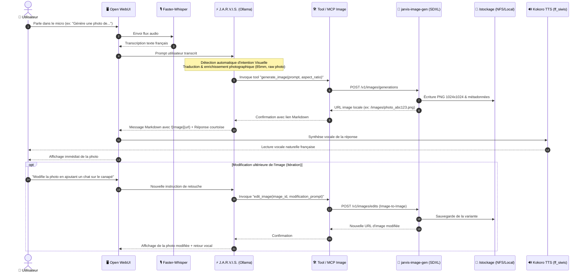
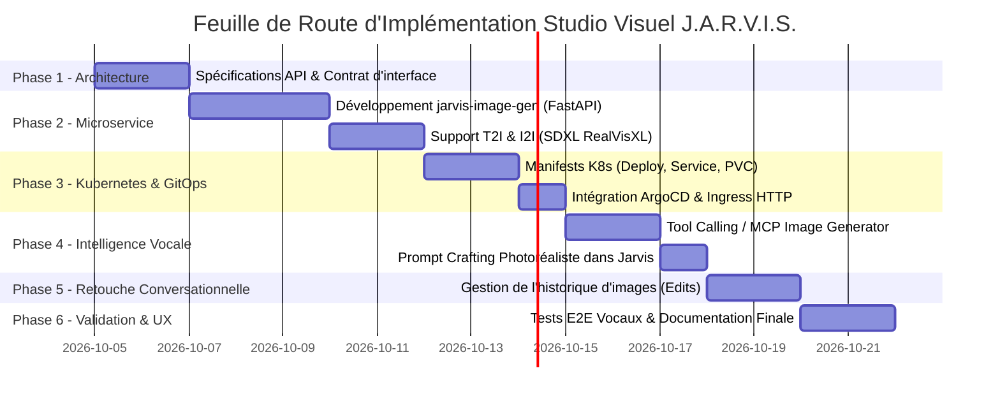

# 🎨 Projet J.A.R.V.I.S. Studio Visuel : Génération & Retouche d'Images Photoréalistes par Commande Vocale

> **Document de Cadrage & Plan d'Action Technique**  
> *Auteur : Antigravity (Google DeepMind) & Julien*  
> *Date de création : 3 octobre 2026*  
> *Cible d'infrastructure : Cluster Kubernetes Bare-metal, Nœud `linux2` (192.168.1.160), GPU NVIDIA GeForce RTX 3070 8 Go, Stockage `/stockage` (2 To libres), GitOps ArgoCD.*

---

## 🧭 1. Vision & Objectifs du Projet

### 1.1. L'Expérience Utilisateur Cible (UX Iron Man)
L'utilisateur s'adresse à **J.A.R.V.I.S.** à la voix via le microphone d'Open WebUI (ou un satellite audio) :

1. **Commande Vocale Naturelle** :  
   *« Jarvis, imagine et génère une photo d'un salon moderne avec une grande baie vitrée donnant sur une forêt de pins enneigée au crépuscule. »*
2. **Interprétation & Amplification Agentique** :  
   - Whisper STT transcrit la voix instantanément en français (< 200 ms).
   - Le persona **J.A.R.V.I.S.** détecte automatiquement l'intention de génération visuelle.
   - Il amplifie et traduit le prompt en anglais cinématographique pour le modèle de diffusion (cadrage, focale 85mm f/1.4, éclairage volumétrique, textures 8k photoréalistes).
3. **Génération Photoréaliste Ultra-Rapide** :  
   - Le microservice local de diffusion calcule l'image en **~3 à 5 secondes** sur la **RTX 3070**.
4. **Restitution Multimodale Immédiate** :  
   - L'image haute définition apparaît directement dans le fil de discussion Open WebUI.
   - J.A.R.V.I.S. confirme vocalement via Kokoro TTS (`ff_siwis`) :  
     *« Voici votre cliché, Monsieur. Souhaitez-vous que j'ajuste l'ambiance lumineuse ou que j'y intègre d'autres éléments ? »*
5. **Retouche Itérative par Prompt (Image-to-Image / Inpainting)** :  
   - L'utilisateur peut réagir à la voix ou au clavier :  
     *« Ajoute un fauteuil club en cuir marron près de la baie vitrée et fais tomber quelques flocons de neige dehors. »*
   - J.A.R.V.I.S. conserve l'état contextuel, transmet l'image de référence au moteur de modification d'image (*Image-to-Image / Edits*), et génère la nouvelle variante cohérente avec la scène initiale.

---

## 🏗️ 2. Architecture Globale & Flux de Données



---

## ⚙️ 3. Choix Technologiques & Contraintes Matérielles

### 3.1. Dimensionnement Matériel (Nœud `linux2` - 192.168.1.160)
* **GPU** : NVIDIA GeForce RTX 3070 (8 Go VRAM GDDR6, architecture Ampere).
* **RAM Système** : 32 Go DDR4.
* **Stockage** : Partition `/stockage` (2.0 To libres) — modèles et images générées isolés de la racine `/`.

### 3.2. Sélection du Moteur de Diffusion Photoréaliste
Pour garantir une qualité **photoréaliste bluffante** tout en respectant l'enveloppe stricte des **8 Go de VRAM** :

| Moteur Candidat | Qualité Visuelle | Empreinte VRAM | Vitesse Inférence | Verdict pour le Projet |
| :--- | :---: | :---: | :---: | :--- |
| **SDXL Lightning (RealVisXL V4.0 / Juggernaut XL)** | ⭐⭐⭐⭐⭐ (Textures peau, éclairage réaliste, 1024x1024) | **~5.2 Go** (avec xFormers / SDPA) | **~3 à 5 sec** (4 à 8 steps) | ✅ **Choix Principal Retenu** (Idéal sur RTX 3070 8 Go). |
| **FLUX.1-schnell (Quantifié 4-bit / NF4)** | ⭐⭐⭐⭐⭐ (Excellente composition, texte dans l'image) | ~7.2 Go | ~12 à 18 sec (4 steps) | 🔄 Option avancée évolutive (nécessite offload CPU partagé). |
| **Stable Diffusion 1.5 Photoreal** | ⭐⭐⭐ (Résolution 512x512 dépassée) | ~3.0 Go | ~2 sec | ❌ Trop ancien, manque de finesse sur les détails modernes. |

### 3.3. Découplage VRAM (Ollama LLM + Image Generator)
Sur un GPU de 8 Go, exécuter simultanément un LLM de 9B et un modèle de diffusion nécessite une orchestration intelligente de la mémoire :
1. **Ollama Auto-Offload** : `OLLAMA_KEEP_ALIVE=2m` permet à Ollama de libérer la VRAM s'il n'est pas sollicité.
2. **Diffusers Memory Optimizations** :
   - `enable_vae_slicing()` & `enable_vae_tiling()`.
   - `torch.bfloat16` ou `torch.float16`.
   - `enable_model_cpu_offload()` : Les blocs UNet/DiT sont chargés en VRAM uniquement pendant l'étape de débruitage, garantissant **zéro crash OOM (Out Of Memory)**.

---

## 📋 4. Plan d'Action Découplé en 6 Phases



---

### Phase 1 : Spécifications & Contrat d'Interface (Jour 1 - 2)
* **Objectif** : Définir les protocoles de communication entre Open WebUI, le LLM et le moteur de génération d'images.
* **Livrables** :
  1. Spécification des endpoints API standardisés :
     - `POST /v1/images/generations` (Text-to-Image compatible format OpenAI).
     - `POST /v1/images/edits` (Image-to-Image / Inpainting pour les retouches).
     - `GET /images/{filename}` (Serveur de fichiers statiques pour afficher les images générées).
  2. Schéma des métadonnées associées aux images (`prompt`, `seed`, `dimensions`, `denoising_strength`, `parent_image_id`).

---

### Phase 2 : Développement du Microservice `jarvis-image-gen` (Jour 3 - 5)
* **Objectif** : Créer le conteneur Python GPU dédié à la génération et la retouche d'image.
* **Stack logicielle** :
  - **Base** : Python 3.11, PyTorch 2.5+ avec CUDA 12.4.
  - **Moteur** : HuggingFace `diffusers`, `transformers`, `accelerate`, `xformers`.
  - **Modèle de référence** : `SG161222/RealVisXL_V4.0_Lightning` (génère des photographies 1024x1024 réalistes en 4 à 8 steps).
  - **Framework Web** : `FastAPI` + `uvicorn`.
* **Fonctionnalités clés** :
  - Détection automatique du mode (Text-to-Image vs Image-to-Image).
  - Normalisation des ratios d'aspect (1:1 carré, 16:9 paysage, 9:16 portrait).
  - Filtrage négatif par défaut pour exclure les artefacts visuels (*bad anatomy, deformed, oversaturated, cartoon, drawing, watermark*).
  - Stockage persistant des images générées avec nommage unique (`timestamp_uuid.png`).

---

### Phase 3 : Manifests Kubernetes & Déploiement GitOps ArgoCD (Jour 6 - 8)
* **Objectif** : Déployer et orchestrer le microservice sur le cluster bare-metal avec accélération NVIDIA et stockage dédié.
* **Manifests à créer dans `k8s/base/image-gen/`** :
  - `pvc.yaml` : Point de montage persistant pointant vers `/stockage/system-storage/generated-images` et `/stockage/system-storage/diffusers-cache`.
  - `deployment.yaml` :
    - Allocation GPU : `resources.limits: { "nvidia.com/gpu": "1" }`.
    - NodeSelector : `accelerator: nvidia-gpu`.
    - Probes HTTP (liveness et readiness).
  - `service.yaml` : ClusterIP sur port interne `8000` + NodePort optionnel `30850`.
  - `ingress.yaml` : Route publique `http://images.local/` ou `http://jarvis.local/images/`.
* **Intégration GitOps** :
  - Ajout dans `k8s/base/kustomization.yaml`.
  - Synchronisation et validation de santé automatique via ArgoCD.

---

### Phase 4 : Intelligence Vocale, Tool Calling & Prompt Crafting Photoréaliste (Jour 9 - 10)
* **Objectif** : Rendre Jarvis capable de comprendre automatiquement la demande vocale, de concevoir un prompt visuel de très haut niveau et de déclencher l'outil sans intervention manuelle.
* **Mécanisme d'Intention & Tool Calling** :
  - **Création de l'outil MCP / Open WebUI Function** :
    ```python
    @tool
    def generate_image(prompt: str, aspect_ratio: str = "1:1") -> str:
        """Génère une image photoréaliste à partir d'un prompt photographique détaillé en anglais.
        Renvoie le lien Markdown de l'image créée."""
    ```
  - **Enrichissement de Prompt par J.A.R.V.I.S.** :
    Le persona Jarvis est instruit pour convertir une demande utilisateur courte (ex: *"Fais-moi une photo d'un café parisien au lever du soleil"*) en directive photographique experte :
    > *« Professional 35mm film photograph of a quaint Parisian café terrace at golden hour sunrise, cobblestone street, warm sunlight reflecting off espresso cups, depth of field, photorealistic, 8k, soft shadows, Kodachrome tone, hyper-detailed. »*
  - **Réponse vocale adaptée** :
    Jarvis répond brièvement à la voix tout en insérant l'image Markdown dans la bulle de chat pour un rendu visuel immédiat.

---

### Phase 5 : Gestion Conversationnelle des Retouches (Image-to-Image / Edits) (Jour 11 - 12)
* **Objectif** : Permettre à l'utilisateur de modifier l'image précédemment générée en décrivant simplement les changements souhaités.
* **Workflow d'Itération** :
  1. **Détection de Continuité** :
     - Lorsque l'utilisateur dit : *« Change le ciel en nuit étoilée »* ou *« Ajoute un chat sur la table »*, Jarvis identifie qu'il s'agit d'une altération de l'image précédente.
  2. **Inférence Image-to-Image (I2I)** :
     - Appel de `POST /v1/images/edits` en transmettant le chemin de l'image d'origine.
     - Paramètre de force de débruitage (*Denoising Strength*) modulé intelligemment :
       - `0.30 - 0.40` : Retouche subtile (éclairage, colorimétrie, météo).
       - `0.55 - 0.70` : Ajout d'éléments ou refonte partielle de la scène.
  3. **Affichage Comparatif** :
     - La nouvelle image s'affiche dans le chat à la suite de l'ancienne, permettant à l'utilisateur de constater les ajustements en continu.

---

### Phase 6 : Validation, Benchmarks & Manuel Utilisateur (Jour 13 - 14)
* **Objectif** : Valider l'expérience globale sous conditions réelles et enrichir la documentation utilisateur.
* **Tests de Validation** :
  - [ ] Test vocal bout-en-bout (Whisper ➔ Jarvis ➔ Image-Gen ➔ Affichage WebUI ➔ Kokoro TTS).
  - [ ] Test de charge mémoire GPU : inférence LLM simultanée avec inférence de diffusion.
  - [ ] Test de persistance : validation que les images générées sont conservées sur `/stockage` après redémarrage du pod.
  - [ ] Test du cycle de retouche (génération initiale puis 2 modifications consécutives par prompt).
* **Documentation** :
  - Mise à jour du [manuel.md](file:///d:/devia/IAlocal/argocd-IA-local/manuel.md) avec une section dédiée : *"Studio Visuel : Générer et retoucher des images à la voix"*.
  - Exemples de prompts types pour des résultats spectaculaires.

---

## 🎯 5. Critères d'Acceptation & Indicateurs Clés (KPI)

| Indicateur | Objectif Ciblé | Méthode de Mesure |
| :--- | :---: | :--- |
| **Délai Total (Voix ➔ Image à l'écran)** | **< 6 secondes** | Chronométrage depuis la fin de la parole jusqu'à l'affichage du PNG. |
| **Résolution Native** | **1024 x 1024 pixels** | Inspection des métadonnées du fichier généré. |
| **Consommation VRAM Maximale** | **< 7.2 Go** | Surveillance en continu via `nvidia-smi` (marge de sécurité de 800 Mo sur les 8 Go). |
| **Cohérence des Retouches** | **Sujet & composition conservés** | Validation visuelle sur cycle Image-to-Image. |
| **Disponibilité & Stabilité** | **100% sans OOM** | Stress-test de 10 générations consécutives. |

---

## 🛡️ 6. Matrice des Risques & Stratégies de Contournement

| Risque Identifié | Gravité | Probabilité | Solution Préventive / Mitigation |
| :--- | :---: | :---: | :--- |
| **Saturation de la VRAM (OOM)** lors d'un appel simultané Ollama + Diffusers | Élevée | Moyenne | 1. Configurer `enable_model_cpu_offload()` dans Diffusers.<br/>2. Réduire le keep-alive d'Ollama (`OLLAMA_KEEP_ALIVE=2m`).<br/>3. File d'attente asynchrone sérielle si GPU occupé. |
| **Compréhension imparfaite de la retouche** par l'IA | Faible | Moyenne | Injection de quelques exemples de *few-shot prompting* dans le System Prompt de J.A.R.V.I.S. pour standardiser la commande I2I. |
| **Accumulation d'images saturant le disque** | Faible | Faible | Les images sont stockées sur `/stockage` (2 To disponibles) + ajout d'un CronJob hebdomadaire de nettoyage des images de plus de 90 jours. |

---

*Ce document constitue le plan de référence pour le déploiement du Studio Visuel J.A.R.V.I.S.*
