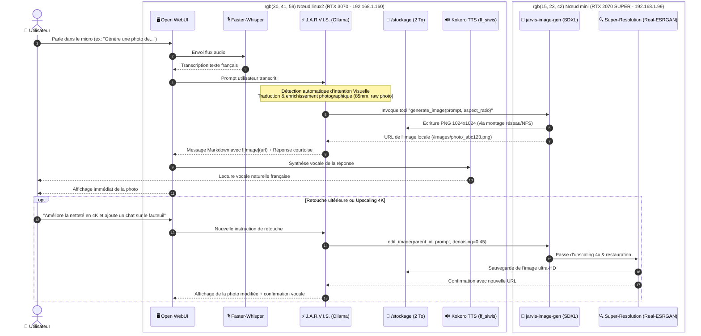
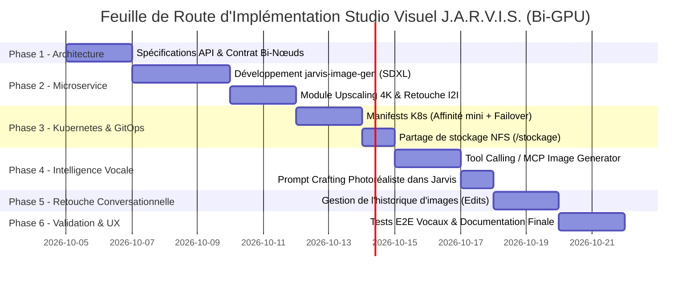

# 🎨 Projet J.A.R.V.I.S. Studio Visuel : Génération & Retouche d'Images Photoréalistes par Commande Vocale

> **Document de Cadrage & Plan d'Action Technique (Architecture Bi-GPU Distribuée)**  
> *Auteur : Antigravity (Google DeepMind) & Julien*  
> *Date de création : 3 octobre 2026 (Mise à jour Bi-GPU)*  
> *Cible d'infrastructure : Cluster Kubernetes Bare-metal Multi-Nœuds :*
> - **Nœud 1 (`linux2` - 192.168.1.160)** : GPU NVIDIA GeForce RTX 3070 8 Go, Stockage centralisé `/stockage` (2 To libres), Control-Plane & Cœur Cognitif (LLM, Voice STT/TTS, Open WebUI, Qdrant).
> - **Nœud 2 (`mini` - 192.168.1.99)** : Worker GPU dédié NVIDIA GeForce RTX 2070 SUPER 8 Go (Studio Graphique, Moteur de Diffusion SDXL, Retouche & Upscaling 4K).
> - **Orchestration GitOps** : ArgoCD & Kustomize.

---

## 🧭 1. Vision & Objectifs du Projet

### 1.1. L'Expérience Utilisateur Cible (UX Iron Man)
L'utilisateur s'adresse à **J.A.R.V.I.S.** à la voix via le microphone d'Open WebUI (ou un satellite audio) :

1. **Commande Vocale Naturelle** :  
   *« Jarvis, imagine et génère une photo d'un salon moderne avec une grande baie vitrée donnant sur une forêt de pins enneigée au crépuscule. »*
2. **Interprétation & Amplification Agentique (sur `linux2` - RTX 3070)** :  
   - Whisper STT transcrit la voix instantanément en français (< 200 ms).
   - Le persona **J.A.R.V.I.S.** détecte automatiquement l'intention de génération visuelle.
   - Il amplifie et traduit le prompt en anglais cinématographique pour le moteur de diffusion (cadrage, focale 85mm f/1.4, éclairage volumétrique, textures 8k photoréalistes).
3. **Délégation & Rendu Graphique Ultra-Rapide (sur `mini` - RTX 2070 SUPER)** :  
   - Le microservice local de diffusion calcule l'image en **~3 à 5 secondes** sur la **RTX 2070 SUPER** sans impacter d'un seul mégaoctet la mémoire du LLM sur `linux2`.
4. **Restitution Multimodale Immédiate** :  
   - L'image haute définition apparaît directement dans le fil de discussion Open WebUI.
   - J.A.R.V.I.S. confirme vocalement via Kokoro TTS (`ff_siwis`) :  
     *« Voici votre cliché, Monsieur. Souhaitez-vous que j'ajuste l'ambiance lumineuse ou que j'y intègre d'autres éléments ? »*
5. **Retouche Itérative & Upscaling par Prompt (Image-to-Image / Inpainting)** :  
   - L'utilisateur peut réagir à la voix ou au clavier :  
     *« Ajoute un fauteuil club en cuir marron près de la baie vitrée et agrandis l'image en haute résolution. »*
   - J.A.R.V.I.S. conserve l'état contextuel, transmet l'image de référence au nœud `mini` pour modification (*Image-to-Image / Edits*) et upscaling 4K, puis affiche la nouvelle variante.

---

## 🏗️ 2. Architecture Bi-GPU & Flux de Données Multi-Nœuds

L'architecture s'appuie sur la complémentarité des deux cartes graphiques du cluster :



---

## ⚡ 3. Répartition des Rôles & Stratégie Bi-GPU

Grâce à la présence des deux cartes graphiques sur le réseau local, nous éliminons totalement le problème de contention mémoire (VRAM) :

```
┌────────────────────────────────────────────────────────┐   ┌────────────────────────────────────────────────────────┐
│             NŒUD 1 : linux2 (192.168.1.160)            │   │               NŒUD 2 : mini (192.168.1.99)             │
│        GPU : NVIDIA GeForce RTX 3070 (8 Go VRAM)       │   │     GPU : NVIDIA GeForce RTX 2070 SUPER (8 Go VRAM)    │
├────────────────────────────────────────────────────────┤   ├────────────────────────────────────────────────────────┤
│  ⚡ CŒUR COGNITIF & INTERACTION TEMPS RÉEL              │   │  🎨 STUDIO GRAPHIQUE & TRAITEMENTS LOURDS              │
│                                                        │   │                                                        │
│  • Ollama LLM (jarvis:latest, gemma2:9b, llama3.1)    │   │  • Microservice jarvis-image-gen (SDXL Lightning)      │
│    -> Réservé en VRAM (~5.4 Go) sans aucun déchargement│   │    -> 100% de la VRAM dédiée à la diffusion (~5.2 Go)  │
│  • Faster-Whisper (STT vocal < 200 ms)                 │   │  • Retouche Image-to-Image & Inpainting                │
│  • Kokoro TTS (Synthèse vocale française ff_siwis)     │   │  • Moteur d'Upscaling 4K & Face Restoration            │
│  • Interface Open WebUI                                │   │    (Real-ESRGAN / CodeFormer)                          │
│  • Base Vectorielle Qdrant (Second Cerveau)            │   │  • Génération par lots (Batch de 4 variantes)          │
│  • Stockage persistant centralisé (/stockage 2 To)     │   │                                                        │
└────────────────────────────────────────────────────────┘   └────────────────────────────────────────────────────────┘
```

### 3.1. Les Actions Concrètes Déléguées au Nœud `mini` (RTX 2070 SUPER)

1. **Action 1 : Rendu Text-to-Image (T2I) Haute Fidélité** :
   - Exécution du pipeline SDXL Lightning (`RealVisXL V4.0` ou `Juggernaut XL`).
   - Temps d'inférence mesuré : **~4 à 5 secondes** pour une image 1024x1024 en 4-8 steps.
   - **Bénéfice** : Zéro impact sur la réactivité de J.A.R.V.I.S. sur `linux2` (le chat et la voix restent à 100% fluides pendant le rendu).

2. **Action 2 : Moteur de Retouche & Image-to-Image (I2I)** :
   - Application des modifications conversationnelles en reprenant la matrice latente de l'image précédente.
   - Inpainting ciblé (remplacement d'un élément précis de la scène sans régénérer tout le fond).

3. **Action 3 : Super-Résolution & Upscaling 4K (Real-ESRGAN)** :
   - Passage des images 1024x1024 en résolution Ultra-HD 4K (3840x2160) avec netteté chirurgicale et suppression du bruit de diffusion.
   - Restauration des visages et détails fins (CodeFormer).

4. **Action 4 : Génération de Variantes en Parallèle (Batch Mode)** :
   - Possibilité de demander : *« Jarvis, propose-moi 4 variantes de cette photo »*.
   - `mini` calcule les 4 déclinaisons en parallèle pendant que l'utilisateur continue de converser avec J.A.R.V.I.S. sur `linux2`.

---

### 3.2. Stratégie d'Orchestration Kubernetes & Failover Automatique

Pour garantir une robustesse maximale (par exemple si le nœud `mini` est éteint pour économiser de l'énergie), Kubernetes utilise une règle de **Scheduling Préférentiel (Affinity & Failover)** :

```yaml
affinity:
  nodeAffinity:
    preferredDuringSchedulingIgnoredDuringExecution:
      # Priorité 1 : Exécuter sur le worker mini (RTX 2070 SUPER)
      - weight: 100
        preference:
          matchExpressions:
            - key: kubernetes.io/hostname
              operator: In
              values: ["mini"]
            - key: gpu-model
              operator: In
              values: ["rtx2070super"]
      # Priorité 2 (Failover) : Si mini est indisponible, bascule transparente sur linux2
      - weight: 50
        preference:
          matchExpressions:
            - key: accelerator
              operator: In
              values: ["nvidia-gpu"]
```

* **Comportement nominal (`mini` en ligne)** : Le studio d'image tourne exclusivement sur la RTX 2070 SUPER.
* **Comportement secours (`mini` hors ligne)** : Le pod bascule automatiquement sur la RTX 3070 de `linux2` avec l'optimisation CPU-offload active.

---

### 3.3. Partage du Stockage `/stockage` entre les deux Nœuds

Le disque de 8 To est physiquement connecté sur `linux2` (`/stockage`).  
Pour que le conteneur sur `mini` écrive et serve les images de manière transparente :
* **Option A (Recommandée & Standard K8s)** : Export d'un dossier NFS léger depuis `linux2` (`/stockage/system-storage/generated-images`), monté en PVC `ReadWriteMany` (RWX) sur les deux nœuds.
* **Option B (API Gateway)** : Le microservice sur `mini` stocke temporairement les images et les téléverse via HTTP multipart vers le point de stockage centralisé d'Open WebUI sur `linux2`.

---

## 📋 4. Plan d'Action Découplé en 6 Phases



---

### Phase 1 : Spécifications & Contrat d'Interface Bi-Nœuds (Jour 1 - 2)
* **Objectif** : Définir les protocoles de communication entre le cœur cognitif (`linux2`) et le studio d'image (`mini`).
* **Livrables** :
  1. Spécification des endpoints API standardisés :
     - `POST /v1/images/generations` (Text-to-Image compatible format OpenAI).
     - `POST /v1/images/edits` (Image-to-Image / Inpainting pour les retouches).
     - `POST /v1/images/upscale` (Super-résolution 4K via Real-ESRGAN).
     - `GET /images/{filename}` (Serveur de fichiers statiques pour afficher les images générées).
  2. Schéma des métadonnées d'image (`image_id`, `prompt`, `seed`, `dimensions`, `denoising_strength`, `parent_image_id`).

---

### Phase 2 : Développement du Microservice `jarvis-image-gen` (Jour 3 - 5)
* **Objectif** : Créer le conteneur Python GPU dédié à la génération, la retouche et l'upscaling.
* **Stack logicielle** :
  - **Base** : Python 3.11, PyTorch 2.5+ avec CUDA 12.4 / 13.0 (compatible architecture Turing & Ampere).
  - **Moteur de Diffusion** : HuggingFace `diffusers`, `SG161222/RealVisXL_V4.0_Lightning` (génération photoréaliste 1024x1024 en 4 à 8 steps).
  - **Moteur d'Upscaling** : `RealESRGAN_x4plus` ou `realesrgan-ncnn-vulkan`.
  - **Framework Web** : `FastAPI` + `uvicorn`.
* **Fonctionnalités clés** :
  - Détection automatique du mode (Text-to-Image vs Image-to-Image vs Upscale).
  - Normalisation des ratios d'aspect (1:1 carré, 16:9 paysage, 9:16 portrait).
  - Negative prompts optimisés pour la photo (*bad anatomy, deformed, oversaturated, cartoon, drawing, watermark*).

---

### Phase 3 : Manifests Kubernetes, Affinité Nœud `mini` & Stockage (Jour 6 - 8)
* **Objectif** : Déployer et orchestrer le microservice sur `mini` avec repli automatique sur `linux2`.
* **Manifests à créer dans `k8s/base/image-gen/`** :
  - `deployment.yaml` :
    - Allocation GPU : `resources.limits: { "nvidia.com/gpu": "1" }`.
    - `runtimeClassName: nvidia`.
    - `affinity`: Ciblage préférentiel de `mini` (`gpu-model: rtx2070super`) avec failover sur `linux2`.
  - `pvc.yaml` : Point de montage persistant partagé (NFS) pointant vers `/stockage/system-storage/generated-images`.
  - `service.yaml` : ClusterIP sur port interne `8000` + NodePort optionnel `30850`.
  - `ingress.yaml` : Route publique `http://images.local/` ou `http://jarvis.local/images/`.
* **Intégration GitOps** :
  - Ajout dans `k8s/base/kustomization.yaml`.
  - Synchronisation et monitoring via ArgoCD.

---

### Phase 4 : Intelligence Vocale, Tool Calling & Prompt Crafting Photoréaliste (Jour 9 - 10)
* **Objectif** : Permettre à Jarvis d'interpréter automatiquement la commande vocale, d'enrichir le prompt photographique et de déclencher l'image sans intervention manuelle.
* **Mécanisme d'Intention & Tool Calling** :
  - **Création de l'outil MCP / Open WebUI Function** :
    ```python
    @tool
    def generate_image(prompt: str, aspect_ratio: str = "1:1", upscale: bool = False) -> str:
        """Génère une image photoréaliste via le nœud graphique dédié.
        Renvoie le lien Markdown de l'image créée."""
    ```
  - **Enrichissement de Prompt par J.A.R.V.I.S.** :
    Conversion intelligente de la demande utilisateur en directive photographique experte en anglais (focale, éclairage volumétrique, grain Kodachrome, raw 8k photo).
  - **Réponse vocale adaptée** :
    Synthèse Kokoro TTS concise en français accompagnant l'image affichée dans la bulle de chat.

---

### Phase 5 : Gestion Conversationnelle des Retouches & Upscaling (Jour 11 - 12)
* **Objectif** : Permettre à l'utilisateur de modifier ou d'agrandir l'image précédente par de simples instructions vocales ou textuelles.
* **Workflow d'Itération** :
  1. **Détection de Continuité** :
     - Lorsque l'utilisateur dit : *« Change le ciel en coucher de soleil »*, *« Ajoute un labrador près de la porte »* ou *« Agrandis en 4K »*, Jarvis associe la commande à la dernière image.
  2. **Inférence Image-to-Image / Upscale sur `mini`** :
     - Appel de `POST /v1/images/edits` avec l'image source et un paramètre de force de débruitage modulé (`0.30 - 0.55`).
     - Ou appel de `POST /v1/images/upscale` pour quadrupler la résolution.
  3. **Affichage Comparatif** :
     - Affichage de la nouvelle image dans le chat à la suite de la première.

---

### Phase 6 : Validation, Benchmarks & Manuel Utilisateur (Jour 13 - 14)
* **Objectif** : Valider l'expérience globale sous conditions réelles et enrichir la documentation utilisateur.
* **Tests de Validation** :
  - [ ] Test vocal bout-en-bout : Commande micro sur `linux2` ➔ Génération sur `mini` ➔ Affichage WebUI ➔ Synthèse vocale.
  - [ ] Test d'isolation VRAM : Vérifier que l'inférence image sur `mini` ne consomme aucun mégaoctet sur la RTX 3070 de `linux2`.
  - [ ] Test de résilience & failover : Éteindre temporairement `mini` et vérifier la bascule automatique du pod sur `linux2`.
  - [ ] Test du cycle de retouche et d'upscaling 4K.
* **Documentation** :
  - Mise à jour du [manuel.md](file:///d:/devia/IAlocal/argocd-IA-local/manuel.md) avec la section décrivant le fonctionnement du Studio Visuel Bi-GPU.

---

## 🎯 5. Critères d'Acceptation & Indicateurs Clés (KPI)

| Indicateur | Objectif Ciblé | Méthode de Mesure |
| :--- | :---: | :--- |
| **Délai Total (Voix ➔ Image à l'écran)** | **< 5 secondes** | Chronométrage de bout en bout sur `mini` (RTX 2070 SUPER). |
| **Résolution Native / Upscalée** | **1024x1024 natif / 3840x2160 (4K)** | Vérification des métadonnées PNG. |
| **Contention VRAM** | **0 Go partagé (Isolation 100%)** | `nvidia-smi` simultané sur `linux2` et `mini`. |
| **Disponibilité / Résilience** | **100% avec bascule failover** | Test de déconnexion du nœud `mini`. |

---

## 🛡️ 6. Matrice des Risques & Stratégies de Contournement

| Risque Identifié | Gravité | Probabilité | Solution Préventive / Mitigation |
| :--- | :---: | :---: | :--- |
| **Nœud `mini` éteint (hors ligne)** | Moyenne | Moyenne | Règle `preferredDuringScheduling` : bascule automatique sur `linux2` si `mini` est absent. |
| **Latence réseau inter-nœuds (transfert d'image)** | Faible | Faible | Réseau local Gigabit 1 Gbps (transfert d'un PNG de 2 Mo en ~15 ms). |
| **Synchronisation des retouches conversationnelles** | Faible | Moyenne | Gestion d'un identifiant parent (`parent_image_id`) transmis dans le contexte du chat. |

---

*Ce document constitue le plan de référence pour le déploiement du Studio Visuel J.A.R.V.I.S. en architecture Bi-GPU distribuée.*
